# Data Model

The domain model: what is stored, and how the pieces relate. It exists to capture music events scraped from Berlin venue websites — every source is listed in
[EVENT_DATA_SOURCES.md](EVENT_DATA_SOURCES.md).

## The short version

An `event` belongs to one `venue` and links to `artist`, `promoter` and `genre_tag` through join tables.
`event.sourceId` is what makes imports idempotent — an upsert keyed on it, not on the title. `event_source` holds the
per-venue import configuration and the conditional-request headers (ETag, Last-Modified) that let an unchanged one-page
source cost one 304. It also holds the licence status that decides whether an event's description and image are served.

**Everything lives in the `events` schema, never `public`.** The name comes from the `EVENTS_SCHEMA` constant in
`events-core`, not from a YAML property. See [ADR-004](adr/ADR-004_DEDICATED_DATABASE_SCHEMA.md) and
[.github/instructions/architecture.instructions.md](../.github/instructions/architecture.instructions.md). Migrations
are owned by the importer ([ADR-005](adr/ADR-005_MIGRATIONS_OWNED_BY_IMPORTER.md)).

## Class Diagram

**This diagram is generated from the domain classes in `events-core`.** Do not edit it by hand. `DomainClassDiagramTest` writes it and the backend build
fails when it stops matching. Rewrite it with `./gradlew :events-core:updateDataModelDiagram`.

```mermaid
classDiagram
    direction LR

    class Venue {
        Long? id
        String name
        String slug
        String? address
        String city
        String? postalCode
        String? district
        BigDecimal? latitude
        BigDecimal? longitude
        String? websiteUrl
        String? instagramUrl
        String? facebookUrl
        String? imageUrl
        String? imageAttribution
        String? imageLicenceId
        String? imageSourceUrl
        String? description
        String? descriptionLanguage
        String? descriptionAlt
        String? descriptionAltLanguage
        List venueTypes
        Int? capacity
        List programmeFamilies
        List programmeEventTypes
        String? programmeUrl
        Instant? reviewedAt
        LocalDate? closedOn
        Instant? createdAt
        Instant? updatedAt
    }

    class Artist {
        Long? id
        String name
        String slug
        String? description
        String? descriptionLanguage
        String? descriptionAttribution
        String? descriptionLicenceId
        String? descriptionSourceUrl
        String? descriptionAlt
        String? descriptionAltLanguage
        String? descriptionAltAttribution
        String? descriptionAltLicenceId
        String? descriptionAltSourceUrl
        String? imageUrl
        String? imageAttribution
        String? imageLicenceId
        String? imageSourceUrl
        String? websiteUrl
        String? facebookUrl
        String? instagramUrl
        String? youtubeUrl
        String? bandcampUrl
        String? soundcloudUrl
        String? discogsUrl
        String? wikidataUrl
        String? residentAdvisorUrl
        String? spotifyUrl
        ArtistType? artistType
        String? founded
        String? foundedIn
        String? country
        String? musicbrainzId
        MusicBrainzMatch musicbrainzMatch
        Instant? musicbrainzCheckedAt
        Instant? musicbrainzEnrichedAt
        Long? discogsId
        DiscogsMatch discogsMatch
        Instant? discogsCheckedAt
        Boolean namePinned
        Instant? createdAt
        Instant? updatedAt
    }

    class Promoter {
        Long? id
        String name
        String slug
        String? websiteUrl
        String? imageUrl
        String? imageAttribution
        String? imageLicenceId
        String? imageSourceUrl
        String? description
        String? descriptionLanguage
        String? descriptionAlt
        String? descriptionAltLanguage
        Instant? reviewedAt
        Instant? createdAt
        Instant? updatedAt
    }

    class GenreTag {
        Long? id
        String name
        String slug
        GenreFamily? family
        Instant? createdAt
        Instant? updatedAt
    }

    class ArtistType {
        <<enumeration>>
        PERSON
        GROUP
        ORCHESTRA
        CHOIR
        OTHER
    }

    class MusicBrainzMatch {
        <<enumeration>>
        EXACT
        AMBIGUOUS
        NONE
        UNCHECKED
    }

    class DiscogsMatch {
        <<enumeration>>
        EXACT
        AMBIGUOUS
        NONE
        UNCHECKED
    }

    class GenreFamily {
        <<enumeration>>
        ELECTRONIC
        HIP_HOP
        POP
        ROCK
        PUNK
        METAL
        WAVE
        SOUL_FUNK
        JAZZ_BLUES
        FOLK
        LATIN_WORLD
        CLASSICAL
        CHARTS
    }

    Artist --> ArtistType: artistType
    Artist --> MusicBrainzMatch: musicbrainzMatch
    Artist --> DiscogsMatch: discogsMatch
    GenreTag --> GenreFamily: family
```

<!-- generated: domain class diagram -->



<!-- /generated: domain class diagram -->

Domain classes are organized by feature in `events-core`:

```
de.norm.events
├── artist/
│   └── Artist.kt         (Artist, ArtistType, MusicBrainzMatch)
├── event/
│   ├── EventEnums.kt     (EventType, EventStatus, ArtistRole)
│   └── EventChangeField.kt
├── genretag/
│   ├── GenreTag.kt
│   └── GenreFamily.kt
├── licence/
│   └── SourceLicence.kt
├── promoter/
│   └── Promoter.kt
└── venue/
    └── Venue.kt
```

### What is generated, and what is not

The diagram shows the **domain classes**. The field tables below show the **database**. The two layers are separate by
[ADR-003](adr/ADR-003_ENTITY_DOMAIN_SEPARATION.md), and they do not always agree.

The `event` table is the example. It exists and both applications map it. The shared model has no `Event` class, so
the diagram draws none. **Where the two disagree, the table is right about the database**, because the column is what
exists. The diagram is right about what the shared code can pass around.

The tables are written by hand. They carry a description and an example for each column, and no generator writes those.

### How much of the code uses these classes

Less than the diagram suggests, and the difference is worth knowing before you add a field to one.

One caller uses all four. The importer's admin API round-trips each one through the pattern
[ADR-003](adr/ADR-003_ENTITY_DOMAIN_SEPARATION.md) describes: `Response.fromDomain(entity.toDomain())` in `VenueService`,
`ArtistService`, `PromoterService` and `GenreTagService`.

**The BFF uses none of them.** No file in `events-bff` declares a `toDomain` or a `fromDomain`. It reads its own
entities and builds its responses straight from them.

**The event path has no domain class at all.** The importer writes entities from `ScrapedEvent`. The BFF reads entities
and builds `EventResponse` with its own `LineupEntryResponse`. #1725 deleted the `Event` and `LineupEntry` classes that
nothing used. The two applications' `EventEntity` classes differ on purpose, so one shared class would fit neither side.

The same answer covers `genreTags`. The join table `event_genre_tag` exists and the public API returns the array on
every event. The shared model carries neither, and a property there would give the code nothing (#1717).

## Entities

### Venue

Represents a physical venue where music events take place (e.g. Astra Kulturhaus, Badehaus Berlin, SO36).

| Field                      | Type           | Nullable | Description                                                     | Example                                           |
| -------------------------- | -------------- | -------- | --------------------------------------------------------------- | ------------------------------------------------- |
| `id`                       | `BIGINT`       | No       | Auto-generated primary key                                      | `42`                                              |
| `name`                     | `TEXT`         | No       | Display name of the venue                                       | `Astra Kulturhaus`                                |
| `slug`                     | `TEXT` (UQ)    | No       | URL-friendly identifier                                         | `astra-kulturhaus`                                |
| `address`                  | `TEXT`         | Yes      | Street address                                                  | `Revaler Str. 99`                                 |
| `city`                     | `TEXT`         | No       | City (defaults to `Berlin`)                                     | `Berlin`                                          |
| `postal_code`              | `TEXT`         | Yes      | Postal code                                                     | `10245`                                           |
| `district`                 | `TEXT`         | Yes      | One of the 23 pre-2001 Berlin districts, as a slug (V021 CHECK) | `kreuzberg`                                       |
| `latitude`                 | `DECIMAL(9,6)` | Yes      | Geographic latitude                                             | `52.507242`                                       |
| `longitude`                | `DECIMAL(9,6)` | Yes      | Geographic longitude                                            | `13.451803`                                       |
| `website_url`              | `TEXT`         | Yes      | Venue's official website                                        | `https://www.astra-berlin.de`                     |
| `instagram_url`            | `TEXT`         | Yes      | Instagram profile, a plain link entered by hand, never fetched  | `https://www.instagram.com/astra_kulturhaus/`     |
| `facebook_url`             | `TEXT`         | Yes      | Facebook page, a plain link entered by hand, never fetched      | `https://www.facebook.com/astrakulturhaus/`       |
| `image_url`                | `TEXT`         | Yes      | Venue logo or photo                                             | `https://example.com/astra.jpg`                   |
| `image_attribution`        | `TEXT`         | Yes      | Who to credit for `image_url`. Null exactly when `image_url` is | `Photographer Name, via Wikimedia Commons`        |
| `image_licence_id`         | `TEXT`         | Yes      | SPDX identifier of the image licence                            | `CC-BY-SA-4.0`                                    |
| `image_source_url`         | `TEXT`         | Yes      | The image's description page                                    | `https://commons.wikimedia.org/wiki/File:…`       |
| `description`              | `TEXT`         | Yes      | Short prose description shown on the detail page                | `A former power plant turned techno institution…` |
| `description_language`     | `TEXT`         | Yes      | Language of `description`: `de` or `en`                         | `en`                                              |
| `description_alt`          | `TEXT`         | Yes      | The same text in the other language                             | `Ein früheres Kraftwerk…`                         |
| `description_alt_language` | `TEXT`         | Yes      | Language of `description_alt`                                   | `de`                                              |
| `venue_types`              | `TEXT[]`       | No       | `VenueType` slugs, curated by hand. Empty until curated         | `{live-venue,club}`                               |
| `capacity`                 | `INTEGER`      | Yes      | Visitors the largest room holds, as the venue publishes it      | `1500`                                            |
| `programme_families`       | `TEXT[]`       | No       | `GenreFamily` slugs, derived from the venue's events            | `{rock,punk}`                                     |
| `programme_event_types`    | `TEXT[]`       | No       | `EventType` names, derived from the venue's events              | `{CONCERT,PARTY}`                                 |
| `programme_url`            | `TEXT`         | Yes      | Where a venue we do not import publishes its programme          | `https://ra.co/clubs/185172`                      |
| `reviewed_at`              | `TIMESTAMPTZ`  | Yes      | When a person last confirmed address, coordinates and opening   | `2026-10-06 18:00:00+00`                          |
| `closed_on`                | `DATE`         | Yes      | The last day the venue is open, when it closes for good         | `2026-10-31`                                      |
| `created_at`               | `TIMESTAMPTZ`  | No       | Record creation timestamp                                       |                                                   |
| `updated_at`               | `TIMESTAMPTZ`  | No       | Last modification timestamp                                     |                                                   |

**Venue types and capacity are curated. The programme columns are derived (#327).** An operator sets `venue_types` and
`capacity` through the admin API or a guarded data migration. A venue can have more than one type. `capacity` stays null
when the venue does not publish a figure. `VenueProgrammeStore` writes the two `programme_*` columns after each import of
the venue, and `VenueProgrammeSweep` writes them for every venue each night. Do not write them by hand: the next pass
overwrites them.

**A venue without an `event_source` row is one we know but do not import (#2766).** No column says so: the BFF derives
`imported` from the source rows, so the state changes when an importer lands. Such a venue has no events. Its page links
to `programme_url`, which is never fetched. A person sets `reviewed_at` through the admin API after confirming the
venue's facts. An import never sets it. The site check in `venue_site_check` reads it.

**A venue that closes for good keeps its row (ADR-046).** A person sets `closed_on`, the last day the venue is open,
through the admin API or a data migration. From the day after, the BFF venue list leaves the venue out unless the request
asks for `closed=true`. The page and the past events stay. A PUT without `closedOn` reopens the venue, because the admin
API has no PATCH.
An event source on the venue keeps importing until a person disables it with
`scripts/seed-sources.py --host <host> --disable <slug> --yes`.

The derivation reads the venue's events from 365 days back, plus all future events. Cancelled events do not count. A
value counts when it is on at least 15 % of those events and on at least 3 of them. The top three values are kept, most
frequent first. `OTHER` never counts as an event type. A family share counts only events that carry a genre family.
A venue whose importer declares a house genre always gets the families of that genre, and they come first. The
thresholds do not apply to them, because a short season can leave too few tagged events. The venue needs at least one
event in the window.

**Both descriptions are our own prose, in two languages (#1210).** The English was written by hand and read against
each venue in #1124. The German says the same thing and was read the same way. So there is no origin column and no
source hash here. On `event` those two columns exist because the second language can be a machine translation. Such a
text must be disclosed, and it goes stale when the venue rewrites the original. Neither applies to a venue. A
correction to one language must be carried to the other by hand.

### venue_character_tag (Side Table)

What a venue says about itself, beyond its type and its programme: its kind of space, its door and its access (#2379). One row per tag on a venue.

| Field        | Type          | Nullable | Description                                                   | Example                      |
| ------------ | ------------- | -------- | ------------------------------------------------------------- | ---------------------------- |
| `venue_id`   | `BIGINT` FK   | No       | References `venue.id`. Deleting the venue deletes its tags    | `42`                         |
| `tag`        | `TEXT`        | No       | `VenueCharacterTag` slug, such as `queer` or `awareness-team` | `queer`                      |
| `source_url` | `TEXT`        | No       | The venue's own page that states the tag                      | `https://www.so36.com/about` |
| `created_at` | `TIMESTAMPTZ` | No       | When the tag was set                                          |                              |

The primary key is `(venue_id, tag)`. A side table and not a `TEXT[]` beside `venue_types`, because a tag must carry its
source URL. **A tag goes on a venue only where the venue's own page states it.** A review, a listing or an impression is
not a source. A venue with an unclear page stays untagged. The admin API sets and removes tags under
`/api/admin/venues/{id}/character-tags`. `scripts/venue-character-tags.py` writes the reviewed rows from
`docs/venue-character-tags/PROPOSED.tsv`. There is no `open-air` tag, because the `open-air` venue type covers it.

### venue_site_check (Side Table)

The last monthly check of a venue without an importer (#2812). One row per venue, overwritten by each pass.

| Field                  | Type          | Nullable | Description                                                             | Example                    |
| ---------------------- | ------------- | -------- | ----------------------------------------------------------------------- | -------------------------- |
| `venue_id`             | `BIGINT` FK   | No       | References `venue.id`. Deleting the venue deletes its row               | `42`                       |
| `checked_at`           | `TIMESTAMPTZ` | No       | When the last pass checked the venue                                    |                            |
| `url`                  | `TEXT`        | Yes      | The URL that decided the outcome: the first failure, else the first OK  | `https://funkloch.berlin/` |
| `outcome`              | `TEXT`        | No       | `OK`, `HTTP`, `DNS`, `TLS`, `TIMEOUT`, `CONNECTION`, `OTHER`, `SKIPPED` | `DNS`                      |
| `http_status`          | `INTEGER`     | Yes      | The status of an `HTTP` outcome, or the 403 or 429 of a `SKIPPED` one   | `404`                      |
| `consecutive_failures` | `INTEGER`     | No       | Passes in a row that failed. `OK` resets it, `SKIPPED` leaves it        | `3`                        |
| `failing_since`        | `TIMESTAMPTZ` | Yes      | When the current run of failures began. Null while the site answers     |                            |

`VenueSiteCheckService` runs on the 1st of each month. It probes `website_url` and `programme_url` of every venue that
has no `event_source` and no `closed_on`. It uses the scraper's client, so `robots.txt` and the per-host throttle apply.
It never contacts Resident Advisor, Facebook, Instagram or Eventbrite: their terms forbid automated access (#356). Such a
link, a `robots.txt` disallow, or a 403 or 429 is `SKIPPED`. A skip is not a failure: it neither adds to nor ends the
run of failures. A 403 or 429 is bot protection or a rate limit refusing the client, not a dead site. The summary log
line counts these refusals apart from the other skips. Any other 4xx or 5xx, and a DNS, TLS, connection or timeout
fault, is a failure. Any URL that fails makes the venue fail.

**A dead site is not a closed venue.** Three failures in a row log a `WARN` and put the venue on
`GET /api/admin/venues/needs-review`. A `reviewed_at` later than `failing_since` takes it off the list. The pass writes
neither `closed_on` nor `reviewed_at`: a person sets both. `POST /api/admin/venues/site-check` runs one pass now.

### Event

Core entity representing a single music event at a venue on a specific date.

| Field                  | Type            | Nullable | Description                                                         | Example                                                    |
| ---------------------- | --------------- | -------- | ------------------------------------------------------------------- | ---------------------------------------------------------- |
| `id`                   | `BIGINT`        | No       | Auto-generated primary key                                          | `101`                                                      |
| `venue_id`             | `BIGINT` FK     | No       | References `venue.id`                                               | `42`                                                       |
| `room`                 | `TEXT`          | Yes      | The room the whole event is in, as the venue names it (#316)        | `Saal`                                                     |
| `title`                | `TEXT`          | No       | Event headline                                                      | `THE ADICTS`                                               |
| `subtitle`             | `TEXT`          | Yes      | Tour name or support acts line                                      | `„Adios Amigos Tour 2026" + Support: MAID OF ACE + KAOS`   |
| `description`          | `TEXT`          | Yes      | Longer description / artist bio                                     | `Formed in Ipswich in the late 1970s…`                     |
| `description_withheld` | `BOOLEAN`       | No       | The licence kept a description out; nothing of it is stored (#2130) | `false`                                                    |
| `event_type`           | `TEXT`          | No       | Event category (see `EventType` enum)                               | `CONCERT`                                                  |
| `spoken_languages`     | `TEXT[]`        | Yes      | What is said on stage, where the venue states it (#2523)            | `{en}`                                                     |
| `subtitle_language`    | `TEXT`          | Yes      | The subtitles of a screening in the original version                | `de`                                                       |
| `status`               | `TEXT`          | No       | Scheduling status (see `EventStatus` enum, default `SCHEDULED`)     | `SCHEDULED`                                                |
| `relocated_to`         | `TEXT`          | Yes      | Where a `RELOCATED` show moved to, as its note says (ADR-030)       | `Hole44`                                                   |
| `slug`                 | `TEXT`          | No       | URL-friendly identifier                                             | `2026-06-12-the-adicts`                                    |
| `event_date`           | `DATE`          | No       | Calendar date of the event                                          | `2026-06-12`                                               |
| `doors_time`           | `TIME`          | Yes      | When doors open                                                     | `19:00`                                                    |
| `start_time`           | `TIME`          | Yes      | When the show starts                                                | `20:00`                                                    |
| `end_date`             | `DATE`          | Yes      | Last day, only when the venue states one (ADR-029)                  | `2026-06-15`                                               |
| `end_time`             | `TIME`          | Yes      | When it ends on `end_date`, never without `end_date`                | `10:00`                                                    |
| `image_url`            | `TEXT`          | Yes      | Event poster / flyer URL                                            | `https://example.com/adicts-poster.jpg`                    |
| `image_withheld`       | `BOOLEAN`       | No       | The licence kept an image out (#2130)                               | `false`                                                    |
| `source_url`           | `TEXT`          | Yes      | Original URL on the venue website                                   | `https://www.astra-berlin.de/events/2026-06-12-the-adicts` |
| `lineup_source_url`    | `TEXT`          | Yes      | The page the line-up came from, credited on the page (ADR-036)      | `https://sisy.fan/events/from/25.09.2026/to/28.09.2026`    |
| `source_id`            | `TEXT` (UQ)     | No       | Unique import key for idempotent upserts                            | `astra:2026-06-12-the-adicts`                              |
| `ticket_url`           | `TEXT`          | Yes      | External ticket shop URL (eventim, dice, etc.)                      | `https://www.eventim.de/event/...`                         |
| `facebook_event_url`   | `TEXT`          | Yes      | Direct link to the Facebook event page                              | `https://fb.me/e/60JFqXAUr`                                |
| `genre`                | `TEXT`          | Yes      | Raw music genre/style text from the source venue (display only)     | `Punk`                                                     |
| `price_presale`        | `DECIMAL(10,2)` | Yes      | Presale ticket price (Vorverkauf)                                   | `38.00`                                                    |
| `price_box_office`     | `DECIMAL(10,2)` | Yes      | Box office price (Abendkasse); a tiered door stores its lowest tier | `45.00`                                                    |
| `price_currency`       | `TEXT`          | No       | ISO 4217 currency code (default EUR)                                | `EUR`                                                      |
| `price_note`           | `TEXT`          | Yes      | Free-form pricing info for non-standard pricing                     | `donation 2-5€`                                            |
| `sold_out`             | `BOOLEAN`       | No       | Whether all tickets are sold out                                    | `false`                                                    |
| `pinned_fields`        | `TEXT[]`        | No       | Fields fixed by hand, which the importer keeps (ADR-042)            | `{title,lineup}`                                           |
| `created_at`           | `TIMESTAMPTZ`   | No       | Record creation timestamp                                           |                                                            |
| `updated_at`           | `TIMESTAMPTZ`   | No       | Last modification timestamp                                         |                                                            |

**A hand edit pins the fields that it changes (ADR-042).** `PUT /api/admin/events/{id}` adds each changed field to
`pinned_fields`, by its name in the request. `lineup`, `promoters` and `genres` pin the join tables. The importer keeps a
pinned field and updates every other field. A pinned title, date or venue also keeps the slug, and a pinned date keeps
the end. `DELETE /api/admin/events/{id}/pins/{field}` removes a pin. The next import that reads the page then writes
the source's value.

### Artist

Represents a musical artist or band. Normalized separately so artists can appear in multiple events.

| Field                    | Type          | Nullable | Description                                                             | Example                                        |
| ------------------------ | ------------- | -------- | ----------------------------------------------------------------------- | ---------------------------------------------- |
| `id`                     | `BIGINT`      | No       | Auto-generated primary key                                              | `7`                                            |
| `name`                   | `TEXT`        | No       | Stage or band name. An unpinned `EXACT` row takes MusicBrainz's case    | `The Adicts`                                   |
| `slug`                   | `TEXT` (UQ)   | No       | URL-friendly identifier                                                 | `the-adicts`                                   |
| `description`            | `TEXT`        | Yes      | Artist biography                                                        | `Formed in Ipswich in the late 1970s…`         |
| `image_url`              | `TEXT`        | Yes      | Photo or logo URL                                                       | `https://example.com/adicts.jpg`               |
| `website_url`            | `TEXT`        | Yes      | Official homepage                                                       | `https://theadicts.net/`                       |
| `facebook_url`           | `TEXT`        | Yes      | Facebook page URL                                                       | `https://www.facebook.com/theadicts`           |
| `instagram_url`          | `TEXT`        | Yes      | Instagram profile URL                                                   | `https://www.instagram.com/theadictsofficial/` |
| `youtube_url`            | `TEXT`        | Yes      | YouTube channel URL                                                     | `https://www.youtube.com/@theadictsofficial`   |
| `musicbrainz_id`         | `TEXT`        | Yes      | MBID, set exactly when the verdict is `EXACT` (ADR-031)                 | `41f4d85a-0bd7-4602-a3e3-8c47f36efb0a`         |
| `musicbrainz_match`      | `TEXT`        | No       | `EXACT` / `AMBIGUOUS` / `NONE` / `UNCHECKED` — the lookup's verdict     | `EXACT`                                        |
| `musicbrainz_checked_at` | `TIMESTAMPTZ` | Yes      | When the verdict was reached; a later `name_changed_at` queues it again |                                                |
| `discogs_id`             | `BIGINT`      | Yes      | Discogs artist id, set exactly when the Discogs verdict is `EXACT`      | `130715`                                       |
| `discogs_match`          | `TEXT`        | No       | The Discogs verdict. Asked only when `musicbrainz_match` is `NONE`      | `EXACT`                                        |
| `discogs_checked_at`     | `TIMESTAMPTZ` | Yes      | When the Discogs verdict was reached (ADR-035)                          |                                                |
| `created_at`             | `TIMESTAMPTZ` | No       | Record creation timestamp                                               |                                                |
| `name_changed_at`        | `TIMESTAMPTZ` | No       | When the name last changed (V062); only a rename moves it               |                                                |
| `updated_at`             | `TIMESTAMPTZ` | No       | Last modification timestamp                                             |                                                |
| `name_pinned`            | `BOOLEAN`     | No       | The name was fixed by hand, and the enrichment keeps it (ADR-042)       | `false`                                        |

**A hand edit of the name pins it (ADR-042).** `PUT /api/admin/artists/{id}` sets `name_pinned` when the name changes.
The MusicBrainz enrichment then keeps the name and logs the spelling that it did not write.
`DELETE /api/admin/artists/{id}/pins/name` removes the pin and queues the row for the enrichment again.
The next read then writes MusicBrainz's letter case on an `EXACT` row.

**A person decides an `AMBIGUOUS` name (#2946).** `GET /api/admin/artists?musicbrainzMatch=AMBIGUOUS&upcomingWithinDays=14` lists the rows to review.
`GET /api/admin/artists/{id}/musicbrainz-candidates` returns what the MusicBrainz search finds for the name.
The importer sends that request, on the same queue as the sweep.
`PUT /api/admin/artists/{id}/musicbrainz-id` stores the chosen MBID as `EXACT` and changes no other field.

### Promoter

Represents an event promoter or presenter. Shared across events and venues.

| Field                      | Type          | Nullable | Description                                                                                     | Example                                          |
| -------------------------- | ------------- | -------- | ----------------------------------------------------------------------------------------------- | ------------------------------------------------ |
| `id`                       | `BIGINT`      | No       | Auto-generated primary key                                                                      | `3`                                              |
| `name`                     | `TEXT`        | No       | Promoter name                                                                                   | `36 Concerts`                                    |
| `slug`                     | `TEXT` (UQ)   | No       | URL-friendly identifier                                                                         | `36-concerts`                                    |
| `website_url`              | `TEXT`        | Yes      | Website or social page                                                                          | `https://www.facebook.com/36Concerts/`           |
| `image_url`                | `TEXT`        | Yes      | Logo image URL                                                                                  | `https://example.com/36-concerts.jpg`            |
| `description`              | `TEXT`        | Yes      | Short prose description shown on the detail page                                                | `The in-house agency of Lido, Astra and Bi Nuu.` |
| `description_language`     | `TEXT`        | Yes      | Language of `description`: `de` or `en`                                                         | `en`                                             |
| `description_alt`          | `TEXT`        | Yes      | The same text in the other language                                                             | `Die Hausagentur von Lido, Astra und Bi Nuu.`    |
| `description_alt_language` | `TEXT`        | Yes      | Language of `description_alt`                                                                   | `de`                                             |
| `reviewed_at`              | `TIMESTAMPTZ` | Yes      | When a person last reviewed the row; null for one an import minted and nobody looked at (#1336) | `2026-09-11T18:00:00Z`                           |
| `created_at`               | `TIMESTAMPTZ` | No       | Record creation timestamp                                                                       |                                                  |
| `updated_at`               | `TIMESTAMPTZ` | No       | Last modification timestamp                                                                     |                                                  |

**The descriptions follow the venue's rule (#328).** Both are our own prose, written by hand through the admin API, with
the same language and all-or-nothing constraints V019 gave `venue`. A promoter's own site is not scraped for them: no
`event_source` row records a promoter's terms, so the per-source licence gate never reaches a promoter.

**A promoter row that no event credits is deleted (#2653).** `OrphanPromoterSweep` runs at 03:40 UTC and deletes such
a row once it is a day old. It keeps a row with a `description` or an `image_url`. A pass does nothing while an import
runs. `OrphanArtistSweep` does the same for `artist` at 03:30 UTC (#350).

### event_artist (Join Table)

Links events to artists with role and billing order to model the lineup. Each application maps the table with its own
`EventArtistEntity`. The BFF turns those rows into the `lineup` array of its `EventResponse`.

| Field           | Type          | Nullable | Description                                                                        | Example               |
| --------------- | ------------- | -------- | ---------------------------------------------------------------------------------- | --------------------- |
| `id`            | `BIGINT`      | No       | Auto-generated primary key                                                         | `12`                  |
| `event_id`      | `BIGINT` FK   | No       | References `event.id`                                                              | `101`                 |
| `artist_id`     | `BIGINT` FK   | No       | References `artist.id`                                                             | `7`                   |
| `role`          | `TEXT`        | No       | `HEADLINER`, `SUPPORT`, `DJ`, or `LIVE`                                            | `HEADLINER`           |
| `billing_order` | `INT`         | No       | Position in lineup (0 = top-billed)                                                | `0`                   |
| `stage`         | `TEXT`        | Yes      | The room or floor of the set, on a lineup split across rooms; else `event.room`    | `Panorama Bar`        |
| `title_derived` | `BOOLEAN`     | No       | The importer read the name from the event title, not from a lineup element (#1145) | `false`               |
| `set_start`     | `TIMESTAMPTZ` | Yes      | Start of the set, from the venue's running order (#2002)                           | `2026-09-26 23:59+02` |
| `set_end`       | `TIMESTAMPTZ` | Yes      | End of the set. Null when the running order gives only the start                   | `2026-09-27 04:30+02` |

Unique constraint on `(event_id, artist_id)` prevents duplicate artist-event associations. Thus one row holds one set, and an
artist with two sets at one event keeps the first.

The set times are instants, not local times. A club night crosses midnight, so the event date does not tell the day of a
04:30 set. Most venues publish no running order, and these rows keep both columns null.

### EventPromoter (Join Table)

Links events to their promoters/presenters.

| Field         | Type        | Nullable | Description              | Example |
| ------------- | ----------- | -------- | ------------------------ | ------- |
| `event_id`    | `BIGINT` FK | No       | References `event.id`    | `101`   |
| `promoter_id` | `BIGINT` FK | No       | References `promoter.id` | `3`     |

Composite primary key `(event_id, promoter_id)`.

### event_change (Side Table)

What moved on an event: its date, start, end, status or venue (#2725). The event page shows the last 14 days of it in the
When block.

| Field       | Type          | Nullable | Description                                                                               | Example      |
| ----------- | ------------- | -------- | ----------------------------------------------------------------------------------------- | ------------ |
| `id`        | `BIGINT` PK   | No       | Identity                                                                                  | `7`          |
| `event_id`  | `BIGINT` FK   | No       | References `event.id`. Deleting the event deletes its changes                             | `101`        |
| `field`     | `TEXT`        | No       | `EventChangeField`: `EVENT_DATE`, `START_TIME`, `END_DATE`, `END_TIME`, `STATUS`, `VENUE` | `START_TIME` |
| `old_value` | `TEXT`        | No       | The value before: an ISO date, a time, an `EventStatus` name or a venue id                | `22:00`      |
| `new_value` | `TEXT`        | No       | The value after, in the same form                                                         | `23:00`      |
| `seen_at`   | `TIMESTAMPTZ` | No       | When the import or the admin edit wrote it                                                |              |

The importer writes a row when it updates an event it matched by `source_id` and a tracked field differs. An admin edit
writes one the same way. An insert writes nothing, and neither does a row matched by slug, so a new source or a re-keyed
event logs no change. A null on either side is not a change: a lost start time is a scrape gap, and a new one was not
published before. Each import deletes its source's rows of ended events and rows older than 14 days.

### GenreTag

Represents a normalized music genre label used for structured filtering. Genre tags are auto-created during event imports from the raw genre text on events. The
raw text is preserved for display, and these tags enable frontend filtering.

| Field        | Type          | Nullable | Description                 | Example   |
| ------------ | ------------- | -------- | --------------------------- | --------- |
| `id`         | `BIGINT`      | No       | Auto-generated primary key  | `1`       |
| `name`       | `TEXT`        | No       | Canonical display name      | `Hip Hop` |
| `slug`       | `TEXT` (UQ)   | No       | URL-friendly identifier     | `hip-hop` |
| `family`     | `TEXT`        | Yes      | `GenreFamily` slug, or none | `hip-hop` |
| `created_at` | `TIMESTAMPTZ` | No       | Record creation timestamp   |           |
| `updated_at` | `TIMESTAMPTZ` | No       | Last modification timestamp |           |

`family` is the filter's first level: one of the thirteen `GenreFamily` values in `events-core`. The importer assigns it from `GenreFamilies.kt` on
insert and reconciles every row on each start, so a remap needs no re-import. A tag the map does not name has no family. The filter offers it in neither
select, and the importer logs those tags at start.

### EventGenreTag (Join Table)

Links events to their normalized genre tags (many-to-many).

| Field          | Type        | Nullable | Description                | Example |
| -------------- | ----------- | -------- | -------------------------- | ------- |
| `id`           | `BIGINT`    | No       | Auto-generated primary key | `5`     |
| `event_id`     | `BIGINT` FK | No       | References `event.id`      | `101`   |
| `genre_tag_id` | `BIGINT` FK | No       | References `genre_tag.id`  | `1`     |

Unique constraint on `(event_id, genre_tag_id)` prevents duplicate tag-event associations.

### event_enrichment (Side Table)

Which fields of an event an enrichment source filled, and the page it read them from (ADR-043, #2593). A source is an
enrichment source when `event_source.role` is `ENRICHMENT`. Every other source is `MAIN`.

| Field             | Type        | Nullable | Description                                                            | Example                              |
| ----------------- | ----------- | -------- | ---------------------------------------------------------------------- | ------------------------------------ |
| `event_id`        | `BIGINT` FK | No       | References `event.id`. Deleting the event deletes the row              | `101`                                |
| `event_source_id` | `BIGINT` FK | No       | References the enrichment source's `event_source.id`                   | `7`                                  |
| `source_url`      | `TEXT`      | No       | The enrichment source's page for the event, credited on the event page | `https://puschen.example/alpha-band` |
| `fields`          | `TEXT[]`    | No       | The fields it filled, by the names `pinned_fields` uses. Never empty   | `{genre,lineup}`                     |

The primary key is `(event_id, event_source_id)`. **An enrichment source fills only empty fields and never creates or
deletes an event.** It leaves a pinned field alone. The main source's import keeps a filled value where it has none of
its own. When it has one, its value wins and the field leaves `fields`. A row with no field left is deleted.

### event_feature (Side Table)

What kind of night an event is, as its own text states it (#2631). One row per party feature on an event.

| Field            | Type        | Nullable | Description                                                     | Example        |
| ---------------- | ----------- | -------- | --------------------------------------------------------------- | -------------- |
| `event_id`       | `BIGINT` FK | No       | References `event.id`. Deleting the event deletes its features  | `101`          |
| `feature`        | `TEXT`      | No       | `PartyFeature` slug, such as `flinta-only` or `open-end`        | `flinta-only`  |
| `matched_phrase` | `TEXT`      | No       | The words of the event's text that set the feature, on one line | `FLINTA* only` |

The primary key is `(event_id, feature)`. The vocabulary is `flinta-only`, `queer`, `sex-positive`, `dress-code`,
`fetish-dress-code`, `no-photo-policy`, `open-end` and `day-party`. Where `venue_character_tag` has the same fact, the
two share the slug. **Each night stands alone: no venue tag fills a night that says nothing.** The importer's
`PartyFeatureRules` reads the features off the stored title, subtitle and description, with keyword rules in German and
English. Every import replaces the rows of the events it saved. A description the licence withholds is not stored, so it
sets nothing. A cue the rules cannot settle sets no feature. Examples are a bare `FLINTA*` and a FLINTA* phrase
about who plays ("open decks for FLINTA*", "Auflegen für FLINTA*"). Such a cue goes to `event_quality_flag`
as `UNCERTAIN_PARTY_FEATURE`, which the data-quality worklist lists. `flinta-only` is a door rule: "FLINTA* only", "nur für
FLINTA*", "Einlass nur für FLINTA*". The public API filters by
`feature=` (every given feature must hold) and returns the slugs on the event detail.

## Design Decisions

### Idempotent Imports via `source_id`

Each event has a unique `source_id` (e.g. `astra:2026-06-12-the-adicts`) that identifies it from the import source. This allows the importer to use upsert
semantics: if an event with the same `source_id` already exists, it gets updated rather than duplicated. This is critical for scheduled re-imports.

### What `events-core` Shares

`events-core` holds the three event enums, their `parseOrDefault` parsers, the money scale, the licence vocabulary and
the schema constant. Both applications use every one of them.

It also holds four plain domain classes: `Venue`, `Artist`, `Promoter` and `GenreTag`. Only the importer's admin API
uses those. [ADR-003](adr/ADR-003_ENTITY_DOMAIN_SEPARATION.md) gives the pattern, and its Status line says why no event
class joins them.

### Separate `event_artist` Join Table

A dedicated join table (rather than just a list of artist IDs on the event) captures:

- **Role** — whether the artist is a headliner, support act, or DJ
- **Billing order** — the position in the lineup (lower = higher on the bill)

This information is displayed prominently on venue websites and is important for the UI.

Each application maps the table with its own `EventArtistEntity`, keyed by foreign key IDs. The BFF builds a
`LineupEntryResponse` from those rows. The shared model has no lineup class.

### Inline Price Fields Instead of Separate Table

Pricing is embedded directly on the `event` table as `price_presale`, `price_box_office`, `price_currency`, and
`price_note` rather than in a separate `event_price` table. This was chosen because:

- Berlin venue websites consistently show at most two price types: presale (Vorverkauf) and box office (Abendkasse)
- Some venues use non-standard pricing (e.g. "donation 2-5€") captured by `price_note`
- A door priced by tier (`10,00 € Ladies / 12,00 € Gents`, early and late entry) has no single figure. The lowest tier is the
  price, read as a "from" figure like a presale "ab" price. `price_note` names every tier (#2083).
- A 1:1 relationship between event and its price record adds unnecessary join overhead
- Nullable `DECIMAL` columns cleanly express "no price information available"
- Keeps queries simple — no joins needed to display event listings with prices

### Genre Tags vs. Genre Enum

The `genre` field on events is free-text scraped from venue websites. A separate `genre_tag` table with a many-to-many join table (`event_genre_tag`) provides
normalized genre tags for structured filtering. This approach was chosen over an enum because:

- Scraped genre data is messy and inconsistent across venues (e.g. "Hip-Hop", "Hip Hop", "Rap", "HipHop")
- Events frequently have multiple genres (e.g. "Indie, Rock, Folk")
- A fixed enum would require constant updates as new venues produce new genre labels
- The `GenreNormalizer` maps known synonyms to canonical names while preserving unknown genres as-is
- The raw genre text is kept on the event for display, and normalized tags enable structured filtering. A genre that only repeats the event title is
  not kept, and the data-quality worklist lists it instead (#320)
- Genre tags are auto-created during imports — no manual curation required
- The tags are too many to filter by directly: 173 in September 2026, 110 of them on fewer than three events. Each carries a `family` from a closed enum,
  and the filter offers the family first, then the styles inside it (#363)

### External Ticket URL

The `ticket_url` field stores a link to the external ticket shop (eventim.de, ticketshop.live, vvk.link, dice.fm, etc.). This is distinct from `source_url` (the
venue's own event page). Nearly every event on Berlin venue websites links to an external ticket provider, and this information is valuable for users.

### Event Status for Relocated/Cancelled Events

Berlin venues frequently update event listings to mark events as relocated ("VERLEGT"), cancelled, or postponed. The `status` field captures this state so the
frontend can display appropriate badges and the importer can update events without losing the original record.

`RELOCATED` means the show moved **away** from this venue. Both houses print the same "verlegt" note. The importer reads the direction out of it at the
persistence boundary and stores the destination's name in `relocated_to`. The row at the house the show moved to is a plain `SCHEDULED` event
([ADR-030](adr/ADR-030_RELOCATED_IS_THE_ORIGIN.md)).

`POSTPONED` means the show moved **away** from this row's date. A "verschoben" note also sits on the new date's row. When the note names this row's
own date after "auf", the importer stores `SCHEDULED`, because the show takes place on that date ([#2206](https://github.com/enorm-labs/event-junkie/issues/2206)).
A note can also name a new house after the new date: "auf den 18.03.27 im Säälchen verschoben". When that house is another venue, the row that the show left
is `RELOCATED`, with that house in `relocated_to` ([#2708](https://github.com/enorm-labs/event-junkie/issues/2708)).

### `slug` Fields on All Main Entities

URL-friendly slugs are stored on venues, artists, promoters, genre tags, and events. These are used for:

- Clean REST API URLs (e.g. `/venues/astra-kulturhaus`)
- Matching against source website URL patterns during import
- Human-readable identifiers in logs and debugging

### Per-Source Licence Status on `event_source`

Five columns, added in `V006` for [#283](https://github.com/enorm-labs/event-junkie/issues/283):

| Column                | Holds                                                                        |
| --------------------- | ---------------------------------------------------------------------------- |
| `description_licence` | `PERMITTED`, `PROHIBITED`, `UNCLEAR`, or null while the source is unreviewed |
| `image_licence`       | The same question for images, answered separately                            |
| `licence_reviewed_at` | The date of the review                                                       |
| `licence_source_url`  | The page that was read                                                       |
| `licence_note`        | The sentence that decided it                                                 |

**Two status columns rather than one**, because a venue's own prose and its agency photographs are different answers. A
single column would force the stricter one onto both.

**Three evidence columns beside them**, for the reason `V005` gives about `robots.txt`. A status with no page behind it
cannot be checked by the next person.

**Null is a fourth state and it is not `UNCLEAR`.** Null means nobody reviewed the source. `UNCLEAR` means somebody read
its pages and found nothing that decides it. Both display. To merge them would lose the only signal that says how much
review work is left.

**The read rule is fail-open: only `PROHIBITED` withholds.** It lives in the BFF rather than the frontend, so no API
consumer can get it wrong. [`docs/SCRAPING_POSITION.md`](SCRAPING_POSITION.md) §3.1 records what that accepts.

A `CHECK` constraint holds each column to the vocabulary, because the enum cannot reach a hand-edited row.

### Cached Venue Images on `cached_image`

`V008` adds two tables so a venue image can be served from our own origin, and the visitor's browser
never contacts the venue ([ADR-019](adr/ADR-019_VENUE_IMAGE_DELIVERY.md)).

| Table                  | Holds                                                                         |
| ---------------------- | ----------------------------------------------------------------------------- |
| `cached_image`         | One row per venue image URL: the hash, the type, the size, the intrinsic size |
| `cached_image_variant` | One row per file we serve: a width, a format and its object key               |

**Two tables rather than one.** A single row cannot hold several widths in several formats, and
putting them in columns would fix the set of derivatives in the schema.

**`event.image_url` is not touched.** It keeps the venue's URL, which is the provenance and what a
refetch needs. The BFF substitutes our URL when it builds a response, so the venue's URL never
reaches a browser.

**`failed_at` and `failure_reason` are a negative cache, not an error log.** The import runs daily,
so without them a dead URL is requested every night forever — load on a venue that returns nothing.
`deleted_at` is set by the takedown route rather than by a `DELETE`. A removed image is therefore
not fetched again by the next pass, which still sees the URL on the page.

**A `failure_reason` without a `failed_at` marks a blank derivative.** The derivative pass sets it
when the smallest JPEG has almost no luminance spread. The black first frame of an animated GIF is
an example. The pass then writes no variant, and the site shows no image for that row. A fetch that
returns new bytes clears the mark.

**A source that prohibits its images has no URL here to find.**
[#807](https://github.com/enorm-labs/event-junkie/issues/807) made the importer store `null` for a
prohibited `image_url`. The exclusion is structural.

### PostgreSQL-Specific Choices

- **`GENERATED ALWAYS AS IDENTITY`** for auto-incrementing IDs (SQL standard, preferred over `SERIAL`)
- **`TIMESTAMPTZ`** for all timestamps (timezone-aware, avoids surprises with UTC conversions)
- **`TEXT`** over `VARCHAR(n)` (PostgreSQL treats them identically, and `TEXT` avoids arbitrary length limits)
- **`DECIMAL(10,2)`** for prices (exact arithmetic, no floating-point rounding)
- **`DECIMAL(9,6)`** for coordinates (6 decimal places ≈ ~11 cm precision)

## Flyway Migration

Flyway in `events-importer` owns the schema. The migrations are in `events-importer/src/main/resources/db/migration/`, and
[ADR-005](adr/ADR-005_MIGRATIONS_OWNED_BY_IMPORTER.md) says which change goes into a migration.

[architecture/schema.sql](architecture/schema.sql) shows the schema after the newest migration, in one file. It contains every table, constraint, index,
trigger and function. `SchemaDumpTest` generates it, and the backend build fails when it is out of date. Rewrite it with
`./gradlew :events-importer:updateSchemaDump`. Where a field table above disagrees with that file, the file is right.
