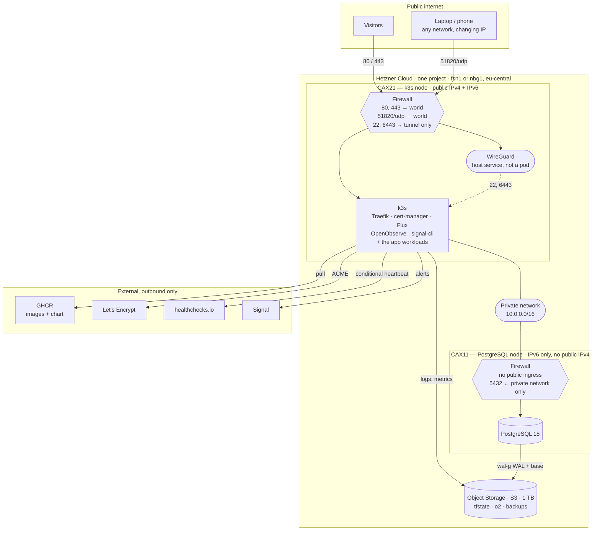
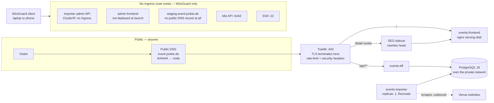
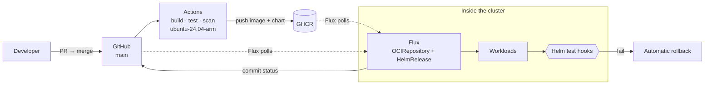

# Platform Setup — Hetzner + k3s, from nothing to go-live

Status: **plan**, 2026-08-10. Nothing in here is built yet.

This is the working plan behind the `v0.2 — Deployable` milestone and the operational half of `v1.0 — Go-live`. It answers the questions that came up while
planning [#260](https://github.com/enorm-labs/event-checker/issues/260). **Every decision in it is now made** (§11); what remains is work and a few accounts.

**The decisions it rests on:** [ADR-012](adr/ADR-012_CLOUD_PLATFORM.md) (Hetzner + k3s, and its 2026-08-10 amendment removing Cloudflare) ·
[ADR-015](adr/ADR-015_OBSERVABILITY_STACK.md) (observability — OpenObserve, accepted on trial; §5 below is the summary) ·
[ADR-014](adr/ADR-014_RENDERING_STRATEGY.md) (the SEO sidecar) · [ADR-008](adr/ADR-008_IMPORT_JOB_SCHEDULING.md) (the importer is always-on and
single-instance).

---

## 1. Sizing — and why ADR-012's number survived

ADR-012 sized a **CX33** (4 vCPU / 8 GB, €8.49) for the k3s node, doing that arithmetic against *two JVMs, an nginx and an ingress*. The tool list originally on
the table — ArgoCD, a full APM stack, OpenSearch, Superset, a local LLM — was a different machine class, and would have forced a **CX43** at €15.99.

**It does not, because of the decisions in §4.** ArgoCD is out in favour of Flux at a quarter the memory, and OpenSearch, Superset and the local LLM are all
deferred with named triggers. What remains fits, with room.

Realistic resident memory, measured in "what it actually uses", not "what the docs say it can survive on":

| Component                                        | RAM         | Note                                            |
|--------------------------------------------------|-------------|-------------------------------------------------|
| k3s server + CoreDNS, metrics-server, local-path | ~800 MB     | The floor                                       |
| Traefik (bundled with k3s)                       | ~100 MB     |                                                 |
| cert-manager                                     | ~150 MB     | §6                                              |
| `events-bff` (JVM)                               | ~900 MB     | 512 MB heap plus metaspace, threads, direct     |
| `events-importer` (JVM)                          | ~900 MB     |                                                 |
| `events-frontend` (nginx)                        | ~32 MB      |                                                 |
| admin frontend (nginx)                           | ~32 MB      | Not built yet                                   |
| SEO sidecar (ADR-014)                            | ~100 MB     | Not built yet                                   |
| **Application subtotal**                         | **~3.0 GB** |                                                 |
| ~~ArgoCD~~                                       | ~~1.2 GB~~  | **Rejected — §4**                               |
| Flux                                             | ~300 MB     | **§4.** A quarter of ArgoCD, and it is required |
| Observability (OpenObserve, ADR-015)             | ~1.0 GB     | SigNoz would be ~5 GB                           |
| OTel collector / log shipper                     | ~200 MB     |                                                 |
| **Total**                                        | **~4.5 GB** | Plus OS ≈ **5.0 GB**                            |

On an 8 GB node that leaves **~3.0 GB**, and the worst spike is a deploy running a second JVM alongside the one it is replacing — about 900 MB — so the floor
under pressure is still ~2.1 GB free. That is genuine headroom.

**Had ArgoCD been taken instead of Flux, this would have needed the next size up.** The margin was that thin, which is worth recording: it was not a close call about GitOps
philosophy, it was a close call about whether a JVM gets OOM-killed mid-deploy. Flux does the same job for a quarter of the memory.

### What to order

> **Amended 2026-08-10: the CX line is unavailable.** ADR-012 and the table above are written against Hetzner's Cost-Optimized `CX` types, which are not
> orderable at present. The replacement is the **`CAX` (Ampere ARM)** line, and it is an upgrade rather than a compromise — see below.

| Role | Type | vCPU / RAM / disk | Notes |
|---------------------|-----------|-------------------|--------------------------------------------------------------|
| **k3s node** | **CAX21** | 4 ARM / 8 GB / 80 GB | Direct CX33 equivalent. Primary IPv4 + IPv6 |
| **PostgreSQL node** | **CAX11** | 2 ARM / 4 GB / 40 GB | Direct CX23 equivalent. **No public IPv4** |
| **Staging** | **CAX11** | 2 ARM / 4 GB / 40 GB | All-in-one. Needs a public IPv4 for the WireGuard endpoint |
| Private network | — | free | One `/16`, both production servers attached |
| Firewalls | — | free | Two, one per role |
| Backups | — | 20 % of server price | Hetzner's automated daily backups, both production servers |
| **Object Storage** | — | 1 TB inc. | **One subscription, three buckets** — see below |

**Not ordered, and why:** Load Balancer (k3s ServiceLB binds to the node IP on one node) · Volumes (local NVMe is enough until the database outgrows 40 GB) ·
Floating IPs (for failover between servers, which does not apply) · **Storage Box** (superseded — see below) · Storage Share.

**Keep everything in one location** — Falkenstein or Nuremberg, both in the `eu-central` network zone. Traffic between servers and Object Storage inside that
zone is free; splitting locations quietly makes it billable.

#### The order, step by step

Only the first three steps are done by hand. Everything after them is declared in `infra/` and applied
([#260](https://github.com/enorm-labs/event-checker/issues/260)) — so **do not create the servers in the console**, or the first `tofu apply` will either
duplicate them or need an import.

1. **Create a Cloud project.** Free, and it is the boundary the API token is scoped to.
2. **Create an API token** with read *and* write. It is shown once.
3. **Create the Object Storage subscription and the `…-tfstate` bucket**, plus its S3 credentials. This bucket is the one genuinely hand-made resource, because
   a state backend cannot be managed by the state it holds (§10 step 4). The other two buckets can be declared.
4. Everything else — servers, network, subnet, firewalls, backups, the remaining buckets — comes from `tofu apply`.

#### The one unknown, and it is cheap to resolve

**The PostgreSQL node is specified with no public IPv4, and it is not confirmed that this leaves it able to reach the internet for `apt`.** Hetzner's
documentation says a server has no public interface unless a Primary IP is assigned, and that IPs are optional — but it does not state whether an IPv6-only
server has working egress to IPv4-only destinations, and some package mirrors and extension repositories are IPv4-only.

**This is reversible in seconds** — Primary IPs attach and detach at any time — so it is not worth resolving in advance. Bring the node up IPv6-only, run
`apt update`, and if it fails, attach an IPv4 for ~€0.50/month and move on. The alternative, routing its egress through the k3s node as a NAT gateway, keeps the
node fully private but is cloud-init work that should not be done speculatively.

**Staging is the exception that does need IPv4**, even though it is otherwise the most private thing here: WireGuard's endpoint must be reachable from wherever
you happen to be, and most networks you will connect from are IPv4-only.

### Why ARM, and the one thing to check first

- **The development laptop is already arm64**, so local images and production images become the same architecture. That is better parity than the x86 plan, not
  worse.
- **GitHub's arm64 runners are generally available and free for public repositories** (`ubuntu-24.04-arm`). That removes the only serious objection — building
  arm64 images under QEMU emulation, which is punishing for JVM builds. This repository is public, so native builds cost nothing.
- Every component has arm64 images: k3s, Temurin, PostgreSQL 18, nginx, Traefik, cert-manager, Flux, OpenObserve, `wal-g`.

**Verify `signal-cli-rest-api` publishes an arm64 manifest before committing to it.** It is JVM-based and popular with Home Assistant users, who are
overwhelmingly on ARM, so it is near-certain — but it is the one component on the list not confirmed.

**The standing risk:** a future dependency that ships amd64-only images. Everything needed today is fine, and if it ever bites, moving to the `CPX` (shared AMD)
line is a rebuild rather than a redesign — neither the Helm chart nor the OpenTofu changes.

### Object Storage replaces the Storage Box

Hetzner's own storage-selection guide recommends **Object Storage for database backups**, and `wal-g` speaks S3 natively. So one product covers all three
storage needs rather than two:

| Bucket | Holds |
|-------------|--------------------------------------------|
| `…-tfstate` | OpenTofu state |
| `…-o2` | OpenObserve's Parquet data (ADR-015) |
| `…-backups` | `wal-g` WAL and base backups ([#270](https://github.com/enorm-labs/event-checker/issues/270)) |

**€4.99/month base, 1 TB storage and 1 TB egress included**, no per-bucket or per-request charge — buckets are free, so use three. That is more than the €1–3
this document first estimated, but it **deletes the Storage Box line entirely**, so the total barely moves and there is one fewer product to operate.

### On the prices in this document

**Treat every euro figure here as indicative and re-check it in the console before ordering.** Hetzner raised cloud prices twice in 2026 — in April and again on
15 June — and the withdrawal of the CX line moved the landscape again. The figures above and in ADR-012 were taken from public sources rather than from an
account, and Hetzner's own pricing tables render client-side and could not be read directly. The *shape* of the decision is robust to a 30 % price move; the
arithmetic is not.

**The upgrade path remains a single step:** CAX31 (8 vCPU / 16 GB) if OpenObserve fails ADR-015's footprint test, or if Grafana joins it later. Nothing else in
the design changes.

---

## 2. What actually runs — the full inventory

### 2.1 The infrastructure, and what is reachable from where

The boundaries are the point of this diagram. Almost everything is unreachable from the internet; the exceptions are deliberate and few.



**There is no NAT gateway, deliberately.** The PostgreSQL node reaches the internet over **IPv6** for package updates and nothing else. Routing its egress
through the k3s node as a NAT is possible and is the documented fallback if IPv6-only egress turns out not to work (§1) — but it is cloud-init work that should
not be written speculatively.

**Note which arrows do not exist.** Nothing reaches the PostgreSQL node from the internet, in either direction, at any port. Nothing reaches `6443` or `22`
without the tunnel. And no arrow points *into* the cluster from GitHub — that is §2.3.

### 2.2 The access paths — how a request actually gets served



**Same origin is the whole trick.** `/` and `/api` are served by one ingress on one hostname, so there is no CORS configuration anywhere and session cookies
will be first-party when authentication lands. That property is why the frontend is a container rather than a CDN-hosted static site — ADR-012 §Frontend
hosting.

**The importer is not in the request path at all.** It is a scheduler that talks outbound to venue sites and inbound to the database; no visitor request ever
reaches it. Its admin API is a `ClusterIP` service with no `Ingress` object — not merely firewalled, but never routed.

### 2.3 The deploy path — pull, never push



**Every arrow crossing into the cluster is dashed, and they all start inside it.** That is the entire security argument for Flux: CI holds no cluster
credential, because there is nothing for it to hold. A repository compromise does not imply a cluster compromise.

It is also why the smoke tests are Helm test hooks rather than a job in Actions — CI cannot reach staging or production, by design, so verification has to run
where the workloads do.

### Ours

| Workload          | Shape                    | Replicas      | Notes                                              |
|-------------------|--------------------------|---------------|----------------------------------------------------|
| `events-importer` | JVM, always-on scheduler | **exactly 1** | ADR-008. `strategy: Recreate`, never rolling       |
| `events-bff`      | JVM, stateless HTTP      | 1–N           | The only genuinely scalable thing here             |
| `events-frontend` | nginx serving `dist/`    | 1–N           | Same origin as the API — ADR-012 §Frontend hosting |
| admin frontend    | nginx                    | 1             | **Not built.** Must not be publicly routed — §8    |
| SEO sidecar       | head rewriting           | 1             | ADR-014, settled as in-cluster by #412             |

### Infrastructure

| Thing           | Choice                                           | Confidence                                                     |
|-----------------|--------------------------------------------------|----------------------------------------------------------------|
| Ingress + TLS   | **Traefik** (ships with k3s) + **cert-manager**  | Decided — §6                                                   |
| Load balancer   | **None.** k3s ServiceLB binds to the node IP     | Decided — §6                                                   |
| Registry        | **GHCR**, not Docker Hub                         | Decided — §3                                                   |
| GitOps / deploy | **Flux** (pull-based); CI builds and pushes only | Decided — §4, §4a                                              |
| Observability   | **OpenObserve**                                  | ADR-015, *Accepted on trial* — §5                              |
| Database        | PostgreSQL 18 on its own VM                      | ADR-012                                                        |
| Backups         | `wal-g` → Object Storage (S3)                    | [#270](https://github.com/enorm-labs/event-checker/issues/270) |
| Secrets         | **SOPS + age**                                   | Decided — §8                                                   |

### Deferred, with reasons — §4

OpenSearch · Superset · local LLM.

---

## 3. Container registry — GHCR, not Docker Hub

**Use `ghcr.io`.** Four reasons, one of which is an outage waiting to happen:

- **Docker Hub rate-limits pulls.** A cluster that pulls images on every deploy, from an IP shared with other Hetzner customers, is exactly the profile that
  trips anonymous and free-tier limits. The failure mode is `ImagePullBackOff` during a deploy you are already halfway through.
- **It is already authenticated.** GitHub Actions gets a token for free; no registry credential to create, store or rotate.
- **It speaks OCI artifacts, so the Helm chart lives next to the image**, which is the point of bundling the two.
  `helm push`
  to `oci://ghcr.io/enorm-labs/charts/event-junkie` works, and the chart version and image tag can be stamped from the same build.
- Free for public images, and these are public.

**Privacy check:** GHCR is GitHub, a US company — but it sits in the *build and deploy* path, not the visitor request path, contains no personal data, and
GitHub is already a named processor in both privacy notices for issue handling. Nothing to add to the notice. This is the AGENTS.md §Privacy re-check being
done, not skipped.

---

## 4. How deploys happen

### How deploys happen — **decided 2026-08-10: Flux. Not ArgoCD, and not plain Helm from CI.**

ArgoCD is built for many applications, many clusters and many teams. This is **one application, one cluster, one developer**, and its ~1.2 GB is what would
force a CX43. That part was never in doubt.

**Plain Helm from CI was chosen first, and then withdrawn, because it cannot work here.** The reason is worth recording in full, because it is not obvious and
it is not about GitOps philosophy at all:

> `helm upgrade` from GitHub Actions requires the runner to reach the Kubernetes API on port 6443. `admin_cidr` exists to make exactly that unreachable. The
> obvious fix — allowlist GitHub's runners — **is arithmetically impossible**: GitHub publishes **7,297 CIDRs** for Actions (5,658 IPv4), and a Hetzner cloud
> firewall permits **500 effective rules**, counting each source separately. Off by a factor of fourteen, and the list changes.
>
> The remaining ways to make push-based deploys work were: leave 6443 open to the internet and rely on client-certificate auth; tunnel in via Tailscale (a US
> SaaS in the deploy path, against the posture #412 established); hand-roll a WireGuard tunnel inside a runner; or put a self-hosted runner on the node — which
> is ruled out outright, because GitHub warns against self-hosted runners on **public** repositories, where a fork PR can execute arbitrary code on what would
> here be the production node.

The options as they were weighed:

|                        | Cost    | What you get                                                                                                                                                                                                                       |
|------------------------|---------|------------------------------------------------------------------------------------------------------------------------------------------------------------------------------------------------------------------------------------|
| **Plain Helm from CI** | 0 MB    | `helm upgrade --install` in the deploy workflow ([#264](https://github.com/enorm-labs/event-checker/issues/264)). Simplest, and the cluster holds no deploy machinery at all. No drift detection, no self-healing, no rollback UI. |
| **Flux**               | ~300 MB | Real GitOps — the cluster reconciles itself towards the repo, drift is corrected, and a rollback is a git revert. A quarter of ArgoCD's footprint, no UI.                                                                          |
| **ArgoCD**             | ~1.2 GB | Same, plus the UI that is the actual reason people choose it.                                                                                                                                                                      |

**Decision: Flux.** It is **pull-based**, which dissolves the problem rather than working around it: the cluster reaches *out* to GitHub and GHCR, so nothing
inbound is required and **6443 need never be publicly reachable at all** — §8a later closes it completely, behind WireGuard. ~300 MB, still comfortable on the
CX33.

Two consequences beyond the firewall, both good, and the second one matters more than the first:

- **CI no longer holds a cluster credential — because there is no longer one to hold.** ADR-012 called this out as a known weakness of choosing Hetzner:
  *"GitHub Actions cannot use OIDC against Hetzner, so deploys authenticate with a scoped kubeconfig or deploy key held as a repository secret, rotated
  deliberately. This is a genuine step down from AWS/GCP OIDC and should be treated as such."* **Flux removes that credential entirely.** A repository
  compromise no longer implies a cluster compromise. That is a straight improvement on the platform decision, arrived at sideways.
- **Rollback becomes `git revert`**, and drift is corrected rather than merely detected.

**What CI does now:** build, test, scan, and push the image and chart to GHCR. It does not deploy. Flux notices the new artifact and reconciles.

**What is knowingly given up:** the immediate, synchronous "the workflow went green so it is live" feedback loop. Deployment becomes eventually-consistent, so
"is it actually running?" is a question for Flux, not for the Actions log — see §4a for how that is put back on GitHub.

**Not ArgoCD**, because the only thing it adds over Flux here is a UI, and it costs 900 MB more and a node upgrade to have one.

## 4a. Deployment visibility on GitHub

> **This section was rewritten when §4 landed on Flux, and the earlier answer is now wrong in an instructive way.** Under push-based deploys the advice was: add
> `environment:` to the deploy job, GitHub creates the deployment record for free, and *"the REST Deployments API is not needed"*. **With pull-based deploys
> none of that holds** — no Actions job deploys anything, so no deployment record is created, and the API turns out to be exactly the right tool after all. It
> is a good illustration of why the deploy mechanism had to be settled before the reporting around it.

### The problem

Flux reconciles on its own schedule. A green Actions run now means "the image was pushed", not "it is live" — those are minutes apart and can diverge
indefinitely if reconciliation fails. Nothing tells GitHub what happened.

### The answer: Flux reports back

Flux's **notification-controller** has two GitHub providers, and they do different jobs:

| Provider         | What it does                                                      | Use it for                                                        |
|------------------|-------------------------------------------------------------------|-------------------------------------------------------------------|
| `github`         | Posts **commit statuses** from `Kustomization` events             | The baseline. Every commit gets ✅/❌ for "Flux reconciled this"  |
| `githubdispatch` | Fires a `repository_dispatch` event carrying Flux's event payload | Triggering a workflow that then writes a proper Deployment record |

**Start with `github` alone.** A commit status showing reconciliation succeeded or failed, right next to the CI checks, is most of the value for none of the
work — and it is truthful in a way a push-time deployment record is not, because it is written *after* the cluster converged.

**Add `githubdispatch` → a small workflow → the Deployments REST API** only if the Deployments view specifically is wanted. That workflow creates the deployment
and immediately sets its status from the Flux payload, so the entry reflects reality rather than intent.

### Do the environments still earn their place?

**Less than they did, and it is worth being straight about that** — most of the case for them rested on CI holding the deploy credential, which it no longer
does:

- **Environment secrets: largely moot.** There is no `KUBECONFIG` to scope, because Flux authenticates itself from inside the cluster. The thing environments
  were protecting has ceased to exist — which is a better outcome than protecting it well.
- **The approval gate: replaced by git.** Promotion to production is a merge, so branch protection and PR review already gate it, and they gate it in the place
  the change actually happens.
- **Deployment history: worth having**, and it is what the `github` provider or the dispatch route above delivers.

So creating `staging` and `production` environments is now **optional rather than foundational**. Do it if the Deployments view is wanted as the single place to
see "what is on what" — declare them on the dispatch-triggered workflow, with `url:` pointing at each site. Skip it and nothing breaks.

Two notes that survive the rewrite:

- **Do not enable *prevent self-review*** if you do use protection rules. As sole maintainer it locks the environment permanently, and the failure is confusing
  because the approval UI appears and then refuses.
- **Environment secrets and protection rules are public-repo-only on Free/Pro/Team plans.** This repository is public, so they are free; going private would
  need a paid plan.

### Bootstrapping Flux

`flux bootstrap github` commits Flux's own manifests to the repository and creates a deploy key. It needs a GitHub PAT **once, from your laptop** — not a stored
secret, and not something CI ever holds.

### Making staging invisible from the internet

> **Superseded 2026-08-10.** This section originally recommended a Traefik `basicAuth` middleware, because at that point there was no VPN in the design and an
> IP allowlist could not follow you between networks. §8a's WireGuard changes the answer: staging can be made **unreachable** rather than merely
> password-protected, which is strictly better and, as it turns out, removes three separate problems the basic-auth design had to work around.

**Yes — staging can be entirely absent from the public internet, while still being a real environment.** The important thing is that this does *not* mean
falling back to `kubectl port-forward`: a port-forward skips Traefik, TLS and the whole routing path, so it tests a different topology than production, which is
most of what staging exists to check.

The design:

| | |
|---|---|
| **No public `A`/`AAAA` record** | `staging.event-junkie.de` simply does not resolve on the public internet |
| **Firewall: no public 80/443 on the staging node** | Only `51820/udp` for WireGuard is exposed, and that is silent to scanners |
| **Ingress listens on the tunnel** | Traefik, routing, middlewares and TLS all behave exactly as production |
| **Name resolution over WireGuard** | The tunnel's DNS (or a `hosts` entry) maps the hostname to the tunnel address |

**The one real consequence: TLS must switch to DNS-01.** Let's Encrypt's HTTP-01 challenge requires Let's Encrypt to *reach* the host, which is precisely what
this design prevents. **DNS-01 works** — cert-manager proves control by writing a TXT record via the Hetzner DNS API, which needs no inbound access at all. So
staging still gets a genuine, publicly-trusted certificate for a hostname that has no public address. Worth noting the shape of that: **the TXT record is
public, the `A` record never exists.**

This needs a cert-manager webhook for Hetzner DNS and an API token in a secret. That cost would not be worth paying for production alone, which can use
HTTP-01 — staging is what justifies it, and a wildcard comes within reach as a side effect.

**What this removes, which is the argument for it:**

- **The basicAuth-versus-ACME trap is gone**, because HTTP-01 is no longer used. That was the single most likely afternoon-loser in the previous design.
- **No password to set, share, rotate or leak**, and no `basicAuth` middleware to misplace onto the wrong Ingress.
- **Indexing stops being a risk rather than a managed risk.** A crawler cannot reach what does not resolve. Still set `X-Robots-Tag: noindex, nofollow` and
  override `robots.txt` per environment — belt and braces, because the cost is one header and the failure mode is a staging site in Google's index — but it is
  now genuinely defence-in-depth rather than the actual control.

**And one thing it breaks, which needs an answer:** CI cannot reach staging either, so **post-deploy smoke tests cannot run from GitHub Actions**. This is the
same shape as the problem that killed push-based Helm in §4, and it has the same resolution: run the checks *inside* the cluster. Flux's `HelmRelease` supports
Helm test hooks with `test.enable`, and can roll back automatically when they fail — which is a better arrangement than an external smoke test anyway, because
the rollback is automatic rather than a human noticing a red build.

**If staging ever needs to be shown to someone else** — a designer, a tester — the fallbacks are a WireGuard config for them, or temporarily re-adding a public
Ingress with `basicAuth` as originally designed. Keep that option documented rather than deleted.

---

## 4b. The remaining "do we need it?" questions

### OpenSearch — no, and probably never

**PostgreSQL full-text search is genuinely enough here.** `tsvector` + a GIN index handles tens of thousands of events with room
to spare, `pg_trgm` covers fuzzy venue and artist matching, and `unaccent` handles the German. Against that, OpenSearch is a second JVM wanting 2 GB minimum, a
second datastore to back up, a second thing to keep in sync, and a second failure mode — for a corpus that is currently eight venues.

**Revisit when** search-quality complaints arrive that are demonstrably ranking problems rather than data problems, or when the corpus passes roughly a million
documents. Neither is close.

### Apache Superset — no, and the alternative is already in the stack

Superset is Python, Celery, Redis and its own metadata database — call it 1.5–2 GB — to do something **Grafana does with a PostgreSQL datasource for ~200 MB**.
And OpenObserve's own dashboards (ADR-015) cover the operational half already.

**So: no Superset.** If business dashboards over the events data become a real need, add Grafana pointed at the read replica or the primary, and keep the query
load away from the BFF's connection pool. That is the whole answer.

### Local LLM / Ollama — no, and this one is not close

Three separate reasons, any one of which is sufficient:

- **Hardware.** A useful model needs a GPU. On CPU, a 7B model wants ~8 GB of RAM to itself and produces single-digit tokens per second — it would be the
  largest process on the node by a factor of two, to do nothing quickly. Hetzner's GPU offerings are dedicated servers starting an order of magnitude above this
  project's entire budget.
- **There is no use case yet.** It is a technology in search of a problem here. The plausible ones — genre normalisation, artist-name disambiguation, event
  deduplication — are all currently handled by deterministic code (`GenreNormalizer`, `ArtistNameMapping`, `EventFieldMapping`) that is testable, debuggable and
  free. Replacing a correct pure function with a probabilistic one is a downgrade unless the function is failing.
- **It would need its own ADR and its own privacy analysis** before it touched anything, per AGENTS.md §Privacy.

**Revisit when** a specific problem appears that deterministic code demonstrably cannot solve — and then evaluate a small purpose-built model or a metered API
call *first*, because both are likely cheaper than a GPU server. Self-hosting is the answer to a privacy question, and there is no personal data in a genre
string.

---

## 5. Observability — see ADR-015

The full comparison is [ADR-015](adr/ADR-015_OBSERVABILITY_STACK.md), **accepted on trial 2026-08-10**. The short version:

**OpenObserve** — one Rust binary covering logs, metrics, dashboards and alerting, storing Parquet in Hetzner Object Storage. ~1 GB against SigNoz's ~5 GB, and
its object-storage backend means log retention stops competing with the node's disk. Licence is AGPL-3.0, which is fine for unmodified self-hosting and is
called out explicitly in the ADR rather than glossed.

**Accepted to be judged, with five written tests** (ADR-015 §Status) applied after a fortnight on staging and again before go-live: does the zero-events alert
actually fire, is the footprint really ~1 GB, is log search usable at 23:00, can it chart the business metrics, and are upgrades uneventful. **If any fails, the
exit is fallback 1 — VictoriaMetrics + VictoriaLogs + Grafana** — and it costs a Helm release plus rebuilt dashboards, not re-instrumentation, because §7's
instrumentation is vendor-neutral OpenTelemetry either way. That property is what makes trialling the youngest product a reasonable thing to do rather than a
gamble.

**Ranked alternatives:** VictoriaMetrics + VictoriaLogs + Grafana (Apache 2.0, same footprint, five components instead of one — the *safest* choice) ·
kube-prometheus-stack + Loki (the standard, but 3–4 GB) · SigNoz (best tracing, but ClickHouse wants the whole node).

**Netdata as a complement**, self-hosted only — ~200 MB for zero-configuration per-second node visibility. Not connected to Netdata Cloud, which would
reintroduce a processor that #412 just removed.

**The requirement that decides it** is not infrastructure monitoring. It is that a scraper does not fail loudly: when a venue redesigns its site the importer
keeps reporting success and silently writes zero events, and nobody notices for a fortnight. Catching that needs a **business metric with an alert** —
"source X imported 0 events for 3 consecutive runs" — which is §7.

### 5a. Where alerts go — Signal, plus something outside the cluster

**Decided 2026-08-10: Signal**, via OpenObserve's webhook destination → [`signal-cli-rest-api`](https://github.com/bbernhard/signal-cli-rest-api) running in the
cluster. OpenObserve supports custom webhook templates, so the alert payload is shaped to signal-cli's API directly and there is no glue service to write.

**Signal is the right choice for a better reason than convenience: it is end-to-end encrypted.** Alert bodies will carry venue names, error strings, query
fragments and possibly IP addresses — and with Signal the carrier cannot read any of it. Telegram's Bot API, the obvious easy alternative, is plaintext to
Telegram's servers. Same effort, materially worse posture, and this project just spent a day removing a US company that *could* read request data.

**The trap, and it is the one that actually matters:**

> **An alerting path that runs on the node it monitors cannot tell you the node is dead.** If the cluster is down, OpenObserve is down, signal-cli is down, and
> the silence is indistinguishable from everything being fine. This is the classic way a carefully-built alerting stack turns out to have never been able to
> report the only outage that counted.

So alerting is **two layers, and the second is not optional**:

| Layer                                           | Runs            | Catches                                                                          | Cannot catch                   |
|-------------------------------------------------|-----------------|----------------------------------------------------------------------------------|--------------------------------|
| OpenObserve → Signal                            | In the cluster  | The app misbehaving: zero-event imports, error rates, disk filling, pod restarts | The cluster being gone         |
| **External uptime monitor + dead-man's switch** | **Off Hetzner** | The node, k3s, or the whole site being down; alerting itself having died         | Nuance — it only knows up/down |

The dead-man's switch is the part people skip: a heartbeat the cluster must send on a schedule, where **absence** raises the alarm. Without it, "no alerts for
three weeks" reads as good news whether it is or not. ADR-012 anticipated exactly this — it budgeted for *"an external uptime/monitoring service"* out of the
Hetzner savings. An uptime monitor only makes requests to public URLs and receives our own responses, so no visitor data reaches it and the residency question
does not arise.

**Four caveats on Signal, all of which are acceptable but none of which should be discovered later:**

1. **There is no official Signal bot API.** `signal-cli` is unofficial and Signal does not support automation. The account could in principle be restricted.
   This is a knowing trade, not an oversight.
2. **It needs its own phone number** — a cheap prepaid SIM. Do not use your personal number: the account becomes a bot, and Signal blocks most VoIP providers
   for registration.
3. **Registration state must persist on a PVC.** Lose it and alerts stop *silently* — which is the same failure the dead-man's switch exists to catch, and the
   second reason it is not optional.
4. **~150–250 MB**, because signal-cli is a JVM. It fits in the CX33's ~3 GB headroom but it is not free; the GraalVM-native mode is lighter if it becomes
   tight.

**Test the whole chain deliberately, including a real outage.** An alert route that has never delivered a message at 23:00 is a hypothesis, not a route.

---

## 6. TLS, ingress, MetalLB and Let's Encrypt

### Does anything set up TLS automatically?

**No.** That was Cloudflare's job in ADR-012 as originally written, and #412 removed it. On Hetzner nothing terminates TLS on your behalf.

### Let's Encrypt via cert-manager — decided

**cert-manager** with a Let's Encrypt `ClusterIssuer`, HTTP-01 challenge. Traefik has its own ACME client and it works, but cert-manager wins on three points:
it stores certificates as Kubernetes Secrets rather than a file on a PVC, it survives Traefik being replaced, and it is what the Helm chart should depend on if
the "exit is cheap" property in ADR-012 is to mean anything.

Practical notes that cost people a day each:

- **Use the Let's Encrypt *staging* issuer while testing.** Production has a limit of 50 certificates per registered domain per week and 5 duplicates per week.
  It is very easy to burn that debugging an Ingress annotation, and then you are locked out for seven days.
- **HTTP-01 needs port 80 reachable and the A record already resolving.** So the order is DNS → deploy → certificate, and it cannot be reordered.
- **DNS-01 is required for staging**, which has no public address for HTTP-01 to reach (§4a). It needs a cert-manager webhook for Hetzner DNS and an API token
  in a secret. Production can stay on HTTP-01, but running one mechanism for both is simpler, and DNS-01 brings a wildcard within reach as a side effect.
- `event-junkie.com` needs its own certificate for the 301 redirect — one more entry, not a wildcard.
- **Set the CAA record first** (`0 issue "letsencrypt.org"`), which is already in [#259's checklist](https://github.com/enorm-labs/event-checker/issues/259).

### MetalLB — no

**Not needed, and probably never.** k3s ships **ServiceLB** (klipper-lb), which binds `LoadBalancer` services straight to the node's IP. On a single node that
is exactly the right behaviour. MetalLB solves address allocation on bare metal with a pool of IPs, which is not the situation.

If a second node ever arrives, the answer is not MetalLB either — it is the **Hetzner Cloud Controller Manager** provisioning a real Hetzner Load Balancer
(LB11, ~€7.49/mo), which is what ADR-012 already anticipated.

### On `hetzner-k3s` and the autoscaling tutorial

[`vitobotta/hetzner-k3s`](https://github.com/vitobotta/hetzner-k3s) is a good tool and does HA control planes and autoscaling well. **It is deliberately not
used here**, because it owns the cluster lifecycle: adopting it means adopting its abstractions rather than OpenTofu's. ADR-012's portability argument —
*"keeping the application to a Docker image plus a Postgres URL is what keeps the exit cheap"* — applies to the infrastructure layer too. Same reasoning rules
out the community tutorial's `cluster-autoscaler`: there is nothing to autoscale on a fixed single node.

Do borrow their k3s flags and firewall rules. Do not adopt their control plane.

---

## 7. Instrumentation — logging and metrics in the applications

Current state, checked: both apps have `spring-boot-starter-actuator` and expose **only** `health,info`. There is no Micrometer registry, no `logback.xml`, no
structured logging configuration. This is greenfield.

Deliberately **backend-agnostic** — all of it works unchanged whichever backend ADR-015's trial ends on.

### JSON structured logging

Spring Boot has built-in structured logging, so no Logback JSON encoder dependency is needed:

```yaml
logging:
  structured:
    format:
      console: ecs        # or logstash / gelf — ECS is the most widely parsed
```

Turn it on **only in the container profile**, never locally — plain console logs are what a terminal wants.

**The WebFlux trap, which is the one that will actually cost time.** MDC does not propagate across reactive operators by default: a `traceId` put into MDC in a
filter is simply absent by the time the log statement runs on another thread. It fails silently — you get logs, they just have no correlation fields, and it
looks like a configuration problem rather than a threading one. The fix is `Hooks.enableAutomaticContextPropagation()` at startup plus Micrometer's
`ContextRegistry`; both apps are WebFlux, so both need it, and it needs a test that asserts a `traceId` actually appears.

**What every log line should carry:** `traceId`, `spanId`, service name, version (already stamped from `gradle.properties`), and — for the importer —
`sourceId` / `venueSlug` / `importRunId`, because the question asked of importer logs is always "what happened to *this venue* on *this run*".

**Do not log client IPs without deciding to.** [LEGAL.md](LEGAL.md) §7.5 — since #412 removed the proxy, the origin now sees real addresses, and nginx's access
log is on by default. `RequestLoggingFilter` is IP-free today by design; keep it that way.

### Metrics via Micrometer

Add `micrometer-registry-prometheus` to both apps and expose the endpoint:

```yaml
management:
  endpoints:
    web:
      exposure:
        include: health,info,prometheus
```

Free from the framework: JVM memory and GC, HTTP server request rate/latency/status, R2DBC pool utilisation, Flyway migration state.

**The ones that have to be written, because they are the ones that matter.** Infrastructure metrics tell you the pod is alive; these tell you it is *working*:

| Metric                                       | Type                                  | Why                                                                                 |
|----------------------------------------------|---------------------------------------|-------------------------------------------------------------------------------------|
| `importer.run.duration`                      | Timer, tagged `source`                | Detects a venue that got slow before it gets fatal                                  |
| `importer.run.outcome`                       | Counter, tagged `source`, `outcome`   | success / failure / partial                                                         |
| `importer.events.written`                    | Counter, tagged `source`, `operation` | inserted / updated / skipped                                                        |
| **`importer.events.written` = 0 for N runs** | **Alert rule**                        | **The silently-broken-scraper alarm — the single most valuable rule in the system** |
| `importer.scrape.failures`                   | Counter, tagged `source`, `reason`    | Distinguishes HTTP 403 from a parse failure                                         |
| `importer.source.last_success`               | Gauge, tagged `source`                | Age of the last good run; alert past ~3× its schedule                               |
| `importer.source.running`                    | Gauge                                 | Catches the ADR-008 `RUNNING`-forever state a restart can strand                    |
| `bff.events.served`                          | Counter, tagged endpoint              | Is anyone actually using it                                                         |
| `db.events.total` / `db.events.future`       | Gauge                                 | A future count trending to zero is a broken pipeline seen from the other end        |

That last group is what makes the dashboards *business* dashboards and not CPU graphs — and, per §4b, it is why Superset is unnecessary.

---

## 8. Security — what k3s gives you and what it does not

**k3s is not secure-by-default in the way one might hope.** It is a sane default; the gaps below are real and each is cheap to close.

What you get free: NetworkPolicy enforcement is on (kube-router, unless `--disable-network-policy`), the API server needs a token, and secrets are namespaced.

What you have to add:

|    | What                                                                     | Why                                                                                                                                                                                        |
|----|--------------------------------------------------------------------------|--------------------------------------------------------------------------------------------------------------------------------------------------------------------------------------------|
| 1  | **WireGuard on the host; SSH and 6443 reachable only through it**        | The Kubernetes API on the public internet is the whole game. See §8a — an IP allowlist alone does not survive changing networks                                                            |
| 2  | **Default-deny NetworkPolicies per namespace**                           | Enforcement being *on* means nothing while every pod may talk to every pod. Deny, then allow                                                                                               |
| 3  | **The importer's admin API is cluster-internal only**                    | ADR-012 is explicit. No Ingress rule, ever. `kubectl port-forward` is the launch answer                                                                                                    |
| 4  | **The admin frontend is not deployed at launch**                         | Runs locally against the port-forward. When it *is* deployed, §8a's WireGuard is its access control — bind its Ingress to the tunnel and it is private without basic auth or an allowlist  |
| 5  | **Pod Security Admission `restricted`**                                  | One namespace label. Blocks privileged pods, host mounts, root                                                                                                                             |
| 6  | **Non-root, read-only rootfs, drop ALL capabilities**                    | In the Helm chart's `securityContext`. The JVM and nginx images both cope                                                                                                                  |
| 7  | **A ServiceAccount per workload, `automountServiceAccountToken: false`** | Default is the namespace's SA with a mounted token — a container escape becomes an API credential                                                                                          |
| 8  | **SOPS + age for secrets**                                               | Encrypted in git, decrypted at apply. Simpler than Sealed Secrets for one developer, and it survives a cluster rebuild — which Sealed Secrets does not, since the key lives in the cluster |
| 9  | **Traefik security headers + rate limiting**                             | HSTS, `X-Content-Type-Options`, frame options; and this is the rate-limit half of [#268](https://github.com/enorm-labs/event-checker/issues/268), which lost its free Cloudflare answer    |
| 10 | **`unattended-upgrades` in cloud-init**                                  | Nobody patches the OS by hand on a Sunday                                                                                                                                                  |
| 11 | **Trivy in CI on the built images**                                      | Dependabot and OWASP cover dependencies; neither looks at the base image                                                                                                                   |
| 12 | **Resource requests *and* limits on every workload**                     | On a single node, one leak takes down everything. This is a security control, not a tuning one                                                                                             |

**Not needed here:** a service mesh (two services), Falco (no capacity to respond to its findings), OPA/Kyverno (PSA covers the realistic cases at a fraction of
the effort).

### 8a. Admin access — WireGuard, because `admin_cidr` alone does not survive real life

**The problem with an IP allowlist is not that home addresses rotate. It is that work does not all happen at home.** A hotspot, a café, an office, a train and a
VPN each give a different public address. An `admin_cidr` locked to one of them means a `tofu apply` after every move — and no access at all from anywhere
unplanned, including the places where emergency access is most likely to be needed.

**So WireGuard on the node, and `admin_cidr` demoted to a bootstrap value.**

|                         | Firewall              | Reachable by                                           |
|-------------------------|-----------------------|--------------------------------------------------------|
| `80`, `443`             | Open to the world     | Everyone. It is a public website                       |
| `51820/udp` (WireGuard) | **Open to the world** | Anyone may send packets; only a valid key gets a reply |
| `22` (SSH)              | **Tunnel only**       | You, from any network, at a fixed VPN address          |
| `6443` (k8s API)        | **Tunnel only**       | Same                                                   |

**Opening the WireGuard port to the world is not a weakening — it is the point.** WireGuard does not reply to unauthenticated packets *at all*: without a valid
key, the port is indistinguishable from a closed one to any scanner. It is a far better public-facing surface than SSH, which announces itself, its version and
its willingness to negotiate to anyone who connects.

**Run it on the host via cloud-init, not in the cluster.** Emergency access must not live inside the thing that might be broken — a WireGuard pod is useless
precisely when k3s is the problem.

**What this changes elsewhere, and it is a nice simplification:** the admin frontend (§8 item 4) and the importer's admin API stop needing an ingress allowlist
or a basic-auth middleware. Bind them to the tunnel interface and they are private by construction, with no credentials to manage and nothing exposed to guess
at. That retires the awkward gap #412 left when Cloudflare Access disappeared.

**`admin_cidr` still exists, with a narrower job.** The very first `apply` happens before WireGuard is running, so the firewall needs to admit *somewhere* long
enough to bring the tunnel up:

```sh
tofu apply -var "admin_cidr=$(curl -s https://ifconfig.me)/32"
```

After that it is break-glass rather than daily-use, and it can be tightened or removed.

**The fallback below the fallback is Hetzner's browser console** — VNC to the server regardless of firewall, WireGuard or SSH state. It is the reason none of
this is unrecoverable, and it is worth logging into once *before* you need it, so the first time is not during an outage.

---

## 9. Local testing

Everything below the cloud layer can be exercised without spending money, which is [#263](https://github.com/enorm-labs/event-checker/issues/263):

- **k3d** — the chart, the images, ingress, cert-manager with a self-signed issuer, NetworkPolicies, and the observability stack all run locally.
- **Flux runs on k3d too**, pointed at the same repository, and this is the part most worth rehearsing: reconciliation timing, what a failed `HelmRelease` looks
  like, and whether the test hooks actually roll back. Discovering that on production is discovering it during an incident.
- **`tofu validate` and `tofu fmt`** run without credentials. `tofu plan` does not — it needs a token, so the OpenTofu is unproven until someone applies it.
- **What cannot be tested locally:** cloud-init, the firewall rules, real Let's Encrypt issuance, the Hetzner CCM, and DNS. Those are staging's job, which is
  [#265](https://github.com/enorm-labs/event-checker/issues/265) — and the reason ADR-012 insisted staging was worth its ~€7.

---

## 10. Step-by-step

Ordered by dependency. Each step names its issue.

### Phase A — foundations

1. ~~Decide ArgoCD vs Flux vs plain Helm~~ — **done 2026-08-10: Flux** (§4), after plain Helm proved unable to reach a firewalled API.
2. ~~Accept or reject ADR-015~~ — **done 2026-08-10: OpenObserve, on trial** (§5).
3. **Hetzner account**, project, API token with read *and* write scope — the click-by-click list is in §1, *The order, step by step*.
4. **Object Storage subscription and the state bucket, by hand** — the provider has no resource for a bucket, and a backend cannot be managed by the state it
   holds. This is a deliberate carve-out against "declared, not clicked" and `infra/README.md` will say so. Test whether `use_lockfile` works on Ceph and write
   down the answer. **Create nothing else in the console** — servers, network and firewalls are all declared.

*(GitHub Environments moved out of this phase. They are no longer a prerequisite for anything, because Flux — not CI — holds the cluster credential; see §4a.)*

### Phase B — infrastructure as code — [#260](https://github.com/enorm-labs/event-checker/issues/260)

5. **`infra/` split by lifetime, not environment.** `bootstrap/` holds the DNS zone, the Object Storage buckets' contents and the SSH key; `environments/{production,staging}/` hold servers,
   network, firewall and records. The zone being outside every environment's blast radius is what makes DNSSEC safe and the destroy/apply cycle honest.
6. **`hcloud_primary_ip` with delete protection** so a rebuilt server keeps its address and DNS never churns.
7. **cloud-init**: **WireGuard on the host** (§8a — before anything else, since it is how you get back in), k3s with `--tls-san`, `unattended-upgrades`, SSH
   hardening on the k3s node; PostgreSQL 18 bound to the private network on the DB node. Roles, credentials and `wal-g` are **not** here — they are #261 and
   #270.
8. **Apply.** Requires a token and spends money; not something an agent should do.
9. **Flip the nameservers at INWX** to Hetzner's, *after* the zone exists. DNSSEC is a separate, later step —
   [#259](https://github.com/enorm-labs/event-checker/issues/259).

### Phase C — the deployable artefact — [#261](https://github.com/enorm-labs/event-checker/issues/261), [#262](https://github.com/enorm-labs/event-checker/issues/262)

10. **Containerise the frontend** — multi-stage node → nginx, `try_files` for history mode, immutable cache headers on `/assets/`, `no-cache` on `index.html`,
    and a **relative `/api`** so one image serves every environment (#262).
11. **Helm chart** — `replicas: 1` + `strategy: Recreate` for the importer (ADR-008), the security context from §8, resource requests and limits everywhere,
    cert-manager annotations, and the admin API deliberately unrouted (#261).
12. **Push image and chart to GHCR** as OCI artifacts, versioned together (§3). This is where CI's involvement in deployment now *ends*.
13. **`flux bootstrap github`** — commits Flux's manifests and creates its deploy key. Needs a PAT once, from a laptop; CI never holds it (§4a). Then declare
    the `HelmRelease` and `OCIRepository` that watch GHCR.
14. **Rehearse on k3d** (#263) — including Flux, since reconciliation behaviour is the part most worth seeing before it matters.

### Phase D — operations

15. **Observability** per ADR-015, plus the second object-storage bucket and its retention policy — which is also where LEGAL.md §7.5's "where is retention
    enforced" question gets its answer.
16. **Instrumentation** (§7): structured logging, the context-propagation fix, Micrometer, and the business metrics. **The zero-events alert is a go-live
    blocker, not a nice-to-have.**
17. **Release workflow** (#264) — build, test, scan, push to GHCR. **It no longer deploys**, which is most of #264's original scope gone; what replaces it is
    Flux's `github` notification provider writing reconciliation status back onto the commit (§4a).
18. **Staging** (#265) — **not on the public internet at all** (§4a): no public `A` record, no public 80/443, Ingress on the WireGuard tunnel, and a real
    certificate via DNS-01. Smoke tests move into the cluster as Helm test hooks, since CI cannot reach it. `X-Robots-Tag: noindex` and a per-environment
    `robots.txt` stay as defence-in-depth.
19. **Backups and a rehearsed restore** (#270). ADR-012 calls this the single highest-risk item it creates. An untested backup is not a backup.
20. **Monitoring and alerting** (#271), with a route that reaches a human at 23:00.

### Phase E — go-live

21. Legal: the Postflex address (#273), role mailboxes (#274), the Hetzner AVV (#275), backup retention in the notice (#277), and clearing
    `INFRASTRUCTURE_IS_PROPOSED` **only after** the notice has been checked against what actually runs.
22. Rate limiting and abuse control (#268) — now real work, since #412 removed the free answer.
23. SEO: `robots.txt`, `sitemap.xml`, the ADR-014 sidecar.
24. A restore drill, performed rather than planned.

---

## 11. Decisions

### Settled 2026-08-10

| Decision                             | Outcome                                                                                                                                                  |
|--------------------------------------|----------------------------------------------------------------------------------------------------------------------------------------------------------|
| ArgoCD, Flux, or plain Helm?         | **Flux.** Plain Helm was chosen first and withdrawn — CI cannot reach a firewalled API, and GitHub's 7,297 runner CIDRs are 14× Hetzner's 500-rule limit |
| ADR-015 — which observability stack? | **OpenObserve, accepted on trial** — five written tests and a pre-decided exit to VictoriaMetrics                                                        |
| CX33 or CX43?                        | **CX33.** Flux's ~300 MB fits; ArgoCD's 1.2 GB would not have                                                                                            |
| How does CI reach the cluster?       | **It does not, and no longer needs to.** Flux pulls; 6443 stays closed to all but `admin_cidr`, and no cluster credential is stored in GitHub            |
| Where do alerts go?                  | **Signal**, via OpenObserve webhook → `signal-cli-rest-api` — chosen because it is E2E encrypted, so alert contents are unreadable in transit (§5a)      |

### Nothing is open

Every decision in this document is made. What remains is work and a handful of accounts.

Three rows lived in this section longer than they should have, recorded so the reasoning is not lost: `admin_cidr` was settled by §8a's WireGuard; **staging's
basic-auth credentials stopped being a question at all** when §4a made staging unreachable rather than password-protected; and the external monitor is settled
below.

### The external monitor — healthchecks.io, used as an end-to-end check

**Decided 2026-08-10.** The thing to understand about healthchecks.io is that it is **passive**: it never polls the site. It waits for a ping and raises the
alarm when one fails to arrive. That sounds like a limitation and is better treated as an opportunity.

**Do not send a bare heartbeat.** A cron that pings unconditionally proves only that the cron ran. Make the ping **conditional on a real end-to-end check
performed the way a visitor would**:

```
resolve event-junkie.de via public DNS
  -> fetch https://event-junkie.de over the internet
  -> assert 200, valid TLS, and some expected content
  -> only then ping healthchecks.io
```

Anything that breaks the visitor path now suppresses the ping, and silence raises the alarm. That single check covers **DNS failure, certificate expiry, ingress
misrouting, application errors and the node being dead** — more than a plain external HTTP monitor would catch, because it exercises the whole chain including
TLS and content rather than just liveness.

The residual gap is a partition where the node can reach healthchecks.io but not serve visitors. Unlikely, and the content assertion covers most of it.

**Two things to get right:**

- **Alerts must go through healthchecks.io's own channel — never the in-cluster Signal bridge.** Routing it through Signal would mean both layers dying
  together, which is the exact scenario this exists for. Its notification path must never touch the cluster.
- **Do not self-host it, even though you can.** Being open source is a genuine virtue of healthchecks.io and exactly the wrong one to exercise here: a
  dead-man's switch hosted on the infrastructure it monitors cannot report that infrastructure's death. Use the hosted service. This is the one place in this
  document where self-hosting is the wrong answer.

No visitor data reaches it — it receives a ping and stores a timestamp — so the residency question does not arise and the AGENTS.md §Privacy re-check comes back
clean.

---

**ADR-012's cost table no longer needs amending.** Dropping ArgoCD brought the total back to ~€31–33 against its ~€30 estimate, the only gap being an
object-storage line it did not anticipate. That was *not* true partway through this section's history — the plan briefly required a CX43 and ~€40 — which is
worth recording, because the ArgoCD decision was the difference.
