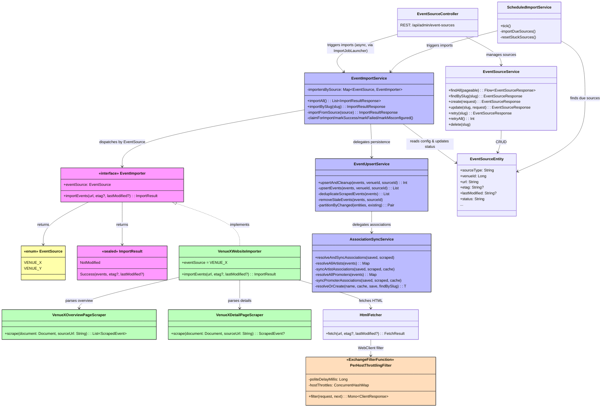

# ADR-007: Web Scraping Strategy

## Status

Accepted — WebClient fetches, Jsoup parses, and a structured JSON source wins over HTML whenever the venue has one.

## Context

The application imports music event data from Berlin venue and promoter websites — every source and its status is in
[EVENT_DATA_SOURCES.md](../EVENT_DATA_SOURCES.md). They vary widely in technology, and the proportions below are what the strategy is sized against:

- **~80% are static/server-rendered HTML** — WordPress, PHP, Laravel, hand-coded HTML (e.g. Privatclub, Madame Claude, Supamolly, Junction Bar, Roadrunner's
  Paradise).
- **~15% are JavaScript-rendered SPAs** — Angular (Fluxbau), Nuxt.js (Festsaal Kreuzberg), Wix (Loge), or sites behind cookie walls (SO36).
- **A few offer structured feeds** — Supamolly has an RSS feed. Astra exposes `schema.org MusicEvent` JSON-LD markup.

Key requirements:

1. Non-blocking integration with the existing coroutine/WebFlux stack.
2. Reliable parsing of messy, real-world HTML (retro sites, malformed markup).
3. Conditional requests (ETag / Last-Modified) to avoid unnecessary re-scraping.
4. Extensible design — adding a new venue scraper should be straightforward.

## Decision

Use a **layered scraping strategy** with three tools, each covering a different tier of complexity:

### 1. Spring WebClient — HTTP Fetching (already in the project)

`spring-boot-starter-webclient` is already a dependency. Use it as the HTTP client for all scraping requests instead of Jsoup's built-in `Jsoup.connect()`. This
keeps HTTP fetching reactive and integrates naturally with the coroutine stack via `awaitBody<String>()`.

WebClient also supports conditional requests. Send an `If-None-Match` (ETag) or `If-Modified-Since` header, and the
server answers `304 Not Modified` when the page did not change.

### 2. Jsoup — HTML Parsing (new dependency)

**`org.jsoup:jsoup`** is the de-facto standard HTML parser on the JVM. It provides:

- A CSS selector API for extracting elements (similar to jQuery / `document.querySelector`).
- Robust handling of malformed HTML — critical for retro/hand-coded sites.
- `schema.org` JSON-LD extraction for sites like Astra that embed structured data.

Jsoup is used **only for parsing** (not HTTP fetching). Since `Jsoup.parse()` is a CPU-bound blocking call, it is wrapped in `withContext(Dispatchers.IO)` to
avoid blocking the coroutine event loop.

This covers ~80% of the target venues.

### 3. Playwright (future — not added yet)

For the ~5 venues that require JavaScript execution (Angular SPAs, cookie walls, JS-rendered content), **Playwright for Java**
(`com.microsoft.playwright:playwright`) is the recommended future addition. It provides a modern headless browser API with Chromium/Firefox/WebKit support.

Playwright is **not added in this initial implementation** to keep the footprint minimal. It will be introduced when the first JS-rendered venue is targeted for
import.

### Prefer a JSON / API Source over HTML

Before you write an HTML scraper, **look for the venue's events as structured JSON**. It can be a public or internal
REST or GraphQL API, or an embedded third-party calendar widget with its own data endpoint.

A structured feed is the most stable source there is
(see [Selector Strategy](#selector-strategy--prefer-semantic-selectors), priority 1). It is an explicit
machine-readable contract, so it survives a site redesign. It needs no CSS selectors, and it often needs no headless
browser even for a JS-rendered SPA. Many "JS-only" venues are a thin front-end over a JSON API that the browser
Network tab shows.

Two implemented importers already take this path and skip HTML entirely:

- **Festsaal Kreuzberg** — the Nuxt.js SPA renders nothing on the server. A **Wagtail headless CMS** behind it has a
  public JSON REST API that returns every upcoming event as clean structured data.
- **Neue Zukunft** — the static landing page holds the concert programme only in an embedded **Elfsight
  "Event Calendar" widget**. The widget has a public JSON boot API (`core.service.elfsight.com/p/boot/?w=<id>`) that
  returns every event. Neither client-side rendering nor OCR of the PDF flyer is necessary.

A JSON/API importer uses **`ApiClient`** (below) in place of `HtmlFetcher`, and is otherwise identical. It implements
`EventImporter` and delegates parsing to a pure `*OverviewPageScraper`. That scraper takes the raw JSON string rather
than a Jsoup `Document`, and returns `List<ScrapedEvent>`. An I/O-free parser keeps snapshot-based testability exactly
as for an HTML scraper.

**`ApiClient` reuses the reactive `WebClient`, not Spring's blocking `RestClient`.** `RestClient` is the synchronous
client from the [Spring REST clients](https://docs.spring.io/spring-framework/reference/integration/rest-clients.html)
docs, and its imperative `.body(T::class)` API is ergonomic. But it **blocks**. In a coroutine importer it stalls the
WebFlux event loop, which breaks the non-blocking stack that [ADR-001](ADR-001_REACTIVE_STACK.md) mandates.
`WebClient` integrates natively with coroutines through `awaitBody()`, so it stays the client for both HTML and JSON.
`ApiClient` returns the raw body as a `String` and leaves parsing to the pure scraper. It deserializes nothing in the
fetch layer. That keeps it independent of the global WebClient codec configuration, and lets each scraper use its own
Jackson mapper.

Only when there is genuinely **no** usable structured source does an HTML scraper (Jsoup, priority 2+) apply.

### Architecture

A new `scraper` Spring Modulith module (`de.norm.events.scraper`) encapsulates all scraping infrastructure:



Key components:

- **`EventSource`** — enum of known import sources (e.g. `CASSIOPEIA`), providing compile-time safe dispatch instead of fragile string-based keys.
- **`EventImporter`** — interface that each venue-specific importer implements. Contains an
  `eventSource` property for dispatch and a `suspend fun importEvents(url, etag?, lastModified?)`
  method returning an `ImportResult` (either `NotModified` or `Success` with scraped events). Each importer owns all HTTP fetching for its venue (overview +
  detail pages).
- **`*OverviewPageScraper` / `*DetailPageScraper`** — pure HTML parsers (no I/O) that operate on pre-fetched Jsoup Documents. Separated from importers for
  testability.
- **Shared scraper utilities** — three focused extension files in `de.norm.events.scraper`, shared across all venue scrapers. `ScrapingExtensions.kt` provides
  Jsoup HTML element extraction helpers and URL resolution. `DateParsingExtensions.kt` covers time/date parsing for standalone `HH:mm`
  strings and ISO 8601 datetime strings from JSON-LD. `EventTypeMapping.kt`, `ArtistNameMapping.kt`, and
  `EventFieldMapping.kt` handle domain-level mapping of scraped text to model constants (event-type classification, placeholder/non-artist detection, artist
  lists, status/title/free-entry fields). See [Shared Scraping Utilities](#shared-scraping-utilities) below. New venue scrapers should use these utilities to
  avoid reinventing boilerplate and ensure consistent handling of blank/missing values.
- **`HtmlFetcher`** — WebClient wrapper for **HTML** venues handling conditional requests (ETag / Last-Modified) and returning either the parsed HTML document
  or a "not modified" signal. Per-host politeness throttling is applied transparently via a `PerHostThrottlingFilter` registered as a WebClient
  `ExchangeFilterFunction` (see [Per-Host Politeness Throttling](#per-host-politeness-throttling) below). It hands
  response bodies to Jsoup as **bytes**, not as a decoded `String`. A retro host can answer `Content-Type: text/html`
  with no `charset` parameter and still serve a Latin-1 page. Spring's UTF-8 fallback then decodes it and destroys
  every umlaut before a scraper sees it. Raw bytes let Jsoup run its standard detection chain (BOM → HTTP `charset` →
  `<meta charset>` → UTF-8). A page's declared encoding then wins wherever it states one.
- **`ApiClient`** — the JSON/API counterpart to `HtmlFetcher` (see
  [Prefer a JSON / API Source over HTML](#prefer-a-json--api-source-over-html)). `fetchJson(url)` returns the raw response body verbatim for venues whose events
  come from a REST/GraphQL API or a calendar-widget boot endpoint. Both fetchers inject the **same** shared `WebClient`
  bean (`ScraperHttpClientConfig`), so they share one `PerHostThrottlingFilter` instance. That filter throttles HTML
  and API requests to the same host together, and a JSON importer gets the identifying User-Agent for free.
- **`ScraperHttpClientConfig`** — builds the single shared, throttled scraper `WebClient` bean (`SCRAPER_WEB_CLIENT`) injected by both `HtmlFetcher` and
  `ApiClient`.
- **`PerHostThrottlingFilter`** — WebClient `ExchangeFilterFunction` that enforces a configurable minimum delay between consecutive HTTP requests to the same
  host. Throttling is transparent to callers — scraper implementations do not need to manage delays themselves.
- **`EventImportService`** — the orchestrator. It loads event source configuration from the database and delegates to
  the correct `EventImporter` bean. It wraps persistence in a transaction through `EventUpsertService`, and it drives
  the event source status transitions (RUNNING → SUCCESS/FAILED/MISCONFIGURED).
- **`EventUpsertService`** — the event persistence pipeline, inside one transactional boundary. It deduplicates scraped
  events, upserts them (insert new, update existing by `sourceId`), and removes stale future events that the source
  website no longer lists. It delegates artist and promoter resolution and association syncing to
  `AssociationSyncService`.
- **`AssociationSyncService`** — resolves artists and promoters by slug, and creates an unknown one with a
  concurrent-safe fallback. It synchronizes many-to-many join-table associations with a diff strategy: insert new,
  update a changed role or billing order, delete stale.
- **`EventSourceService`** — CRUD service for managing event source configuration.
- **`event_source` table** — tracks per-venue import metadata: URL, ETag, Last-Modified, last import timestamp, event count, status, and error messages.

### Event Source Dispatch

The **`EventSource` enum** is the compile-time safe dispatch mechanism that links a database-configured event source to the correct `EventImporter` bean at
runtime:

1. Each `EventImporter` implementation declares an `eventSource` property returning an `EventSource`
   enum value (e.g. `EventSource.CASSIOPEIA`).
2. The `event_source` table has a `source_type` column that must match an `EventSource` enum name.
3. On startup, `EventImportService` indexes all `EventImporter` beans into a
   `Map<EventSource, EventImporter>` keyed by `EventImporter.eventSource`.
4. When an import runs, the service resolves the enum from the stored key. It then looks up
   `importersBySource[eventSourceEnum]` for O (1) dispatch to the correct importer. If no bean matches, or the key is
   invalid, the source becomes `MISCONFIGURED`. That status is permanent: the scheduler skips the source and spends no
   retry budget. Only a person can clear it.

This design separates **what** to scrape from **how** to parse it. The database holds the URL and the schedule. The
code holds the HTML selectors. To add a venue, implement one `EventImporter` class, add an enum value, and seed an
`event_source` row.

The relationship between `event_source` rows and `EventSource` enum values is intentionally **many-to-one**: multiple event source rows can share the same
`source_type` (enum value). This enables two important scenarios:

1. **Same importer, different venues**: two venues can use identical website templates, for example the same Webflow
   CMS theme. They then share one `EventImporter` implementation and one `EventSource` enum value. Each venue keeps its
   own `event_source` row, with its own URL, schedule and ETag, and reuses the parsing logic.
2. **Same venue, multiple pages**: one venue can publish its events on more than one page. Cassiopeia could list
   `/club` (indoor concerts) and `/garden` (outdoor events) separately. Each page gets its own `event_source` row, with
   a distinct URL and its own change detection. Both rows name `CASSIOPEIA` as their `source_type`, and the same
   `CassiopeiaWebsiteImporter` handles them.

The `event_source` table could use the enum as its primary key instead. That is rejected here, because a primary key
enforces a one-to-one constraint and removes both scenarios above.

### Event Source Management

Event sources are managed across three layers, each handling a different kind of change:

| What changes                                       | Where                                                         | When                               |
| -------------------------------------------------- | ------------------------------------------------------------- | ---------------------------------- |
| HTML parsing logic (CSS selectors, data mapping)   | `EventImporter` class (code)                                  | Website structure changes → deploy |
| Source registration (URL, venue, event source key) | REST API (`POST /event-sources`) or Flyway migration          | New venue added                    |
| Operational config (enabled, interval, retries)    | REST API (`PATCH /event-sources/{slug}`)                      | Anytime, no deploy needed          |
| Source removal                                     | REST API (`DELETE /event-sources/{slug}`)                     | Anytime, no deploy needed          |
| Job control (trigger, retry, monitor)              | REST API (`POST /event-sources/import`, `GET /event-sources`) | Anytime, no deploy needed          |

**Structural changes require deployment**: a new venue needs an `EventImporter` class implementing the HTML parser. This is always a code change because every
venue's HTML structure is different.

**Source registration is runtime**: `EventSourceController` provides a `POST /event-sources` endpoint to create new event sources and a
`DELETE /event-sources/{slug}` endpoint to remove them. This avoids using Flyway for data seeding (Flyway is reserved for schema-only DDL changes). Sources can
also be seeded via the IntelliJ HTTP Client scripts in `http/event-sources.http` for local development.

**Operational changes are runtime**: `EventSourceController` also exposes endpoints that need no redeployment. They
enable and disable a source, adjust import intervals, change retry limits, trigger a manual import, and reset a failed
source.

### Single Entry URL with Internal Detail-Page Fetching

The `event_source` table stores a single `url` per source — the **entry point** (listing/overview page). This is intentional. Venue websites follow three
patterns:

1. **Single listing page (~70%)** — all event data on one page (e.g. Privatclub, Supamolly, Monarch). The single `url` covers everything.
2. **List + detail pages (~25%)** — a listing page carries the summaries and each event page carries the full data.
   Loge, Hole 44 and Madame Claude work this way. The scraper extracts the detail URLs from the listing HTML and
   fetches each one with `HtmlFetcher`.
3. **Paginated / multi-page listings (~5%)** — monthly program pages (e.g. Junction Bar:
   `/program/05_2026/05_26.html`). The scraper constructs page URLs from the entry point.

Adding a `detail_url_pattern` column or a `urls` array was considered and rejected:

- Detail URL patterns vary too much between venues to be usefully abstracted into a column.
- Multiple URLs complicate ETag/Last-Modified caching — which URL do you track for change detection?
- The listing page is the natural change-detection target: it changes when events are added or removed.

Instead, each `EventImporter` owns all HTTP fetching for its venue. Its `importEvents()` method uses `HtmlFetcher` for
the overview page and for every detail page. Parsing goes to dedicated `*OverviewPageScraper` and `*DetailPageScraper`
classes that read a parsed Jsoup Document and do no I/O. The infrastructure layer stays simple — one URL, one ETag —
and the importer keeps full freedom.

### Pagination — First Page Only

Venue listing pages are sometimes paginated (e.g. Cassiopeia uses Finsweet CMS Load to lazy-load additional pages via JavaScript). **The scraper intentionally
imports only the first page of each listing.** Multi-page crawling was considered and rejected for several reasons:

1. **Most pagination is JS-driven**: infinite scroll, a "load more" button, or Finsweet CMS Load. To reach the later
   pages, the scraper would have to reverse-engineer an undocumented JavaScript API. The alternative is a headless
   browser (Playwright). Both cost more than the extra events are worth.
2. **First page = most upcoming events**: venue listings are sorted by date. The first page already holds the events a
   reader is looking for. Far-future events add little.
3. **Stale event cleanup is already pagination-safe**: `removeStaleEvents()` scopes cleanup to the date range of the
   current scrape (`today..maxScrapedDate`). The cleanup leaves events outside that range alone, so an unfetched page
   2 deletes nothing by accident.
4. **Conditional requests only cover the entry page**: ETag and Last-Modified headers apply to the overview page URL.
   Every later page would need its own change tracking, which complicates the `event_source` metadata model for little
   gain.
5. **Complexity cost**: multi-page crawling adds loop and termination logic, per-page error handling, rate limiting
   between page requests, and partial-failure semantics. The gain in event coverage is marginal.

One venue may later need multi-page support — a site with server-side `?page=2` pagination, for example. That belongs
**inside that venue's `*WebsiteImporter`**: loop over the pages in `importEvents()` and concatenate the results before
you return `ImportResult.Success`. Pagination stays a per-importer concern, and the `EventImporter` interface and the
framework-level infrastructure do not change.

### Shared Detail Pages — Fetch Once Per Distinct URL

The list+detail pattern above assumes a one-to-one mapping: one listing entry, one detail page. A venue that programmes **runs** rather than one-off nights
breaks that assumption. Bar jeder Vernunft's calendar lists one card per _performance date_. Every date of a
production links to the same `/programmuebersicht/<show>.html` page, so 28 calendar cards can resolve to 2 show pages.

`AbstractTwoPageWebsiteImporter` fetches a detail page per event, so it would re-request one page 20+ times per import.
With [per-host throttling](#per-host-politeness-throttling) that is both wasteful and slow. It is also the load the
[best practices](#scraping-best-practices) tell you to keep off a venue's server. Such an importer therefore
implements `EventImporter` directly and de-duplicates the fetch itself. It groups the scraped events by detail URL,
fetches each distinct URL once, and applies the parsed result to every event that shares it.

Two consequences follow for the parser split:

1. **The detail scraper does not return a `ScrapedEvent`.** It parses _show-level_ data — genre, price range, blurb —
   and has no date of its own. So it returns a small venue model (`BarJederVernunftShow`) that enriches an occurrence.
   `HavannaWeeklyNight` below makes the same modelling choice.
2. **`sourceId` cannot be the URL slug**, which is shared by the whole run. It combines the date with the show slug (`bar_jeder_vernunft:<date>-<show-slug>`),
   keeping upserts idempotent per performance.

### Undated Recurring Programmes — Derived Occurrences

Most venues announce individual dated events. A few instead assert a **standing weekly programme**:
the same resident nights every week, described once, with no dates published anywhere. Havanna is the first such
source. Its `/events` page is a static teaser that links to three undated pages (`/wednesday`, `/friday`,
`/saturday`). Each page describes a night that runs every week.

Skipping these venues would leave a real, regularly-running programme out of the calendar entirely. So the importer
**derives** the dates. The venue-specific parser produces an undated recurrence model (`HavannaWeeklyNight`). The
importer expands that model into one `ScrapedEvent` per week, over a rolling horizon of 8 weeks. Three constraints
make this safe:

1. **Stable dated `sourceId`** (`havanna:<date>-<night-slug>`) — every run regenerates the same window, so upserts
   stay idempotent. `removeStaleEvents()` removes an occurrence that rolls out of the window, because it already
   scopes cleanup to `today..maxScrapedDate`.
2. **No conditional requests** — a derived horizon must advance daily, but these pages never change. A 304 would
   freeze the window, and the calendar would silently stop moving forward. Such an importer therefore fetches
   unconditionally and returns `null` cache headers. AMT opts out of the same thing for a different reason.
3. **Honour announced closures** — a closure notice with a start date suppresses that night from that date on. Havanna
   writes them as "… AB DEM 01.07.2026 IN DER SOMMERPAUSE!". Without this, a derived schedule keeps announcing parties
   that the venue cancelled in public. A notice with no parseable date goes to the log instead. One ambiguous "Pause"
   must not erase the venue from the calendar.

Derived occurrences are a deliberate, bounded inference. They never apply to a venue that publishes dates. They never
extend past the horizon, or across a break that a page announces.

### Per-Host Politeness Throttling

Venue websites are typically hosted on modest infrastructure (shared WordPress hosting, small VPS). The scraper must avoid overwhelming them with rapid
consecutive requests, especially when fetching many detail pages for a single venue.

**`PerHostThrottlingFilter`** is a WebClient `ExchangeFilterFunction` registered on `HtmlFetcher`'s WebClient instance. It enforces a minimum delay
(`ScraperProperties.politeDelayMillis`, default:
200ms) between consecutive HTTP requests to the **same host**, while allowing requests to different hosts to proceed concurrently.

```
Cassiopeia detail pages:  ──[200ms]──▶ req1 ──[200ms]──▶ req2 ──[200ms]──▶ req3
Loge detail pages:        ──▶ req1 ──[200ms]──▶ req2 ──[200ms]──▶ req3
                          ↑ different hosts proceed independently
```

**How it works:**

1. Each host gets a lazily-created throttle entry (`ConcurrentHashMap<String, HostThrottle>`)
   containing a coroutine `Mutex` and a `TimeSource.Monotonic.ValueTimeMark`.
2. Before each request, the filter acquires the per-host mutex. It then measures the time since the last request to
   that host. If that time is below the minimum interval, it suspends with `delay()`.
3. The `filter()` method uses `kotlinx.coroutines.reactor.mono {}` to bridge the reactive
   `ExchangeFilterFunction` contract and the coroutine `Mutex` and `delay`. It then chains into
   `next.exchange(request)`, which stays fully reactive.

**Why an `ExchangeFilterFunction`:**

- **Transparent to scrapers**: `EventImporter` implementations do not need to manage delays themselves — any HTTP request through `HtmlFetcher` is automatically
  throttled. New scrapers get rate-limiting for free.
- **Idiomatic Spring**: `ExchangeFilterFunction` is the standard WebClient extension point for cross-cutting HTTP client concerns (logging, auth, retry,
  throttling). Keeping throttling in this layer follows the same pattern.
- **Single responsibility**: `HtmlFetcher` remains focused on HTTP fetching and HTML parsing. Throttling is a separate concern handled at the HTTP client layer.

**Alternatives considered:**

| Approach                           | Verdict                                                                                                                                                                                           |
| ---------------------------------- | ------------------------------------------------------------------------------------------------------------------------------------------------------------------------------------------------- |
| Per-scraper `delay()` calls        | Requires every `EventImporter` to remember adding delays. Easy to forget, no enforcement. Rejected.                                                                                               |
| Resilience4j `RateLimiter`         | Standard library, but semantics ("N permits per time window") don't naturally map to "minimum delay between requests." Would still need per-host instances + registry. Adds dependency. Rejected. |
| Guava `RateLimiter`                | Blocking API — doesn't fit the reactive/coroutine stack without `withContext(Dispatchers.IO)`. Rejected.                                                                                          |
| Global throttle (all hosts)        | Too conservative — serialises all requests even to different servers. Slows down parallel imports of independent venues. Rejected.                                                                |
| Reactor Netty `ConnectionProvider` | Only limits concurrent connections, does not add delays between sequential requests. Rejected.                                                                                                    |

### Change Detection

Each import source row stores the last ETag and Last-Modified values. Before scraping, the fetcher sends conditional headers:

- If the server responds with **304 Not Modified** → skip import, no work done.
- If the server responds with **200 OK** → parse the new HTML and upsert events via `sourceId`.

This minimizes unnecessary network traffic and database writes.

### Shared Scraping Utilities

Three focused extension files in the `de.norm.events.scraper` package provide reusable utilities shared across all venue scrapers. Each file has a single
cohesive responsibility, keeping the codebase organized as the number of utilities grows with new venue scrapers.

**`ScrapingExtensions.kt`** — Jsoup HTML element extraction helpers and URL resolution:

| Extension / Function                            | Purpose                                                               |
| ----------------------------------------------- | --------------------------------------------------------------------- |
| `Element.textAt(cssQuery)`                      | Select first match → `.text()` → trim → null if blank                 |
| `Element.attrAt(cssQuery, attr)`                | Select first match → attribute value → null if blank                  |
| `Element.imgSrcAt(cssQuery)`                    | Select `` → `src` attribute → null if not an absolute HTTP URL   |
| `Element.hrefAt(cssQuery)`                      | Select `<a>` → `href` attribute → null if not an absolute HTTP URL    |
| `Element.hasVisibleWebflowFlag(cssQuery, text)` | Webflow `w-condition-invisible` visibility check + text content match |
| `resolveUrl(baseUrl, href)`                     | Resolve relative URLs against a base URL, pass-through absolute URLs  |
| `extractEventSlug(url, prefix)`                 | Strip a detail-URL path prefix down to the event's stable slug        |
| `ISO_DATE_LENGTH`                               | Length of the `YYYY-MM-DD` prefix some platforms bake into that slug  |

**`DateParsingExtensions.kt`** — date and time parsing for the two common formats on venue websites:

| Extension / Function                            | Purpose                                                                           |
| ----------------------------------------------- | --------------------------------------------------------------------------------- |
| `HH_MM_FORMATTER`                               | Shared `DateTimeFormatter` for 24-hour time (`HH:mm`)                             |
| `parseTime(text, formatter = HH_MM_FORMATTER)`  | Null-safe `LocalTime` parsing — returns null instead of throwing                  |
| `parseIsoDate(dateTimeStr)`                     | Extract date from ISO 8601 datetime (e.g. `"2026-05-16T20:00"`)                   |
| `parseIsoTime(dateTimeStr)`                     | Extract time from ISO 8601 datetime, delegates to `parseTime`                     |
| `inferYearForWeekday(monthDay, weekday, clock)` | Pick the year for a year-less date using its weekday (retro single-page listings) |
| `parseGermanMonthAbbreviation(text)`            | German month abbreviation → `Month` (`Okt`, `Dez`, every `Mär`/`März` spelling)   |

**`EventTypeMapping.kt` / `ArtistNameMapping.kt` / `EventFieldMapping.kt`** — domain-level mapping of scraped text to model constants:

| Extension / Function                   | Purpose                                                                             |
| -------------------------------------- | ----------------------------------------------------------------------------------- |
| `mapGermanCategory(category)`          | Maps German category labels ("Konzert", "Party", "Sonstiges") to `EventType` values |
| `isPlaceholderName(name)`              | Detects placeholder artist names ("TBA", "N.N.") that should not be persisted       |
| `buildArtistList(title, supportNames)` | Constructs headliner + support artist list from the common title/subtitle pattern   |
| `parseEventStatus(statusText)`         | German/English status badge → `EventStatus` (sold-out stays a flag, not a status)   |
| `orderDoorsBeforeStart(doors, start)`  | Recovers a source's transposed doors/start labels by swapping them back             |
| `stripRelocationPrefix(title)`         | Strips a `"verlegt in(s) <venue> –"` note a venue prepends to a moved show's title  |

**`WixEventsWarmupData.kt`** — the platform-level reader for a venue on Wix with a Wix Events widget (Loge and MAXXIM
today). The widget renders on the client, but Wix injects the full event data on the server. It arrives as strict JSON
in a `<script type="application/json" id="wix-warmup-data">` block, so that payload is the source (priority 1 below)
rather than the rendered cards. Only the payload location and the two readers every Wix venue needs live here. The
venue's field mapping stays in its own scraper.

| Extension / Function                      | Purpose                                                                                        |
| ----------------------------------------- | ---------------------------------------------------------------------------------------------- |
| `WixEventsWarmupData.events(doc, source)` | Locates the `events.events` array under the global Wix Events appDefId and the per-page widget |
| `JsonNode.stringOrNull(field)`            | Trimmed string field → null when missing, JSON `null`, or blank                                |
| `parseWixSchedule(config)`                | UTC `startDate` + `timeZoneId` → Berlin-local `(LocalDate, LocalTime)`                         |

**Design rationale**: a declarative selector map, from field names to CSS selectors, is rejected here. Each scraped
field needs different extraction logic: sibling traversal, regex extraction from a `style` attribute, multi-element
date assembly, visibility checks, fallback chains. A selector map covers only the simplest cases, about 3 of the 10
fields per scraper. The split architecture that results is harder to maintain than one consistent method per field.
Extension functions sit at the right level: they remove the repetitive
`selectFirst(...)?.text()?.trim()?.takeIf { ... }` chains and leave the complex field-specific logic in dedicated
methods.

### Selector Strategy — Prefer Semantic Selectors

CSS selectors in `EventImporter` implementations are the most fragile part of the scraping pipeline:
when a venue redesigns their website, selectors break. To maximise robustness, scrapers must prefer **semantic selectors** — selectors that target the _meaning_
of elements rather than their visual presentation or DOM position. Semantic selectors survive redesigns far more often than layout-based ones because the
meaning of the content rarely changes even when styling does.

**Selector preference order** (most to least stable):

| Priority | Selector type                        | Example                                                        | Why stable                                              |
| -------- | ------------------------------------ | -------------------------------------------------------------- | ------------------------------------------------------- |
| 1        | JSON / API source or structured data | REST/GraphQL/widget API; `<script type="application/ld+json">` | Explicit machine-readable contract; rarely changed      |
| 2        | Semantic HTML5 elements              | `article`, `time[datetime]`, `h2`, `address`                   | Reflects content meaning, not layout                    |
| 3        | ARIA roles & landmarks               | `[role="listitem"]`, `[aria-label="Event date"]`               | Accessibility attributes tied to purpose, not design    |
| 4        | Data attributes                      | `[data-event-id]`, `[data-date]`                               | Often stable internal identifiers used by the site's JS |
| 5        | Meaningful CSS classes               | `.event-title`, `.event-date`                                  | Semantic class names tied to content, not styling       |
| 6        | Positional / presentational          | `div > div:nth-child(3) > span`                                | **Avoid** — breaks on any structural change             |

**Concrete guidelines for `EventImporter` implementations:**

1. **Structured data first**: prefer a JSON source over rendered HTML wherever one exists. See
   [Prefer a JSON / API Source over HTML](#prefer-a-json--api-source-over-html). A standalone REST or GraphQL API, or
   a calendar-widget API, is best. `ApiClient` fetches it, as for Festsaal and Neue Zukunft. Second best is
   `schema.org/MusicEvent` JSON-LD or Microdata in the page, as for Astra Kulturhaus. Select
   `script[type=application/ld+json]` with Jsoup and parse the JSON payload. Both are the most stable and
   self-documenting sources.
2. **Target semantic HTML elements**: Prefer `article`, `section`, `time[datetime]`, `h1`–`h6`,
   `a[href]` over generic `div`/`span`. For example, select `time[datetime]` to extract event dates rather than parsing text from a styled
   `<span class="small-text">`.
3. **Use `data-*` attributes when available**: Many modern sites decorate elements with
   `data-event-id`, `data-date`, etc. for their own JavaScript. These are more reliable than class names because they carry semantic meaning independent of
   styling.
4. **Prefer class names that describe content over appearance**: `.event-card` and `.artist-name`
   are better selector targets than `.col-md-4` or `.text-red`. Presentational classes change with a CSS framework
   upgrade. Content classes rarely change.
5. **Avoid deep positional selectors**: Selectors like `div.content > div:nth-child(2) > p:first-of-type`
   are extremely brittle. A single `<div>` wrapper added by a CMS update will break them.
6. **Scope selectors to the narrowest useful container**: start with a broad semantic container, such as
   `article.event`. Select the children relative to it. The scraper is then safe from changes elsewhere on the page —
   navigation, footer, ads.
7. **Use `:has()` for contextual matching**: Jsoup supports the `:has()` pseudo-class. `div:has(time[datetime])`
   selects only the divs that contain a `<time>` element, which combines structural and semantic targeting.

### Scraping Best Practices

The following operational best practices ensure the scraping pipeline is ethical, resilient, and maintainable at scale. Several of these are informed by common
web scraping pitfalls documented in industry literature (see References).

1. **Respect `robots.txt`** — enforced by `RobotsTxtFilter`, not by memory. `RobotsRulesCache` reads a host's
   `robots.txt` once per day, and `crawler-commons` parses it. The filter sits on the shared scraper `WebClient`, so
   every request an importer makes is checked. A new venue is covered by its first fetch. This is the same shape as
   [Per-Host Politeness Throttling](#per-host-politeness-throttling). A rule that nothing enforces is a rule that three
   of eighty importers followed (#790).

    **Reporting comes before enforcement.** `app.scraper.robots-enforced` is `false`, so a disallowed request is logged
    and recorded on `event_source` and still sent. Nobody knows yet how many venues disallow the paths already read, and
    enforcing blind could stop every import in one deploy. Read `event_source.robots_allowed` after a cycle, then turn
    it on (#795).

    Still check a venue's `robots.txt` when writing its importer. The filter stops a request the rules forbid, and only
    a person can pick a permitted URL that carries the same programme.

2. **Rate-limit requests**: a venue website usually runs on modest infrastructure — shared WordPress hosting, a small
   VPS. The scraper must put a delay between requests and never overload the server. `PerHostThrottlingFilter`
   enforces that globally. It is a WebClient `ExchangeFilterFunction` (see
   [Per-Host Politeness Throttling](#per-host-politeness-throttling)). It waits a configurable time (200ms by default)
   between consecutive requests to the same host. With change detection (ETag / Last-Modified) on top, the load on a
   venue server stays negligible. A scraper implementation manages no delays of its own.

3. **Set a descriptive `User-Agent` header**: configure WebClient to send a transparent, identifying
   `User-Agent` string. A venue operator can then recognise the bot and contact us. Do not masquerade as a browser. The
   one exception is a venue that blocks non-browser agents and gives explicit permission.

    `ScraperHttpClientConfig` sends `Mozilla/5.0 (compatible; EventJunkie/1.0; +https://github.com/enorm-labs/event-junkie)`.
    The `Mozilla/5.0 (compatible; …)` prefix is the convention every well-behaved crawler follows, Googlebot and bingbot
    included. It is not a masquerade: the string names the product and carries a contact URL, which is what a venue
    operator needs. **Keep the product token and the URL** if the prefix ever changes — they are the transparency, not
    the prefix.

4. **Handle pattern changes with regression tests**: a venue website redesign is the most common cause of scraper
   breakage. Each `EventImporter` needs unit tests that parse sample HTML snapshots from the test resources. They
   assert the data the scraper must extract. When a venue changes its markup, the test fails at once and names the
   broken scraper. Run these tests in CI on every build.

5. **Validate data quality**: Never blindly persist scraped data. Each `EventImporter.importEvents()` call should validate extracted fields (non-blank title,
   parseable date, valid URL). Log warnings for events that fail validation and exclude them from the import rather than inserting garbage data. Data integrity
   is critical downstream for the BFF and frontend.

6. **Use canonical URLs**: one venue site can serve the same content at several URLs. A trailing slash, a query
   parameter or a locale prefix is enough. Normalise a URL before the deduplication check. The `sourceId`-based upsert
   already prevents duplicate events, but a canonical URL also saves the network request.

7. **Schedule scrapes during off-peak hours** — wanted, and **not implemented**. Berlin venue websites see most traffic
   in the evening, so early-morning imports would cost a venue least. `ScheduledImportService` fires when a source's
   `lastImportAt` plus its `import_interval_minutes` expires, which is an interval and not a time of day. The hour
   therefore drifts. `import_interval_minutes` alone cannot express a window, so a time-of-day column or a cron
   expression is the change this needs (ADR-008). The load stays small either way: one entry page per source per day,
   with conditional requests on top.

8. **Be aware of honeypot traps**: some sites embed invisible links to detect a bot. CSS `display: none` or the
   background colour hides them. Be careful with any link the scraper discovers at run time. The current design is
   safe, because an `EventImporter` parses known page structures and follows no arbitrary link.

9. **Use the scraped data responsibly**: this project aggregates event data to show what is on in Berlin. It does not
   republish raw content. Respect venue copyright: store only the structured fields you need — title, date, artists,
   URL. Link to the original source for the full details.

    **Two fields go beyond that principle today.** The schema also stores `description` and `imageUrl`, and the site
    displays neither. Storing a promotional text is already a reproduction, so this is a known gap.
    [SCRAPING_POSITION.md](../SCRAPING_POSITION.md) §3.1 carries the reasoning. #283 adds the per-source licence status
    that resolves it.

### Candidate options

| Library            | Verdict                                                                                                                                     |
| ------------------ | ------------------------------------------------------------------------------------------------------------------------------------------- |
| Selenium           | Outdated, flaky, slower than Playwright. Rejected.                                                                                          |
| HtmlUnit           | Incomplete JS engine, unreliable for modern SPAs. Rejected.                                                                                 |
| Skrape{it}         | Kotlin-native but small community, limited maintenance. Rejected.                                                                           |
| Scrapy / BS4       | Python ecosystem — wrong language. Rejected.                                                                                                |
| AI/LLM for parsing | Unreliable for consistent structured extraction. May be useful later for free-text fields (e.g. extracting artist names from descriptions). |

## Consequences

**Positive**

- Jsoup is mature, well documented, and handles real-world HTML.
- WebClient integration keeps everything non-blocking.
- Conditional requests reduce load on venue websites.
- First-page-only scraping keeps the pipeline simple, while covering the most relevant upcoming events.
- The `EventImporter` interface makes a new scraper a single-class addition.
- Shared utilities reduce boilerplate: `ScrapingExtensions.kt`, `DateParsingExtensions.kt`, `EventTypeMapping.kt`, `ArtistNameMapping.kt` and
  `EventFieldMapping.kt`. Text extraction, URL parsing, time and date parsing, category mapping and artist-list construction are reusable functions.
- Per-host politeness throttling via `PerHostThrottlingFilter` is transparent to scrapers. A new importer gets rate limiting without managing any delay itself.
- Import metadata in the database enables a future scheduling dashboard.
- Semantic selector guidelines and regression tests on HTML snapshots reduce breakage when a venue redesigns.
- Rate limiting, a transparent User-Agent and off-peak scheduling keep the scraper ethical and sustainable.

**Negative**

- Jsoup's `parse()` is blocking. `Dispatchers.IO` mitigates it.
- Each venue needs a hand-written scraper class, because HTML structure varies.
- JS-rendered venues are not covered until Playwright is added.
- HTML snapshot fixtures cost something per venue to maintain. They pay for it in early breakage detection.

The `event_source` table is owned by the importer, consistent with [ADR-005](ADR-005_MIGRATIONS_OWNED_BY_IMPORTER.md).

## References

- [Jsoup documentation](https://jsoup.org/)
- [Jsoup CSS selector syntax](https://jsoup.org/cookbook/extracting-data/selector-syntax) — full selector reference including `:has()`
- [Playwright for Java](https://playwright.dev/java/)
- [Spring WebClient reference](https://docs.spring.io/spring-framework/reference/web/webflux-webclient.html)
- [Web Scraping: Introduction, Best Practices & Caveats (Velotio)](https://medium.com/velotio-perspectives/web-scraping-introduction-best-practices-caveats-9cbf4acc8d0f) —
  industry best practices for ethical and resilient scraping
- [schema.org MusicEvent](https://schema.org/MusicEvent) — structured data vocabulary for music events
- [EVENT_DATA_SOURCES.md](../EVENT_DATA_SOURCES.md) — venue/promoter inventory, import status, and per-source scraping notes
