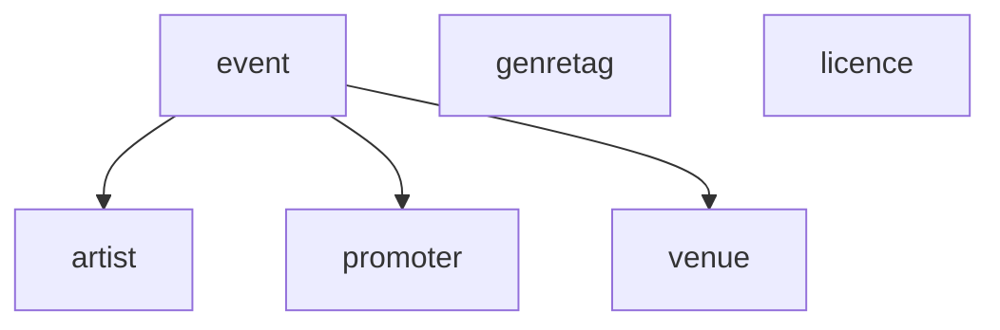

# Modules — events-core

The application modules and the dependencies between them, as Spring Modulith reads them.

**This diagram is generated.** Do not edit it by hand. Rewrite it with `./gradlew updateModuleDiagrams`.

<!-- generated: module diagram -->

<!-- /generated: module diagram -->
