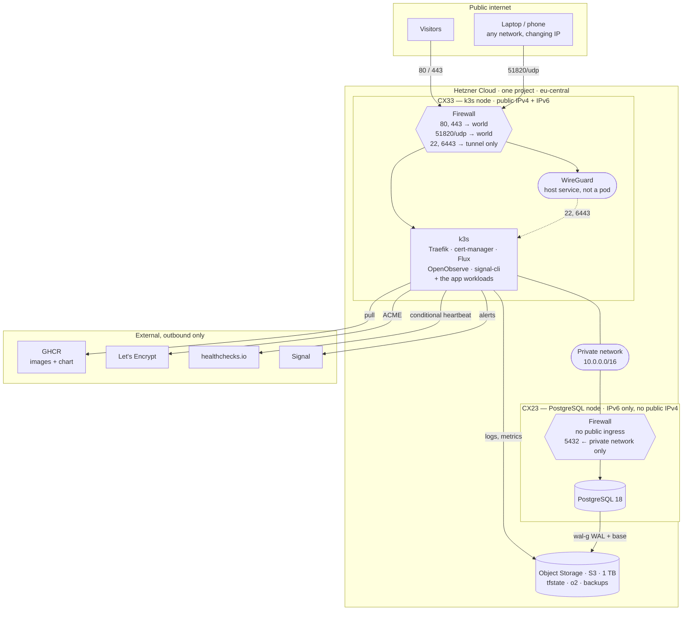
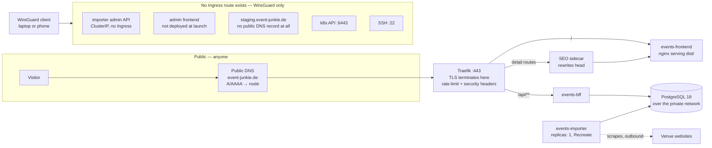
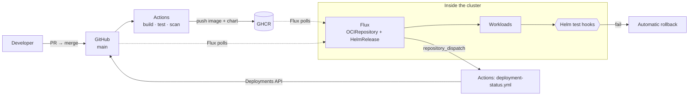

# Platform Setup — Hetzner + k3s

Both environments are **running**. Staging is reachable only through its WireGuard tunnel; production is installed and reconciling but **dark** — the domain
resolves nowhere until `publish_dns` is flipped at go-live.

This is the reference for what the platform _is_: the inventory, the access paths, the deploy path, and the reasoning behind each. Standing one up is
[CLUSTER_BOOTSTRAP.md](CLUSTER_BOOTSTRAP.md); using one day to day is [CLUSTER_ACCESS.md](CLUSTER_ACCESS.md) and [DAILY_COMMANDS.md](DAILY_COMMANDS.md); what
happens on every commit is [RELEASING.md](RELEASING.md).

**The decisions it rests on:** [ADR-012](../adr/ADR-012_CLOUD_PLATFORM.md) (Hetzner + k3s, no Cloudflare) ·
[ADR-016](../adr/ADR-016_GITOPS_DELIVERY.md) (pull-based delivery with Flux) · [ADR-015](../adr/ADR-015_OBSERVABILITY_STACK.md) (observability — OpenObserve) ·
[ADR-014](../adr/ADR-014_RENDERING_STRATEGY.md) (the SEO sidecar) · [ADR-008](../adr/ADR-008_IMPORT_JOB_SCHEDULING.md) (the importer is always-on and
single-instance).

## The short version

|                    |                                                                                                               |
| ------------------ | ------------------------------------------------------------------------------------------------------------- |
| **Staging**        | One `CX33` (4 x86 vCPU / 8 GB / 80 GB). k3s, PostgreSQL and all workloads on the one node                     |
| **Production**     | `CX33` k3s node + `CX23` PostgreSQL node (2 vCPU / 4 GB / 40 GB, no public IPv4), one private network         |
| **Both**           | 10 GB volume for `PGDATA` · Primary IPv4 + IPv6 · Hetzner firewall · daily Hetzner backups on production      |
| **Storage**        | One Object Storage subscription, three buckets: `…-tfstate`, `…-o2`, `…-backups`                              |
| **In the cluster** | Traefik (k3s), cert-manager, Flux, OpenObserve + OTel collector, signal-cli, and the three application pods   |
| **Public ports**   | `80`, `443`, and `51820/udp` for WireGuard. `22` and `6443` answer through the tunnel only                    |
| **Deploys**        | Pull-based. CI builds and pushes to GHCR; Flux notices and reconciles. No cluster credential exists in GitHub |
| **Alerts**         | OpenObserve → Signal, plus healthchecks.io as a dead-man's switch **outside** the cluster                     |
| **Cost**           | ~€31–33/month, both environments — [COSTS.md](COSTS.md) has the line items                                    |

Everything here is declared in [`infra/`](../../infra) and [`deploy/`](../../deploy) and applied by OpenTofu and Flux. Three things are deliberately hand-made:
the Object Storage state bucket, the GHCR package visibility flip, and the secrets in [SECRETS.md](SECRETS.md).

---

## 1. What runs where

### 1.1 What is reachable from where

The boundaries are the point of this diagram. Almost everything is unreachable from the internet; the exceptions are deliberate and few.



**Staging is the same picture with both nodes collapsed into one**, and with no public `A` record and no public 80/443 at all — see §6.

**Note which arrows do not exist.** Nothing reaches the PostgreSQL node from the internet, in either direction, at any port. Nothing reaches `6443` or `22`
without the tunnel. And no arrow points _into_ the cluster from GitHub — that is §1.3.

**There is no NAT gateway, deliberately.** The PostgreSQL node reaches the internet over **IPv6** for package updates and nothing else. If IPv6-only egress ever
turns out to be insufficient, the fallback is one
[`hcloud_network_route`](https://registry.terraform.io/providers/hetznercloud/hcloud/latest/docs/resources/network_route) with `destination = "0.0.0.0/0"`
pointing at the k3s node, plus a `MASQUERADE` rule there — nothing is configured on the database node at all, and no separate NAT server is needed. Hetzner's
[NAT gateway tutorial](https://community.hetzner.com/tutorials/private-network-nat-lb-hetzner-opentofu/) is the recipe, with `infra/AGENTS.md`'s caveats about
what not to copy from it. The coupling that buys: if the k3s node is down, the database node loses `apt`. Acceptable, because nothing in the request path
depends on it.

### 1.2 The access paths — how a request actually gets served



**Same origin is the whole trick.** `/` and `/api` are served by one ingress on one hostname, so there is no CORS configuration anywhere and session cookies
will be first-party when authentication lands. That property is why the frontend is a container rather than a CDN-hosted static site — ADR-012 §Frontend
hosting.

**The importer is not in the request path at all.** It is a scheduler that talks outbound to venue sites and inbound to the database; no visitor request ever
reaches it. Its admin API is a `ClusterIP` service with no `Ingress` object — not merely firewalled, but never routed.

### 1.3 The deploy path — pull, never push



**Every arrow crossing into the cluster is dashed, and they all start inside it.** That is the entire security argument for Flux: CI holds no cluster
credential, because there is nothing for it to hold. A repository compromise does not imply a cluster compromise.

It is also why the smoke tests are Helm test hooks rather than a job in Actions — CI cannot reach staging or production, by design, so verification has to run
where the workloads do.

### 1.4 The workloads

| Workload          | Shape                    | Replicas      | Notes                                              |
| ----------------- | ------------------------ | ------------- | -------------------------------------------------- |
| `events-importer` | JVM, always-on scheduler | **exactly 1** | ADR-008. `strategy: Recreate`, never rolling       |
| `events-bff`      | JVM, stateless HTTP      | 1–N           | The only genuinely scalable thing here             |
| `events-frontend` | nginx serving `dist/`    | 1–N           | Same origin as the API — ADR-012 §Frontend hosting |
| admin frontend    | nginx                    | 1             | **Not built.** Must not be publicly routed — §8    |
| SEO sidecar       | head rewriting           | 1             | **Not built.** ADR-014, settled as in-cluster      |

| Thing           | Choice                                          |
| --------------- | ----------------------------------------------- |
| Ingress + TLS   | **Traefik** (ships with k3s) + **cert-manager** |
| Load balancer   | **None.** k3s ServiceLB binds to the node IP    |
| Registry        | **GHCR**, not Docker Hub — §2                   |
| GitOps / deploy | **Flux**; CI builds and pushes only — §3        |
| Observability   | **OpenObserve** — ADR-015, §4                   |
| Database        | PostgreSQL 18 on its own VM — ADR-012           |
| Backups         | `wal-g` → Object Storage, 30-day PITR           |
| Secrets         | **SOPS + age** — [SECRETS.md](SECRETS.md)       |

**Not ordered, and why:** Load Balancer (k3s ServiceLB binds to the node IP on one node) · Floating IPs (for failover between servers, which does not apply) ·
Storage Box (Object Storage covers all three storage needs) · Storage Share · OpenSearch, Superset and a local LLM (§10).

### 1.5 Sizing and headroom

Realistic resident memory, measured in "what it actually uses", not "what the docs say it can survive on":

| Component                                        | RAM         | Note                                        |
| ------------------------------------------------ | ----------- | ------------------------------------------- |
| k3s server + CoreDNS, metrics-server, local-path | ~800 MB     | The floor                                   |
| Traefik (bundled with k3s)                       | ~100 MB     |                                             |
| cert-manager                                     | ~150 MB     | §6                                          |
| `events-bff` (JVM)                               | ~900 MB     | 512 MB heap plus metaspace, threads, direct |
| `events-importer` (JVM)                          | ~900 MB     |                                             |
| `events-frontend` (nginx)                        | ~32 MB      |                                             |
| admin frontend (nginx)                           | ~32 MB      | Not built yet                               |
| SEO sidecar (ADR-014)                            | ~100 MB     | Not built yet                               |
| Flux                                             | ~300 MB     | A quarter of ArgoCD, and it is required     |
| Observability (OpenObserve + collector)          | ~938 MB     | Measured, §4 — SigNoz would be ~5 GB        |
| **Total**                                        | **~4.5 GB** | Plus OS ≈ **5.0 GB**                        |

On an 8 GB node that leaves **~3.0 GB**, and the worst spike is a deploy running a second JVM alongside the one it is replacing — about 900 MB — so the floor
under pressure is still ~2.1 GB free.

**The margin is thinner than it looks, and it has been hit once.** Staging ran a 2-core / 4 GB `CPX22` until 2026-08-21, when a global OOM killed OpenObserve
and load reached 99 on two cores ([#271](https://github.com/enorm-labs/event-junkie/issues/271)). 8 GB is the floor for this stack, not a comfort.

**The upgrade path is a single step:** `CX43` (8 vCPU / 16 GB) if OpenObserve outgrows ADR-015's footprint test, or if Grafana joins it. Nothing else in the
design changes. `cx43` is supported in `eu-central` but frequently out of stock — `infra/check-capacity.sh --probe` is the only way to find out, because
Hetzner's `datacenters` endpoint both advertises types it will not sell and omits types it will (§10).

**Keep the two production nodes in one _location_.** Every query crosses that link and inter-location latency lands on every request. The network _zone_ is a
different thing: Hetzner charges nothing for traffic within `eu-central`, so the buckets pin the servers nowhere.

### 1.6 The volume — durability, not capacity

`PGDATA` is on a 10 GB volume mounted at `/var/lib/postgresql`, one per environment. **Capacity was never the problem; the node being replaced was**
([#460](https://github.com/enorm-labs/event-junkie/issues/460)).

`user_data` is a force-new attribute, so any edit under `infra/modules/environment/cloud-init/` replaces the node. So does a `server_type` change across
architectures, and so does the destroy/apply cycle. Each is correct behaviour for a node meant to be disposable — and each used to take the database with it.

10 GB is Hetzner's minimum and deliberately the floor: growing a volume is online (`hcloud volume resize` plus `resize2fs`), shrinking one is impossible.
**Volumes are location-bound, exactly like the Primary IPs** — moving an environment to another location means dealing with the volume first.

**A volume is not a backup.** It survives the node; it does not survive `DROP TABLE`, a bad migration, corruption written faithfully to disk, or the loss of the
Hetzner project — and it is not off-site. That is [BACKUPS.md](BACKUPS.md): `wal-g` streaming WAL and a nightly base backup, 30-day window, restore rehearsed on
both a full replay and a point-in-time recovery past a `DROP TABLE`.

**`delete_protection` stops the console and the API, not OpenTofu.** The provider lifts its own locks, so a `tofu destroy` in an environment directory still
removes the volume — and the Primary IPs, for the same reason. `lifecycle { prevent_destroy }` is the only lock OpenTofu enforces, and it is used on the DNS
zones alone.

### 1.7 Object Storage — one subscription, three buckets

| Bucket      | Holds                                |
| ----------- | ------------------------------------ |
| `…-tfstate` | OpenTofu state                       |
| `…-o2`      | OpenObserve's Parquet data (ADR-015) |
| `…-backups` | `wal-g` WAL and base backups         |

**€4.99/month base, 1 TB storage and 1 TB egress included**, no per-bucket or per-request charge — buckets are free, so use three. `wal-g` speaks S3 natively,
which is why this replaces the Storage Box the design first called for.

**`…-tfstate` is the one genuinely hand-made resource**, because a state backend cannot be managed by the state it holds. `infra/README.md` says so where it
matters.

**Treat every euro figure here as indicative.** Hetzner raised cloud prices twice in 2026, and the CX line's availability has moved repeatedly. The _shape_ of
the decision is robust to a 30% price move; the arithmetic is not. [COSTS.md](COSTS.md) is the maintained version.

---

## 2. Container registry — GHCR, not Docker Hub

**Use `ghcr.io`.** Four reasons, one of which is an outage waiting to happen:

- **Docker Hub rate-limits pulls.** A cluster that pulls images on every deploy, from an IP shared with other Hetzner customers, is exactly the profile that
  trips anonymous and free-tier limits. The failure mode is `ImagePullBackOff` during a deploy you are already halfway through.
- **It is already authenticated.** GitHub Actions gets a token for free; no registry credential to create, store or rotate.
- **It speaks OCI artifacts, so the Helm chart lives next to the image.** `helm push` to `oci://ghcr.io/enorm-labs/charts/event-junkie` works, and the chart
  version and image tag are stamped from the same build.
- Free for public images, and these are public.

**Privacy check:** GHCR is GitHub, a US company — but it sits in the _build and deploy_ path, not the visitor request path, contains no personal data, and
GitHub is already a named processor in both privacy notices for issue handling. Nothing to add to the notice.

### Four things that each cost an afternoon if learned the hard way

- **Packages are private on first publish, always** — regardless of the repository's visibility. The symptom is `ImagePullBackOff` on the first deploy, **with
  nothing in the logs naming visibility as the cause**. Flipping each to public is one click in its package settings, once per package, and there are **four**:
  `bff`, `importer`, `frontend`, plus the chart. Once public they pull anonymously, so the cluster needs no `imagePullSecret` — which is why the chart's
  `imagePullSecrets` value defaults to empty. It stays in the chart for k3d and for the window before the flip.
- **CI needs no credential to create.** `permissions: packages: write` plus `docker/login-action` with `${{ secrets.GITHUB_TOKEN }}`; the token gets `admin` on
  packages published by its own repository.
- **A local `docker push` or `helm push` needs a _classic_ PAT** with `write:packages`. GitHub Packages does **not** support fine-grained tokens, and the error
  it returns does not say so — reaching for a fine-grained token is the obvious wrong turn.
- **`LABEL org.opencontainers.image.source` is what attaches the package to this repository**, and it is matched on the canonical name. A URL left pointing at a
  renamed repository still resolves through GitHub's redirect, so the label looks fine and the package silently fails to attach.

### What publishes them — `release.yml`

**One workflow, one computed version, four artifacts, and no path filters.** `.github/workflows/release.yml` runs on every push to `main` (a snapshot) and on a
`v*` tag (a release), builds the three images and packages the chart, scans the images with Trivy _before_ pushing anything, and pushes images before the chart.

Five decisions in it are worth not re-deriving:

- **No path filters on the publishing trigger, unlike every other workflow here.** The chart's `appVersion` is the default image tag for all three components,
  so a published chart version requires all three image tags to exist. Filtering the `push` trigger means a frontend-only commit publishes a chart pointing at
  two backend tags that were never built — surfacing as `ImagePullBackOff` in staging hours later, with nothing naming the cause.
- **It tests itself on pull requests that change it**, because `workflow_dispatch` is offered only for workflows already on the default branch — the dry-run
  button does not exist until the change merges, and merging is what publishes. Publishing is decided by an allowlist (`push`, or a dispatch that asks for it),
  so that self-test trigger cannot become a publishing one by accident.
- **No tests.** They gate the pull request; re-running them on every push to `main` buys no new information. The accepted cost is that a direct push bypassing a
  PR can publish an unbuilt-on snapshot, which is what branch protection is for.
- **Scanning before publish costs a second build.** A multi-platform image cannot be loaded into the local daemon, so it cannot be scanned before it exists in a
  registry. Each image is therefore built for amd64 and loaded, scanned, then rebuilt for both platforms and pushed — the second build reuses the first's cache.
  The known gap: only the amd64 variant is scanned.
- **The Trivy gate blocks on CRITICAL and HIGH _that have a fix_.** `--ignore-unfixed` is load-bearing: a base-image CVE with no upstream fix would otherwise
  block every release until someone deleted the gate, which is how gates die. Waivers go in `.trivyignore` with a reason and a date.

**Images are multi-arch** — same chart, same tags, digests per platform — which is what keeps the door open to ARM whenever it becomes buyable again (§10).

The versioning scheme — one number derived from `gradle.properties`, snapshots as prereleases _of the coming release_, `latest` published but never consumed —
is in [DEVELOPMENT.md](../DEVELOPMENT.md#versions-and-cutting-a-release).

---

## 3. How deploys happen

**Flux, pull-based.** The decision and its consequences are [ADR-016](../adr/ADR-016_GITOPS_DELIVERY.md); the end-to-end path a commit takes, with a diagram, is
[RELEASING.md](RELEASING.md). What matters here is the property it buys:

**The cluster reaches _out_ to GitHub and GHCR, so nothing inbound is required and `6443` need never be publicly reachable at all.** CI holds no cluster
credential, because there is none to hold. ADR-012 named the absence of OIDC against Hetzner as a genuine weakness of the platform choice; Flux removes the
credential that weakness was about.

**What CI does:** build, test, scan, and push the image and chart to GHCR. It does not deploy.

**What is knowingly given up:** the synchronous "the workflow went green so it is live" feedback loop. Deployment is eventually-consistent, so "is it actually
running?" is a question for Flux — which is what the next section puts back on GitHub.

### 3.1 Deployment visibility on GitHub

Flux's **notification-controller** reports back through a `githubdispatch` Provider — one Alert pair per cluster in
`deploy/clusters/<cluster>/notification.yaml` — which fires a `repository_dispatch` that
[`.github/workflows/deployment-status.yml`](../../.github/workflows/deployment-status.yml) turns into a record on the GitHub Deployments API, on an environment
named after the cluster.

**The `github` commit-status provider does not work for this workload and is deliberately absent.** notification-controller's `parseRevision` requires a git
hash. A HelmRelease event reports the _chart version_ and an OCIRepository event reports `<tag>@sha256:<digest>` — the latter passes as a valid-looking SHA-256
and earns a `422` against a commit that does not exist. The mechanism that solves exactly this, `originRevision`, lives in kustomize-controller and has no
counterpart in helm-controller. **The provider is fine; the pairing is not.**

Three things that were not obvious until it was built:

- **The revision Flux reports is a chart version, not a commit.** The workflow parses the commit back out of the version string — both shapes
  `scripts/version.sh` produces encode it. **And it is not quite the string `version.sh` wrote:** helm-controller appends the chart's OCI digest as SemVer build
  metadata, so what arrives is `0.1.1-snapshot.20260819153524.g3b1c09e+97ec754320b5`. That suffix is split off before matching.
- **The dispatch token needs `contents: write`**, which is a strong scope for a cluster to hold. It is therefore one PAT **per cluster**, so revoking one does
  not take the other down. It is also why that secret stays hand-made rather than encrypted into git — [SECRETS.md](SECRETS.md).
- **`staging` and `production` exist as GitHub environments, but nothing declares them with `environment:` on a job.** That distinction is the point: a
  job-level `environment:` is what protection rules and environment secrets attach to, and neither is wanted — promotion to production is a merge, so branch
  protection already gates it in the place the change actually happens. The Deployments tab is a **read-only history, not a gate**. Leave every protection rule
  empty; verify with `gh api repos/enorm-labs/event-junkie/environments`.

**An environment has no URL field**, which is worth writing down because it looks like it should have one. The link on an environment card comes from
`environment_url` on each deployment status, which is why `deployment-status.yml` sends it: `production` → `https://event-junkie.de`; `staging` → **omitted
entirely**, because `staging.event-junkie.de` answers only through the tunnel and a link would resolve for nobody. Absent beats broken.

### 3.2 Bootstrapping Flux

`flux bootstrap github` commits Flux's own manifests to the repository and creates a deploy key. It needs a GitHub PAT **once, from your laptop** — not a stored
secret, and not something CI ever holds.

**Two repository settings block it, and neither is a token scope:**

- **Deploy keys must be enabled for the organisation** — `deploy_keys_enabled_for_repositories`. Disabled, bootstrap fails at `422 Deploy keys are disabled for
this repository`, and no PAT of any shape helps.
- **Bootstrap pushes directly to `main`**, which the branch ruleset forbids. It has to be disabled for two pushes and re-enabled immediately — and that window
  matters more than it sounds, because with Flux live, branch protection _is_ the control that replaces the kubeconfig (ADR-016).

The ordered runbook is [CLUSTER_BOOTSTRAP.md](CLUSTER_BOOTSTRAP.md).

---

## 4. Observability — see ADR-015

The full comparison is [ADR-015](../adr/ADR-015_OBSERVABILITY_STACK.md); operating it is [OPENOBSERVE.md](OPENOBSERVE.md). The short version:

**OpenObserve** — one Rust binary covering logs, metrics, dashboards and alerting, storing Parquet in Hetzner Object Storage, so log retention stops competing
with the node's disk. Licence is AGPL-3.0, which is fine for unmodified self-hosting.

**The measured footprint:**

|                                                                                   | Resident  |
| --------------------------------------------------------------------------------- | --------- |
| OpenObserve alone, after ingesting 100,000 records                                | **321Mi** |
| The whole metrics path — plus collector gateway, two agents and the OTel operator | **938Mi** |

938Mi passes ADR-015's ~1.5 GB ceiling, but the margin is 63% of the budget rather than 21% — on a node also running two JVMs, worth knowing before anything
else is added.

**Two things that are easy to get wrong:**

- **It is the `openobserve-standalone` chart, not `openobserve`.** The plain chart deploys microservices — ingester, querier, router, scheduler, compactor, and
  `o2ai` at two replicas — which is nothing like the figures above. Picking it silently invalidates ADR-015's criterion 2.
- **The app pods are reachable only because the chart says so.** Collection needs `prometheus.io/*` annotations on the pods _and_ a NetworkPolicy allowing the
  collector to the management port. Without the second, discovery works perfectly and every scrape is refused — which looks like nothing at all.

**Accepted to be judged, with five written tests** (ADR-015 §Status) applied after a fortnight on staging and again before go-live: does the zero-events alert
actually fire, is the footprint really ~1 GB, is log search usable at 23:00, can it chart the business metrics, and are upgrades uneventful. **If any fails, the
exit is VictoriaMetrics + VictoriaLogs + Grafana** — a Helm release plus rebuilt dashboards, not re-instrumentation, because §7's instrumentation is
vendor-neutral OpenTelemetry either way.

**The requirement that decides it** is not infrastructure monitoring. It is that a scraper does not fail loudly: when a venue redesigns its site the importer
keeps reporting success and silently writes zero events, and nobody notices for a fortnight. Catching that needs a **business metric with an alert** — §7.

### 4.1 Where alerts go — Signal, plus something outside the cluster

**Signal**, via OpenObserve's webhook destination → [`signal-cli-rest-api`](https://github.com/bbernhard/signal-cli-rest-api) running in the cluster. OpenObserve
supports custom webhook templates, so the alert payload is shaped to signal-cli's API directly and there is no glue service to write.

**Signal is chosen for a better reason than convenience: it is end-to-end encrypted.** Alert bodies carry venue names, error strings, query fragments and
possibly IP addresses — and with Signal the carrier cannot read any of it. Telegram's Bot API, the obvious easy alternative, is plaintext to Telegram's servers.

**The trap that actually matters:**

> **An alerting path that runs on the node it monitors cannot tell you the node is dead.** If the cluster is down, OpenObserve is down, signal-cli is down, and
> the silence is indistinguishable from everything being fine.

So alerting is **two layers, and the second is not optional**:

| Layer                                           | Runs            | Catches                                                                          | Cannot catch                   |
| ----------------------------------------------- | --------------- | -------------------------------------------------------------------------------- | ------------------------------ |
| OpenObserve → Signal                            | In the cluster  | The app misbehaving: zero-event imports, error rates, disk filling, pod restarts | The cluster being gone         |
| **External uptime monitor + dead-man's switch** | **Off Hetzner** | The node, k3s, or the whole site being down; alerting itself having died         | Nuance — it only knows up/down |

The second layer is healthchecks.io, and the way it is used is the interesting part — [HEALTHCHECKS.md](HEALTHCHECKS.md) is the full picture. It is **passive**:
it never polls the site, it waits for a ping and raises the alarm when one fails to arrive. So the ping is made **conditional on a real end-to-end check
performed the way a visitor would**: resolve the name via public DNS → fetch over the internet → assert 200, valid TLS and expected content → only then ping.
Anything that breaks the visitor path suppresses the ping, and silence raises the alarm. One check covers DNS failure, certificate expiry, ingress misrouting,
application errors and the node being dead.

**Two things to get right:**

- **Its alerts must never route through the in-cluster Signal bridge**, or both layers die together, which is the exact scenario it exists for.
- **Do not self-host it.** A dead-man's switch hosted on the infrastructure it monitors cannot report that infrastructure's death. This is the one place in this
  document where self-hosting is the wrong answer.

**Four caveats on Signal**, all acceptable, none of which should be discovered later:

1. **There is no official Signal bot API.** `signal-cli` is unofficial and Signal does not support automation. The account could in principle be restricted.
2. **It needs its own phone number** — a cheap prepaid SIM. Signal blocks most VoIP providers for registration.
3. **Registration state must persist on a PVC.** Lose it and alerts stop _silently_ — the same failure the dead-man's switch exists to catch.
4. **~150–250 MB**, because signal-cli is a JVM. It fits, but it is not free.

**Test the whole chain deliberately, including a real outage.** An alert route that has never delivered a message at 23:00 is a hypothesis, not a route.

---

## 5. TLS and ingress

**[cert-manager](https://cert-manager.io/docs/)** with a Let's Encrypt `ClusterIssuer`. Traefik has its own ACME client and it works, but cert-manager stores
certificates as Kubernetes Secrets rather than a file on a PVC, survives Traefik being replaced, and is what the chart depends on.

**Production solves HTTP-01; staging solves DNS-01**, because staging has no public address for an HTTP-01 challenge to reach (§6). That split is deliberate
rather than incidental: the hcloud token DNS-01 needs is **project-wide** — tokens cannot be scoped to a zone, let alone to TXT records — so the credential that
issues a certificate could also delete the servers. Staging accepts that because it is rebuildable; production declines it, and declines the wildcard with it.

Practical notes that cost a day each:

- **Use the Let's Encrypt _staging_ CA while testing.** Production allows 50 certificates per registered domain per week and 5 duplicates. `event-junkie.de` is
  the same registered domain in both environments, so burning it from staging locks production out too — which is why the chart's default ACME endpoint is the
  staging CA in **every** values file, staging's included.
- **HTTP-01 needs port 80 reachable and the A record already resolving.** The order is DNS → deploy → certificate, and it cannot be reordered.
- **The redirect certificate covers three names** — `www.event-junkie.de`, `event-junkie.com`, `www.event-junkie.com` — each an explicit SAN rather than a
  wildcard. `www.event-junkie.de` is on that list because the apex is canonical and `www` is redirected **at Traefik, not in DNS**.
- **Every one of those names has to resolve to the node before the certificate can issue.** A redirect domain pointing nowhere leaves a Certificate stuck
  pending and an Ingress answering TLS errors — with everything else on the cluster green. The `.com` records are `publish_dns`-gated in the same apply as the
  `.de` ones, so all four appear together or not at all.
- **Set the CAA record first** (`0 issue "letsencrypt.org"`).

**Use Hetzner's own DNS webhook, and check which one you are looking at.** Hetzner shut down the old `dns.hetzner.com` API and console in **May 2026**, and every
token the old console issued stopped working with it. Six or so community webhooks — `vadimkim`, `mecodia`, `fionera` and forks — still rank at the top of a
search and all speak that dead API; they install cleanly, report Ready, and fail at challenge time.

|                  |                                                                                                                                 |
| ---------------- | ------------------------------------------------------------------------------------------------------------------------------- |
| Chart            | `cert-manager-webhook-hetzner` from `https://charts.hetzner.cloud`                                                              |
| `groupName`      | `acme.hetzner.com` — the community forks use `.cloud`                                                                           |
| Solver config    | `tokenSecretKeyRef: {name, key}`, **not** the `secretName`/`secretKey` pair the forks take                                      |
| Token            | An ordinary hcloud API token with read+write, the same kind `infra/` uses                                                       |
| Secret namespace | `cert-manager`, **not** the release namespace — a ClusterIssuer resolves secret references against cert-manager's own namespace |

### How the chart splits it

The chart annotates its Ingress with `cert-manager.io/cluster-issuer` and lets cert-manager's ingress-shim create the `Certificate`; it owns no `Certificate`
resource of its own. Two things about the split are decisions rather than defaults:

- **The `ClusterIssuer` template is off by default.** A ClusterIssuer is cluster-scoped, so a chart that owns one cannot be installed twice on the same cluster
  — which is exactly what the k3d rehearsal does. `values-staging.yaml` turns it on; production points at an issuer created out of band.
- **The solver is a value**, `http01` or `dns01`. The chart renders the solver; the Hetzner DNS webhook it names is installed separately, not as a chart
  dependency.

**The chart ships no `crds/` directory and must not gain one.** Helm has no story for upgrading or deleting CRDs a chart installed, so owning cert-manager's is
how a chart acquires a resource it can never safely change. The consequence: **`helm install` fails outright if cert-manager is not already present**, because
the API server rejects an unknown kind. It is not a race that resolves itself.

The redirect from `event-junkie.com` is the one place the chart uses a Traefik-specific object — a `Middleware` doing `redirectRegex`, because the Ingress API
has no way to express a redirect. It is gated on a values list, so emptying that list leaves a chart with nothing Traefik-specific in it.

**No MetalLB, and probably never.** k3s ships **ServiceLB** (klipper-lb), which binds `LoadBalancer` services straight to the node's IP — on a single node that
is exactly right. MetalLB solves address allocation on bare metal with a pool of IPs, which is not the situation. If a second node ever arrives, the answer is
the **Hetzner Cloud Controller Manager** provisioning a real Hetzner Load Balancer, which ADR-012 already anticipated.

---

## 6. Staging is absent from the public internet

Staging is a real environment — Traefik, routing, middlewares and TLS all behave exactly as production — that simply cannot be reached from outside the tunnel.
This is **not** `kubectl port-forward`, which skips Traefik, TLS and the whole routing path, and therefore tests a different topology than the one production
runs.

|                                                    |                                                                               |
| -------------------------------------------------- | ----------------------------------------------------------------------------- |
| **No public `A`/`AAAA` record**                    | `staging.event-junkie.de` does not resolve on the public internet             |
| **Firewall: no public 80/443 on the staging node** | Only `51820/udp` for WireGuard is exposed, and that is silent to scanners     |
| **Ingress listens on the tunnel**                  | Traefik, routing, middlewares and TLS all behave exactly as production        |
| **Name resolution over WireGuard**                 | The tunnel's DNS (or a `hosts` entry) maps the hostname to the tunnel address |

**The one real consequence: TLS must be DNS-01** (§5), because HTTP-01 requires Let's Encrypt to reach the host, which is precisely what this prevents. Staging
gets a real ACME certificate for a hostname that has no public address — note the shape of that: **the TXT record is public, the `A` record never exists.** It
is **not** publicly trusted, and that is a separate thing: DNS-01 solves reachability, not which CA signs, and staging points at `acme-staging-v02` (§5), whose
root is in no trust store. `curl` fails here without `-k`, and that is correct.

**What it removes:** no password to set, share, rotate or leak, and no `basicAuth` middleware to misplace onto the wrong Ingress. Indexing stops being a managed
risk and becomes an impossibility — a crawler cannot reach what does not resolve. `X-Robots-Tag: noindex, nofollow` and a per-environment `robots.txt` are still
set, as defence-in-depth rather than as the actual control.

**And one thing it breaks:** CI cannot reach staging either, so post-deploy smoke tests cannot run from GitHub Actions. Same shape as the problem that killed
push-based Helm, and the same resolution — run the checks _inside_ the cluster. Flux's `HelmRelease` supports Helm test hooks with `test.enable` and rolls back
automatically when they fail, which is better than an external smoke test anyway, because the rollback does not wait for a human to notice a red build.

**If staging ever needs showing to someone else** — a designer, a tester — the fallbacks are a WireGuard config for them, or temporarily re-adding a public
Ingress with `basicAuth`.

---

## 7. Instrumentation — logging and metrics in the applications

**The metrics half is done** ([#415](https://github.com/enorm-labs/event-junkie/issues/415)): both apps carry `micrometer-registry-prometheus`, expose
`health,info,prometheus`, and emit every business meter below. **The logging half is not** — there is no `logback.xml` and no structured logging configuration
yet. Deliberately **backend-agnostic**: all of it works unchanged whichever backend ADR-015's trial ends on.

**What is deliberately not done, because it cannot be here:** the zero-events alert. An alert needs somewhere to evaluate it, which is
[#271](https://github.com/enorm-labs/event-junkie/issues/271). The meters exist; the rule does not, and _"an alert that has never fired is a hypothesis"_ still
stands.

### JSON structured logging — still to build

Spring Boot has built-in structured logging, so no Logback JSON encoder dependency is needed:

```yaml
logging:
  structured:
    format:
      console: ecs # or logstash / gelf — ECS is the most widely parsed
```

Turn it on **only in the container profile**, never locally — plain console logs are what a terminal wants.

**The WebFlux trap, which is the one that will actually cost time.** MDC does not propagate across reactive operators by default: a `traceId` put into MDC in a
filter is simply absent by the time the log statement runs on another thread. It fails silently — you get logs, they just have no correlation fields, and it
looks like a configuration problem rather than a threading one. The fix is `Hooks.enableAutomaticContextPropagation()` at startup plus Micrometer's
`ContextRegistry`; both apps are WebFlux, so both need it, and it needs a test that asserts a `traceId` actually appears.

**What every log line should carry:** `traceId`, `spanId`, service name, version (already stamped from `gradle.properties`), and — for the importer —
`sourceId` / `venueSlug` / `importRunId`, because the question asked of importer logs is always "what happened to _this venue_ on _this run_".

**Do not log client IPs without deciding to.** [LEGAL.md](../LEGAL.md) §7.5 — the origin sees real addresses, and nginx's access log is on by default.
`RequestLoggingFilter` is IP-free today by design; keep it that way.

### Metrics via Micrometer

Free from the framework: JVM memory and GC, HTTP server request rate/latency/status, R2DBC pool utilisation, Flyway migration state.

**The ones that had to be written, because they are the ones that matter.** Infrastructure metrics tell you the pod is alive; these tell you it is _working_:

| Metric                                         | Type                                  | Why                                                                               |
| ---------------------------------------------- | ------------------------------------- | --------------------------------------------------------------------------------- |
| `importer.run.duration`                        | Timer, tagged `source`                | Detects a venue that got slow before it gets fatal                                |
| `importer.run.outcome`                         | Counter, tagged `source`, `outcome`   | success / not_modified / failed / misconfigured / skipped                         |
| `importer.events.written`                      | Counter, tagged `source`, `operation` | inserted / updated / skipped                                                      |
| `importer.scrape.failures`                     | Counter, tagged `source`, `reason`    | Distinguishes HTTP 403 from a parse failure                                       |
| `importer.source.last_success`                 | Gauge, tagged `source`                | Age of the last good run; alert past ~3× its schedule                             |
| `importer.source.has_succeeded`                | Gauge, tagged `source`                | 1/0 — **exists for a source that has never worked**, which the row above does not |
| `importer.source.running`                      | Gauge                                 | Catches the ADR-008 `RUNNING`-forever state a restart can strand                  |
| `importer.source.events_future{source}`        | Gauge                                 | Future events held per source — **the silently-broken-scraper alarm** (#700)      |
| `importer.source.field_coverage{source,field}` | Gauge                                 | The partial-failure alarm — alert on a **drop against history**, not a floor      |
| `bff.events.served`                            | Counter, tagged endpoint              | Is anyone actually using it                                                       |
| `db.events{horizon="all"\|"future"}`           | Gauge                                 | A future count trending to zero is a broken pipeline seen from the other end      |
| `data_quality{source=…,metric=…}`              | Gauge                                 | Per-source quality, refreshed daily. Alert on a metric that starts rising         |

**Seven things to know before writing a rule against these:**

- **`db.events.total` could not exist.** `_total` is Prometheus' reserved suffix for counters, so Micrometer strips it: the meter published as `db_events`,
  silently, while anything written against the documented name matched nothing. It is one gauge with a `horizon` label — `db_events{horizon="future"}`.
- **`importer.source.last_success` needed a column of its own.** It first published from `event_source.last_import_at`, which is written on failure too, so it
  meant _last attempt_ — and the series **disappeared the moment a source started failing**, which is the exact instant the staleness rule is meant to fire.
  `event_source.last_success_at` is now written only by a successful run. **Write the rule against the gauge, not against its absence** — and note that a source
  which has never succeeded still publishes no `last_success`, deliberately, because a zero would read as 1970.
- **`importer.source.has_succeeded` is how "never worked" is expressible at all** (#618). `last_success` springs into existence on a source's first success, so
  a venue that has never imported had **no series**, and something with no series cannot be stale, late or failing — it is absent. Staging, 2026-08-20: 86
  sources, 84 series, and the two missing were the only two that were broken, while the dashboard read "0 sources stale". This gauge is refreshed from
  `event_source` for **every** enabled row, so it survives the restart that a per-run counter does not. **`never worked` and `worked and went stale` need
  different responses**, so keep them separate in rules: `importer_source_has_succeeded == 0` is a scraper that has never once worked; an old
  `importer_source_last_success` is one that has stopped.
- **The silently-broken-scraper alarm is a gauge, not the counter this table used to name** (#700). `importer.events.written = 0 for N runs` was the obvious
  form and cannot work: a Micrometer counter lives in the process, so it resets on every deploy and is absent from the exposition until it first increments —
  against a 24h import interval, `increase(...[48h]) == 0` cannot tell _wrote nothing_ from _was restarted_. `importer.source.events_future` is the same
  question asked of the database, refreshed for **every** enabled source including the ones holding nothing, because a source missing from the exposition reads
  as healthy. **Zero is not broken, though**: a venue on summer break is legitimately empty, so the rule (`ej-source-emptied`) asks for zero _now_ against a
  non-zero recent history for the same series rather than for a floor. `db.events{horizon="future"}` stays as the aggregate — it catches what no per-source rule
  can, because the importer being down empties every source at once.
- **A 304 counts as a success**, for both the column and the gauge. The request went out, the venue answered, and the conditional headers did their job.
  Treating it as "no success" would make a stable venue look broken after three quiet days.
- **`field_coverage` must never be alerted on with a threshold.** A venue that has never published a price sits at `0` forever without anything being wrong. The
  signal is a **drop against that source's own history**, which is why the flagging lives in the importer (where the history is) rather than in an alert rule:
  `event_source.flagged_at` is the alertable thing. Alerting on `field_coverage < 0.5` would page on half the corpus on day one.
- **`importer.run.outcome` has no `partial`.** This pipeline cannot produce one: a run completes and upserts, is skipped, or throws — and the upserts are in one
  transaction, so there is no half-written state. A bucket nothing can emit would be a panel that is always zero, which reads as "never happens" rather than
  "cannot happen".

**Spring Boot forces `management.defaults.metrics.export.enabled` to false in tests**, so `/actuator/prometheus` 404s in any `@SpringBootTest` unless the class
carries `@AutoConfigureMetrics`. It looks exactly like a wrong exposure list. Production is unaffected.

**The exposure list lives in each module's `application.yaml` and nowhere else — the chart deliberately does not set it.** It used to: the shared ConfigMap
restated `health,info`, and because `envFrom` becomes an environment variable it silently outranked both modules. The endpoint therefore 404'd in every cluster
while working perfectly in every test. `invariants_test.yaml` now fails the build if anything in the chart sets `MANAGEMENT_ENDPOINTS_WEB_EXPOSURE_INCLUDE`, by
a `data` key or an `env` entry.

**The endpoint is private by construction rather than by a rule that excludes it.** Actuator lives on its own management port and no Ingress names it — the
chart's `ingress_test.yaml` asserts positively that `/api` and `/` are the only routed paths and `http` the only named port, so adding `prometheus` to the
exposure list does not widen the public surface at all.

---

## 8. Security — what k3s gives you and what it does not

**k3s is not secure-by-default in the way one might hope.** It is a sane default; the gaps below are real and each is cheap to close.

What you get free: NetworkPolicy enforcement is on (kube-router, unless `--disable-network-policy`), the API server needs a token, and secrets are namespaced.

What had to be added — all of it now in place except where noted:

|     | What                                                                     | Why                                                                                                                                                                                        |
| --- | ------------------------------------------------------------------------ | ------------------------------------------------------------------------------------------------------------------------------------------------------------------------------------------ |
| 1   | **WireGuard on the host; SSH and 6443 reachable only through it**        | The Kubernetes API on the public internet is the whole game. See §8.1 — an IP allowlist alone does not survive changing networks                                                           |
| 2   | **Default-deny NetworkPolicies per namespace**                           | Enforcement being _on_ means nothing while every pod may talk to every pod. Deny, then allow. `event-junkie`, `observability` and `cert-manager`; `flux-system` deliberately not — below   |
| 3   | **The importer's admin API is cluster-internal only**                    | ADR-012 is explicit. No Ingress rule, ever. `kubectl port-forward` is the launch answer                                                                                                    |
| 4   | **The admin frontend is not deployed at launch**                         | Runs locally against the port-forward. When it _is_ deployed, §8.1's WireGuard is its access control                                                                                       |
| 5   | **Pod Security Admission, per namespace**                                | Blocks privileged pods, host mounts, root. Four namespaces at `restricted`, one deliberately not — the table below                                                                         |
| 6   | **Non-root, read-only rootfs, drop ALL capabilities**                    | In the Helm chart's `securityContext`. The JVM and nginx images both cope                                                                                                                  |
| 7   | **A ServiceAccount per workload, `automountServiceAccountToken: false`** | Default is the namespace's SA with a mounted token — a container escape becomes an API credential                                                                                          |
| 8   | **SOPS + age for secrets**                                               | Encrypted in git, decrypted at apply. Simpler than Sealed Secrets for one developer, and it survives a cluster rebuild — which Sealed Secrets does not, since the key lives in the cluster |
| 9   | **Traefik security headers + rate limiting**                             | HSTS, `X-Content-Type-Options`, frame options. **The rate-limit half is still open** — [#268](https://github.com/enorm-labs/event-junkie/issues/268)                                       |
| 10  | **`unattended-upgrades` in cloud-init**                                  | Nobody patches the OS by hand on a Sunday                                                                                                                                                  |
| 11  | **Trivy in CI on the built images**                                      | Dependabot and OWASP cover dependencies; neither looks at the base image                                                                                                                   |
| 12  | **Resource requests _and_ limits on every workload**                     | On a single node, one leak takes down everything. This is a security control, not a tuning one                                                                                             |

**Not needed here:** a service mesh (two services), Falco (no capacity to respond to its findings), OPA/Kyverno (PSA covers the realistic cases at a fraction of
the effort).

**`flux-system` has no default-deny, deliberately.** Its three `allow-*` policies come from `gotk-components.yaml`, they permit and nothing denies, so they
document intent and enforce nothing. Adding a deny there is the one case where getting it wrong cannot be fixed by a commit: a controller that cannot reach Git,
the OCI registry or the API server cannot apply the change that would relax the rule, and the recovery is manual `kubectl`. That is a worse trade than in a
namespace whose failure costs metrics (#662).

**The Pod Security Admission level per namespace**, which is item 5 and is the part a single label never covered:

| Namespace                        | `enforce`        | Why                                                                                               |
| -------------------------------- | ---------------- | ------------------------------------------------------------------------------------------------- |
| `event-junkie`                   | `restricted`     | the chart's workloads were built to it (#426, #448)                                               |
| `cert-manager`                   | `restricted`     | verified against the pinned v1.21.1 render — three Deployments and the startupapicheck Job        |
| `flux-system`                    | `restricted`     | verified against the pinned `gotk-components.yaml` — all four controllers                         |
| `default`                        | `restricted`     | nothing runs there, and enforcing is what stops it becoming somewhere things do                   |
| `observability`                  | **`privileged`** | the collector agent DaemonSet mounts `/`, `/var/log` and `/var/lib/docker/containers` — see below |
| `kube-system`                    | **exempt**       | k3s's own components need host mounts and privileged pods; a blanket sweep breaks the cluster     |
| `kube-node-lease`, `kube-public` | **exempt**       | no pods, ever. Labelling them buys nothing and adds two objects Flux would then own               |

**`observability` enforces nothing, and its `audit`/`warn` labels are the point.** `hostPath` is a restricted field in `baseline` as well as `restricted`, so
no enforcing level admits the collector agent, and rejecting it means losing every log line in the cluster. What the namespace does carry is `audit: restricted`
and `warn: restricted`, which record every violation without rejecting it — so the next workload added there arrives with its violations named. Real enforcement
needs the agent moved to a namespace of its own, since PSA has no per-workload exemption; that is [#709](https://github.com/enorm-labs/event-junkie/issues/709).

Two things worth having written down before touching items 2 or 5:

- **`createNamespace: true` cannot carry a PSA label.** It creates a bare namespace, and PSA is enforced _by namespace label_ — so a namespace that exists is
  not a namespace that is governed, and nothing about the cluster looks wrong. The namespace is therefore its own manifest in each `deploy/clusters/<env>/`,
  with `enforce` pinned to an `enforce-version` so a cluster upgrade cannot tighten the profile under a running release. `scripts/cluster-assertions.sh`
  enforces the pairing: a release with `createNamespace: true` and no declared Namespace fails the gate (#604).
- **A pod's first packet can leave before the CNI has programmed the policy that permits it.** k3s's policy controller populates its ipsets from pod labels
  asynchronously, so a short-lived pod that connects milliseconds after starting can be denied by a rule that is entirely correct. Measured on k3d: the chart's
  `helm test` hook failed with `curl: (7) … after 0 ms`, and the identical request two seconds later returned 200. It matters more than it sounds because Flux
  runs that hook with `remediateLastFailure: true` — **a flaky test rolls back a deploy that was fine** — so the hook retries. Anything else added later that
  connects immediately on start needs the same treatment.

### 8.1 Admin access — WireGuard, because `admin_cidr` alone does not survive real life

**The problem with an IP allowlist is not that home addresses rotate. It is that work does not all happen at home.** A hotspot, a café, an office, a train and a
VPN each give a different public address. An `admin_cidr` locked to one of them means a `tofu apply` after every move — and no access at all from anywhere
unplanned, including the places where emergency access is most likely to be needed.

|                         | Firewall              | Reachable by                                           |
| ----------------------- | --------------------- | ------------------------------------------------------ |
| `80`, `443`             | Open to the world     | Everyone. It is a public website                       |
| `51820/udp` (WireGuard) | **Open to the world** | Anyone may send packets; only a valid key gets a reply |
| `22` (SSH)              | **Tunnel only**       | You, from any network, at a fixed VPN address          |
| `6443` (k8s API)        | **Tunnel only**       | Same                                                   |

**Opening the WireGuard port to the world is not a weakening — it is the point.** WireGuard does not reply to unauthenticated packets _at all_: without a valid
key, the port is indistinguishable from a closed one to any scanner. It is a far better public-facing surface than SSH, which announces itself, its version and
its willingness to negotiate to anyone who connects.

**Run it on the host via cloud-init, not in the cluster.** Emergency access must not live inside the thing that might be broken — a WireGuard pod is useless
precisely when k3s is the problem.

**`admin_cidrs` still exists, with a narrower job.** The very first `apply` happens before WireGuard is running, so the firewall needs to admit _somewhere_ long
enough to bring the tunnel up — and **two addresses, not one, behind a corporate HTTP proxy**, since `ifconfig.me` reports the proxy's egress while SSH and
WireGuard arrive unproxied from another:

```sh
ADMIN="[\"$(curl -s -4 https://ifconfig.me)/32\",\"$(dig -4 +short myip.opendns.com @resolver1.opendns.com | tail -1)/32\"]"
tofu apply -var "admin_cidrs=$ADMIN"
```

**Force IPv4 on both.** `curl -s https://ifconfig.me` has returned an IPv6 address, which makes the `/32` meaningless, and the unforced `dig` has returned
nothing at all. After the first apply this is break-glass rather than daily-use, and it can be tightened or removed.

**The fallback below the fallback is Hetzner's browser console** — VNC to the server regardless of firewall, WireGuard or SSH state. It is the reason none of
this is unrecoverable, and it is worth logging into once _before_ you need it.

### 8.2 Keeping the servers patched

**You do not need to `apt update && apt upgrade` after logging in.** cloud-init runs both on first boot, and `unattended-upgrades` takes over from there —
the daily timer applies security updates without anyone deciding to.

Three things that are _not_ automatic:

|                      | Why not                                                                                         | What covers it                                              |
| -------------------- | ----------------------------------------------------------------------------------------------- | ----------------------------------------------------------- |
| **Reboots**          | On a single-node cluster an unannounced 04:00 reboot is an outage nobody scheduled              | A deliberate reboot, when `/var/run/reboot-required` exists |
| **k3s**              | Not apt-managed — installed pinned from `get.k3s.io`, and restarting it disrupts every workload | Bump `k3s_version` and let the node rebuild, or reboot      |
| **Container images** | The applications' libraries come from their images, not the host's apt                          | Rebuild in CI, with Trivy scanning the result — §8 item 11  |

**The trap worth knowing about is `needrestart`.** It decides whether a service running an updated library actually gets restarted, and its default is
interactive — which, run non-interactively from `unattended-upgrades`, silently falls back to _list only_. The result is a machine that reports itself fully
patched while every running process still has the old library mapped. `harden.sh` therefore sets `$nrconf{restart} = 'a'`, excluding k3s alone, so a patched
library takes effect within the hour rather than at the next reboot.

**The remaining gap, stated rather than hidden: nothing tells you a reboot is pending.** `/var/run/reboot-required` is written, and a login shows it — but the
whole design is that nobody logs in for weeks at a time. That is [#419](https://github.com/enorm-labs/event-junkie/issues/419), blocked on
[#271](https://github.com/enorm-labs/event-junkie/issues/271) for somewhere to send the alert. Until then this is a calendar reminder, not an engineering
control, and it is worth fixing early: a kernel CVE with no reboot is indistinguishable from being patched.

### 8.3 What the hardening guides changed

Three guides were worked through: [k3s CIS hardening](https://docs.k3s.io/security/hardening-guide),
[k3s secrets encryption](https://docs.k3s.io/security/secrets-encryption), and Hetzner's
[Ubuntu server security tutorial](https://community.hetzner.com/tutorials/security-ubuntu-settings-firewall-tools).

**Taken, and now in `k3s.sh` and `harden.sh`:**

|                                                                                                       |                                                                                                                                                         |
| ----------------------------------------------------------------------------------------------------- | ------------------------------------------------------------------------------------------------------------------------------------------------------- |
| `protect-kernel-defaults: true` plus `/etc/sysctl.d/90-kubelet.conf`                                  | The flag makes the kubelet **exit** if those four kernel parameters differ from its defaults, so the sysctls are a prerequisite rather than a companion |
| `secrets-encryption-provider: secretbox`                                                              | The default `aescbc` gives confidentiality with **no integrity**; secretbox is authenticated. Available since v1.33.0+k3s1                              |
| `enable-admission-plugins=NodeRestriction`                                                            | Stops a compromised kubelet editing other nodes or claiming pods it does not run                                                                        |
| `streaming-connection-idle-timeout=5m`, restricted `tls-cipher-suites`, `terminated-pod-gc-threshold` | Cheap, no behavioural cost                                                                                                                              |
| `PubkeyAuthentication yes`                                                                            | Already the default; stating it means a future OS default change cannot quietly weaken it                                                               |

k3s configuration lives in `/etc/rancher/k3s/config.yaml` rather than `INSTALL_K3S_EXEC` flags, because the hardening guide is written in terms of that file — a
future item can be pasted in and diffed rather than translated.

**Still deferred**, and to be rehearsed on k3d before production sees them: API server audit logging (needs an `audit.yaml` policy), `EventRateLimit` and
PSA-by-default (both need an `admission-control-config-file`). Each adds a file whose typo prevents the API server from starting.

**Rejected from the Hetzner guide, with reasons, so they are not proposed again.** It is a good tutorial for a server with SSH open to the internet. Ours is not
that server:

- **Moving SSH to port 2222** — it defends against bots scanning port 22. Ours does not answer on 22 _at all_ from the internet; the tunnel is the only path.
  Moving a closed port would trade a real property for the appearance of one, and break every runbook.
- **`ufw`** — the Hetzner Cloud firewall already denies by default at the network edge, before packets reach the host. k3s manages iptables extensively enough
  that layering `ufw` on top is a known way to break pod networking. The one place it would help — a compromised k3s node reaching PostgreSQL — is the one case
  any rule set would have to allow anyway.
- **fail2ban** — it bans repeated password failures. `PasswordAuthentication no` means there are none.
- **rkhunter / chkrootkit / AIDE** — the same argument that rejects Falco: a detection tool nobody has the capacity to respond to produces alert fatigue, not
  security. Revisit when someone is on call.
- **2FA via `libpam-google-authenticator`** — an SSH key held on a laptop _plus_ a WireGuard key is already two independent factors, and an interactive prompt
  would break `ssh` in scripts.
- **`apt update && apt upgrade` as a routine** — §8.2: a manual habit is worse because it depends on remembering.

---

## 9. Local testing

Everything below the cloud layer can be exercised without spending money — `/k3d-rehearsal` is the scripted version:

- **k3d** runs the chart, the images, ingress, cert-manager with a self-signed issuer, NetworkPolicies and the observability stack.
  `deploy/charts/event-junkie/values-k3d.yaml` is the values file for it.
- **Flux runs on k3d too**, pointed at the same repository, and this is the part most worth rehearsing: reconciliation timing, what a failed `HelmRelease` looks
  like, and whether the test hooks actually roll back.
- **What the chart's own gate does and does not prove.** `helm lint --strict`, `helm template`, `flux schema validate` and `helm unittest` with
  `scripts/cluster-assertions.sh` all run in CI on every change to `deploy/`, and all four are pure functions of the working tree. They prove the chart parses,
  matches the API schemas, and does not do a specific list of wrong things — no ingress path reaching the importer or `/actuator`, no floating image tag, no
  selector carrying a label that changes between releases, no hardcoded namespace. They prove **nothing** about whether a pod starts, a probe passes or a
  connection string resolves. The assertions exist because `lint` and schema validation both pass on a chart that is well-formed and wrong, and because the
  selector-label failure they catch does not surface until the _second_ release — which is to say, after the first one has already looked like a success.
- **`tofu validate` and `tofu fmt`** run without credentials; `tofu plan` needs a token.
- **What cannot be tested locally:** cloud-init, the firewall rules, real Let's Encrypt issuance and DNS. Those are staging's job, and the reason ADR-012
  insisted staging was worth its cost.

---

## 10. What is left

Every decision in this document is made. What remains is work, tracked in the
[`v0.3` and `v1.0` milestones](https://github.com/enorm-labs/event-junkie/milestones):

|                                                                                                     |                                                                             |
| --------------------------------------------------------------------------------------------------- | --------------------------------------------------------------------------- |
| **Monitoring and alerting** — [#271](https://github.com/enorm-labs/event-junkie/issues/271)         | The zero-events alert is a **go-live blocker**, not a nice-to-have          |
| **Structured logging** — §7                                                                         | No `logback.xml` yet, and the WebFlux context-propagation fix with it       |
| **Rate limiting and abuse control** — [#268](https://github.com/enorm-labs/event-junkie/issues/268) | §8 item 9's other half                                                      |
| **Reboot-pending alert** — [#419](https://github.com/enorm-labs/event-junkie/issues/419)            | Blocked on #271 for somewhere to send it                                    |
| **Deploy to production** — [#285](https://github.com/enorm-labs/event-junkie/issues/285)            | The application is installed; go-live is flipping `publish_dns`             |
| **Legal sign-off** — [LEGAL.md](../LEGAL.md) §14                                                    | Clearing `INFRASTRUCTURE_IS_PROPOSED` only after the notice matches reality |
| **SEO** — `sitemap.xml` and the ADR-014 sidecar                                                     | Neither is built                                                            |

### Three things nobody needs, and why

**OpenSearch — no, and probably never.** PostgreSQL full-text search is genuinely enough here: `tsvector` + a GIN index handles tens of thousands of events with
room to spare, `pg_trgm` covers fuzzy venue and artist matching, and `unaccent` handles the German. Against that, OpenSearch is a second JVM wanting 2 GB
minimum, a second datastore to back up, and a second thing to keep in sync. **Revisit when** search-quality complaints arrive that are demonstrably ranking
problems rather than data problems, or when the corpus passes roughly a million documents.

**Apache Superset — no, and the alternative is already in the stack.** Superset is Python, Celery, Redis and its own metadata database — call it 1.5–2 GB — to
do something **Grafana does with a PostgreSQL datasource for ~200 MB**, and OpenObserve's own dashboards cover the operational half already. If business
dashboards over the events data become a real need, add Grafana pointed at the primary and keep the query load away from the BFF's connection pool.

**Local LLM / Ollama — no, and this one is not close.** A useful model needs a GPU; on CPU a 7B model wants ~8 GB to itself and produces single-digit tokens per
second. There is also no use case: genre normalisation, artist-name disambiguation and event deduplication are all handled by deterministic code
(`GenreNormalizer`, `ArtistNameMapping`, `EventFieldMapping`) that is testable, debuggable and free. **Revisit when** a specific problem appears that
deterministic code demonstrably cannot solve — and evaluate a small purpose-built model or a metered API call _first_.

---

## 11. Background and history

None of this is needed to operate the platform. It is here so the same ground is not re-covered.

**Why Flux and not ArgoCD or plain Helm from CI.** Plain Helm was chosen first and withdrawn, because `helm upgrade` from GitHub Actions requires the runner to
reach the Kubernetes API on 6443 — and allowlisting GitHub's runners is arithmetically impossible: GitHub publishes **7,297 CIDRs** for Actions (5,658 IPv4)
against a Hetzner firewall's **500 effective rules**. Off by a factor of fourteen, and the list changes. The remaining push-based options were all worse: 6443
open to the internet, Tailscale (a US SaaS in the deploy path, against the posture the Cloudflare removal established), a hand-rolled tunnel inside a runner, or
a self-hosted runner on the node — ruled out outright, because GitHub warns against self-hosted runners on **public** repositories, where a fork PR can execute
arbitrary code on what would here be the production node. ArgoCD does the same job as Flux for ~1.2 GB against ~300 MB, and the only thing it adds is a UI. On
an 8 GB node with two JVMs, that difference was the difference between fitting and not.

**Why the nodes are x86 and not ARM.** The design was ARM (`CAX`) from the start: the development laptop is arm64, GitHub's arm64 runners are free for public
repositories, and every component publishes arm64 images. It was abandoned on 2026-08-21 because **ARM cannot be bought in `eu-central` at all** — `cax11` and
`cax21` were refused with `unsupported location for server type` in `fsn1`, `nbg1` and `hel1` alike, across ten days and many attempts. By then it was also the
more expensive plan: `cx33` + `cx23` is €16.63/month against `cax21` + `cax11`'s €19.61, for the same cores, memory and disk. Multi-arch images keep the door
open; moving back is a rebuild of both nodes, because Hetzner cannot rescale across architectures and the plan renders a tidy in-place update that the API
refuses partway through the apply.

**Hetzner's capacity API cannot be trusted in either direction.** It advertises types it will not sell _and_ omits types it will: `cx33` was absent from
`nbg1`'s `available` list on a day it was successfully ordered there, and twenty minutes after two successful orders the endpoint reported `cx33` as
`UNAVAILABLE anywhere in eu-central`. That is why `check-capacity.sh` grew a `--probe` mode which places a real order and deletes what it gets. **Only placing
an order settles it** — refusals are free and return in 0.1s. Two refusal codes, and they are not the same news: `resource_unavailable` means supported here
but out of stock, and may resolve; `unsupported location` has never been seen to.

**The staging OOM.** Staging ran a `CPX22` (2 vCPU / 4 GB) between 2026-08-13 and 2026-08-21 — chosen because it was the only thing orderable at the time, not
because it was sized. A global OOM killed OpenObserve, load reached 99 on two cores, and the API server flapped for half an hour. The `CX33` that replaced it is
twice the node for less than half the bill, and restored spec parity with production.

**The commit-status provider that was deleted rather than fixed** is described in §3.1. It was configured first, on the assumption that a commit status was the
baseline and the dispatch route the optional extra; the HelmRelease/OCIRepository pairing makes it impossible, and it was removed.

**GitHub Environments were once a Phase A prerequisite**, back when CI held a `KUBECONFIG` that environment secrets would have scoped and an approval gate would
have protected. Flux removed the credential, so both reasons went with it — which is why they exist today as a read-only history and nothing more.

**Two notes on environments that survive**, for anyone who does reach for protection rules: do not enable _prevent self-review_, because as sole maintainer it
locks the environment permanently and the failure is confusing — the approval UI appears and then refuses. And environment secrets and protection rules are
public-repo-only on Free/Pro/Team plans; this repository is public, so they are free, and going private would need a paid plan.

**`hetzner-k3s` and the autoscaling tutorial.** [`vitobotta/hetzner-k3s`](https://github.com/vitobotta/hetzner-k3s) is a good tool and does HA control planes
and autoscaling well. It is deliberately not used, because it owns the cluster lifecycle: adopting it means adopting its abstractions rather than OpenTofu's,
and ADR-012's portability argument applies to the infrastructure layer too. Same reasoning rules out the community tutorial's `cluster-autoscaler` — there is
nothing to autoscale on a fixed single node. Do borrow their k3s flags and firewall rules; do not adopt their control plane.

**Staging was originally going to be password-protected** with a Traefik `basicAuth` middleware, because at that point there was no VPN in the design and an IP
allowlist could not follow you between networks. WireGuard made staging _unreachable_ instead, which is strictly better and removed three problems the
basic-auth design had to work around — including the basicAuth-versus-ACME trap, which was the single most likely afternoon-loser in that design.
