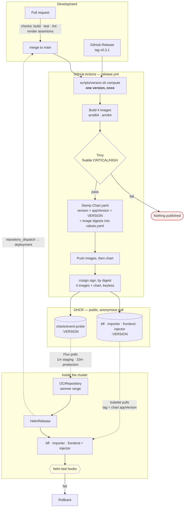

# Releasing and deploying

How a commit becomes a running deployment. Two halves that meet at a registry and never talk to each other directly:
[`release.yml`](../../.github/workflows/release.yml) **builds and publishes**, and Flux **pulls and reconciles**. Nothing in CI can reach a cluster, by design —
[ADR-016](../adr/ADR-016_GITOPS_DELIVERY.md).

The version scheme itself is in [DEVELOPMENT.md §Versions](../DEVELOPMENT.md#versions-and-cutting-a-release). The platform reasoning is in
[PLATFORM_SETUP §3–4a](PLATFORM_SETUP.md#3-container-registry--ghcr-not-docker-hub).

## The short version

```sh
# Ship a change: merge to main. That is the whole of it.
#   release.yml builds and publishes a snapshot; Flux notices and reconciles within minutes.

flux --context event-junkie-staging get helmreleases -A          # did it land?
flux --context event-junkie-staging reconcile helmrelease event-junkie -n flux-system --with-source   # impatient
gh api repos/enorm-labs/event-junkie/deployments --jq '.[0] | {environment, ref, created_at}'         # what GitHub thinks

# Cut a release: one dispatch. It publishes the release; nothing in the tree moves (ADR-032).
scripts/version.sh deserved                                                # what the commits since the last tag earn
gh run list --workflow=release.yml --branch main --limit 1                 # green? the cut refuses a red one
gh workflow run cut-release.yml -f dry_run=false
```

**Nothing here deploys from CI, and nothing can.** A green Actions run means "the artifact was published", not "it is live" — those are minutes apart. §When a
deploy goes wrong is the page to read when they diverge.

## The whole path



**Every arrow crossing into the cluster is dashed, and they all start inside it.** That is the entire security argument: CI holds no cluster credential because
there is nothing for it to hold.

**Every published artifact carries a cosign signature, keyless, on its digest** (#1425). Fulcio issues a certificate for the workflow's own identity —
`https://github.com/enorm-labs/event-junkie/.github/workflows/release.yml@<ref>` — and Rekor logs it. Anyone can check one from a laptop with no key:

```sh
cosign verify ghcr.io/enorm-labs/charts/event-junkie:<version> \
  --certificate-oidc-issuer https://token.actions.githubusercontent.com \
  --certificate-identity-regexp '^https://github\.com/enorm-labs/event-junkie/\.github/workflows/release\.yml@'
```

The signature is separate from the provenance attestation (#443), which `gh attestation verify` reads and Flux cannot. Flux verifies cosign
signatures and nothing else, so the signature is the half a cluster can enforce through `spec.verify` on its OCIRepository.

**The chart names its images by digest** (#1473). After the pushes, the same run stamps each image's digest into the chart's `values.yaml`. A verified
chart therefore pulls `repo:VERSION@sha256:…`: the bytes the run built and signed, whatever a tag on GHCR points at later. A missing digest fails the run.

## What triggers what

| Trigger                                      | Version                                 | Published                                      | Reconciled onto |
| -------------------------------------------- | --------------------------------------- | ---------------------------------------------- | --------------- |
| push to `main`                               | `0.3.1-snapshot.<utc-timestamp>.g<sha>` | images + chart                                 | **staging**     |
| **publish a GitHub Release** tagged `v0.3.1` | `0.3.1`                                 | images + chart, **and** `latest` on the images | **production**  |
| PR touching `release.yml` or `version.sh`    | snapshot                                | **nothing** — dry run                          | —               |
| `workflow_dispatch`                          | as above                                | nothing, unless `publish` is ticked            | —               |

Publishing is decided by an **allowlist** (`push`, `release`, or a dispatch that asks), so a trigger added later cannot silently become a publishing one.

**Releases are cut through GitHub Releases, not by pushing a tag.** The workflow triggers on `release: published`, so a hand-pushed tag publishes nothing — which
keeps the Releases page the single record of what shipped.

**[`cut-release.yml`](../../.github/workflows/cut-release.yml) is what publishes that release**, on a `workflow_dispatch` with `dry_run` on by default. It reads
the version from the commits (§What a release deserves), refuses a tag that already exists, and creates the release. Nothing in the tree carries the version
([ADR-032](../adr/ADR-032_VERSION_FROM_TAGS.md)), so no pull request follows. The next commit's snapshot is named after the next number by the same script.

**The notes open with a summary, written for a visitor to the site.** Claude writes it, driven by
[`/release-highlights`](../../.github/prompts/release-highlights.prompt.md). It reads the Conventional Commits since the last release and keeps the ones
whose effect shows on the site. It names them in the visitor's words: three to five bullets under one sentence. Breaking changes come first, then new
event sources, then what the site newly does, then what it now does correctly. A release with nothing visible says so in one line. `cut-release.yml` puts
that summary above the label categories from [`.github/release.yml`](../../.github/release.yml), and the dispatch's own `notes` input between the two.

The text comes from one of three places, and the run summary says which. The `highlights` input wins when it is set. A dry run prints the model's text.
You read it, edit it or not, and paste it into the real dispatch. What ships is then what you read, not a second answer. Otherwise the model writes it.
The model step is `continue-on-error`, and it reports success without running when the workflow file differs from `main`'s. When it writes nothing,
[`scripts/release-highlights.sh`](../../scripts/release-highlights.sh) writes the summary instead, from the commits' subjects verbatim. An outage at the
model delays no release. At a terminal, both are one command:

```bash
claude -p '/release-highlights'          # what the model would write, since the last release tag
scripts/release-highlights.sh            # the fallback, since the last release tag
scripts/release-highlights.sh v0.13.0    # since a named tag
```

**It cannot use `GITHUB_TOKEN`.** GitHub suppresses the events its own token raises. A release created with it fires no `release: published`, so `release.yml`
never runs, nothing reaches GHCR, and every job reports green. The workflow mints a GitHub App installation token instead, narrowed to `contents: write` and
valid for an hour ([CREDENTIALS.md](../CREDENTIALS.md) §2, #25).

## One version, five artifacts

No file carries the version ([ADR-032](../adr/ADR-032_VERSION_FROM_TAGS.md)). [`scripts/version.sh`](../../scripts/version.sh) reads it from the newest
release tag reachable from the commit and the Conventional Commits since it. Every build stamps that number over the `0.0.0` placeholders in
`gradle.properties`, `package.json` and `Chart.yaml`.

```
tags + commits since v0.3.0
        │
        └── scripts/version.sh compute ──► 0.3.1-snapshot.20260814122042.gdf18a02
                     │
                     ├── ./gradlew -Pversion=0.3.1-snapshot.… ──► build-info.properties, GET /meta
                     ├── docker build -t ghcr.io/…/bff:0.3.1-snapshot.20260814122042.gdf18a02
                     ├── docker build -t ghcr.io/…/importer:…
                     ├── docker build -t ghcr.io/…/frontend:…
                     ├── docker build -t ghcr.io/…/injector:…
                     └── Chart.yaml  version: … / appVersion: …
                                             │
                                             └── every image.tag falls back to .Chart.AppVersion
```

**That fallback is the mechanism, and it is one line from being defeated.** A published values file that pins `<component>.image.tag` opts that
component out silently, and so does a `HelmRelease`. The render still looks correct, with a plausible tag on every image, while one workload runs a version
nobody chose. The chart's `tests/invariants_test.yaml` fails the build on the values file. `scripts/cluster-assertions.sh` fails it on a `HelmRelease`.

## The two version policies

Each environment's `OCIRepository` decides what it follows. They are deliberately opposite, and the staging one fails **silently** if written wrong.

```yaml
# deploy/clusters/staging/oci-repository.yaml
ref:
  semver: ">=0.0.0-0"          # the -0 admits prereleases. Without it: no snapshot ever matches
```

```yaml
# deploy/clusters/production/oci-repository.yaml
ref:
  semver: ">=0.1.0"
  semverFilter: '^[0-9]+\.[0-9]+\.[0-9]+$'   # release tags only, stated positively
```

Observed on k3d rather than reasoned about:

```
semver: ">=0.0.0-0"  ->  resolved 0.1.1-snapshot.20260814122042.gdf18a02@sha256:0a9239c280ab…
semver: ">=0.0.0"    ->  no match found for semver: >=0.0.0
```

### The range only means "newest" if the versions order

Two independent things have to be true, and only the first is famous. The `-0` decides **which versions are candidates**. The version scheme decides **which
candidate wins**. A correct range ranking unordered versions resolves a chart at random, reports `Ready`, and logs nothing. That is the same silent shape as
the missing `-0`, and it cost three days ([#455](https://github.com/enorm-labs/event-junkie/issues/455)).

SemVer §11 says identifiers made only of digits compare **numerically**, and identifiers containing a letter compare **lexically in ASCII**. The old
`0.1.0-snapshot.g<sha>` therefore sorted by short sha, which is random. Staging ran whichever sha happened to sort highest, until a merge produced one
higher still. That is roughly a 1-in-16 chance per commit, and it could move backwards. The timestamp is digits-only and fixes it. The `g<sha>` stays as a tie-break and for
traceability.

The same rule is why the base version moved `0.1.0` → `0.1.1` without `0.1.0` ever being released. **Numeric identifiers rank below alphanumeric ones**, so
`0.1.0-snapshot.2026…` sorts _under_ all ten legacy `0.1.0-snapshot.g…` tags. Those are immutable published artifacts and were not deleted. The patch bump puts
every new snapshot above them on the `major.minor.patch` comparison, before any prerelease identifier is read.

[`scripts/version-test.sh`](../../scripts/version-test.sh) is the gate. It resolves fabricated version sets through Helm's own Masterminds solver, the library
Flux's source-controller embeds, and asserts the newest wins. Asserting the _format_ would not have caught this. The format was always valid.

## When a deploy goes wrong

Flux runs the chart's own `helm test` hooks as part of reconciliation — the smoke tests CI cannot run, because CI cannot reach the cluster (ADR-033). The
first curls the two Services. The second, where `tests.smoke.enabled` is on, runs `perf/smoke.js` through the Ingress: every public endpoint once, and the
SPA. A failure of either triggers remediation:

|                                 |                                                                                                                                                    |
| ------------------------------- | -------------------------------------------------------------------------------------------------------------------------------------------------- |
| Upgrade fails or the test fails | Retry up to `retries`, rolling back between attempts                                                                                               |
| Retries exhausted               | **Roll back** — `remediateLastFailure: true`, without which the broken release is simply left running                                              |
| First install fails             | Retried, and the last failure is **left in place** on purpose: there is no previous version to return to, and a failed install is worth looking at |

Rollback is also `git revert` on the manifests, and drift from a manual `kubectl edit` is reported on staging (`driftDetection: warn`) and corrected on
production (`enabled`).

### Publishing is blocked

The symptom is a red `release.yml` on `main`, failing at _Scan the images_ on every push. **The cause is usually not the change that landed.** Trivy gates
on fixable CRITICAL and HIGH findings in the base images. Alpine publishes a fix, and the base image does not carry it yet. This happened on 2026-09-01
(libexpat, #964) and on 2026-09-05 (util-linux, #1117). Nothing reaches staging until it is fixed, and `cut-release.yml` refuses to cut.

The levers, in order:

1. **A newer base digest.** Compare the tag's digest with the pin. Then check the package inside it, never the digest alone.
2. **Upgrade the package in our layer.** Name the package, and write the deletion condition in the comment. #964 is the shape. #1033 is its removal.
3. **A dated waiver in `.trivyignore`**, only when the fix cannot be taken. The gate scans the **amd64** image, and Alpine builds each architecture
   separately. So verify on `--platform linux/amd64`. #1118 was verified on arm64 and changed nothing in CI. #1119 is the waiver that followed.

A red publish on `main` does two things by itself (#1122). `publish-failure-issue.yml` opens one blocker issue with the Trivy tables, updates it on
each further red run, and closes it on the first green one. `agent-security.yml` runs on the same trigger. It walks this list with the commands in
[`security-triage.prompt.md` § A blocked publish](../../.github/prompts/security-triage.prompt.md#a-blocked-publish). When the answer is an upgrade
line, or a waiver it can justify, it opens the pull request. Look for that pull request before starting by hand. The same section deletes an upgrade
line or a waiver once the base has caught up, which is what #1033 did by hand.

## What a release deserves

The decision and its reasoning are [ADR-025](../adr/ADR-025_RELEASE_VERSION_FROM_COMMITS.md). The number is not chosen. [`scripts/version.sh deserved`](../../scripts/version.sh) reads it from the Conventional Commits since the last release
tag. The rule is [SemVer 2.0.0](https://semver.org/) applied to what the commits say:

| The commits since the last tag contain                          | Before `1.0.0` | From `1.0.0` |
| --------------------------------------------------------------- | -------------- | ------------ |
| a breaking change (`!` in the subject, or `BREAKING CHANGE:`)   | **minor**      | **major**    |
| a `feat` in a product scope, and no breaking change             | **minor**      | **minor**    |
| only `fix`, `perf`, `refactor`, `docs`, `chore`, `ci`, and such | **patch**      | **patch**    |

A new event source is a `feat`, so a release that adds one is a minor. `feat` is reserved for a change a visitor can see, in a product scope:
`frontend`, `events`, `promoters`, `venues`, `artists`, `importer`, `scraper`, `bff`, `images`, `branding`. `label-pr.yml` goes red on one outside them,
and `deserved` counts one that landed anyway as a patch, listed in its summary. A minor then says the site grew, not that the pipeline did. A subject that is not Conventional Commits counts as a patch. The summary lists it,
so an unlabelled feature is visible rather than silently cheap. A revert is a patch. The floor `at_least` is for the one decision the commits cannot
show: `1.0.0` is cut with `major`. It never lowers the verdict.

**What "breaking" means here.** The `!` belongs on a change that a consumer has to act on. That is the BFF's public `/api/**` contract, the chart's
`values.yaml` keys, the importer's admin API, or a step an operator must take before the upgrade. A change to a scraper is not breaking, however large.

**Before `1.0.0` a breaking change is a minor.** SemVer §4 says a `0.y.z` release may change anything, and the minor is the number that signals it.
`docs/LEGAL.md` §4.7 holds the decision on `1.0.0` itself.

Every release since `v0.3.0` was a patch. Under this rule `v0.3.9`, with fifteen `feat` commits, was a `v0.4.0`. The rule is enforced from now on and rewrites
nothing.

## Cutting a release

```bash
scripts/version.sh deserved                                      # 0.4.0, with the commits that decided it on stderr
gh workflow run cut-release.yml -f dry_run=true                  # resolves the version and previews the notes
gh workflow run cut-release.yml -f dry_run=false                 # publishes; nothing in the tree moves
gh workflow run cut-release.yml -f dry_run=false -f at_least=major   # the 1.0.0 release, once
```

The workflow refuses three things. Nothing landed since the last release. The tag already exists. The commit's snapshot publish on `main` is not green.
The last one is the release gate seen early. A release rebuilds what the snapshot built, so it fails the same way. It then leaves a tag with nothing
behind it. The by-hand fallback and the reasoning are in [DEVELOPMENT.md § Cutting a release](../DEVELOPMENT.md#cutting-a-release).

**Nothing moves `main` after a cut.** The next commit publishes as the next patch snapshot, and a `feat` during the cycle moves the snapshot number to
the minor on its own. `helm list` on staging shows `0.3.13-snapshot.…` become `0.4.0-snapshot.…` without a release. That is expected.

A release version is **never committed**: `release.yml` passes `-Pversion=` from the tag, so the tag and the artifacts cannot disagree. Tagging `v0.4.0` on
commits that deserve `0.3.13` fails before anything is built.

## Rehearsing the whole thing locally

```bash
scripts/k3d-rehearsal.sh flux-all   # the published chart, through Flux, on k3d
scripts/k3d-rehearsal.sh all        # the working tree's chart, with locally built images
```

The first answers _"does the delivery mechanism work?"_, the second _"does my change work?"_. They must not share a cluster. See
[the k3d rehearsal prompt](../../.github/prompts/k3d-rehearsal.prompt.md).

## Bringing up a new cluster

**Not here — [CLUSTER_BOOTSTRAP.md](CLUSTER_BOOTSTRAP.md).** That is a different lifecycle: it happens once per cluster, from a laptop, and then never again.
This document is about what happens on every commit afterwards.

The one property worth carrying across, because it constrains the chart rather than the runbook: **order is enforced, not assumed.** The chart renders a
`cert-manager.io/v1` ClusterIssuer, and the API server rejects unknown kinds — so without cert-manager the whole application release fails, workloads included.
`dependsOn` is what orders it. `scripts/cluster-assertions.sh` fails the build if a release that creates an issuer stops declaring one.

## What is not automated, and why

- **`flux bootstrap` runs once per cluster, from a laptop** — [CLUSTER_BOOTSTRAP.md](CLUSTER_BOOTSTRAP.md) §9. It commits Flux's manifests to this repository
  and creates a deploy key. It needs a GitHub PAT once, which CI never holds.
- **Two secrets are made by hand** — the database credentials, and on staging only the Hetzner DNS token. The chart never templates a password, and
  [#416](https://github.com/enorm-labs/event-junkie/issues/416) replaces both with SOPS.
- **Production is deployed and dark.** Its `database.host` is the real private address. While `publish_dns` is false it serves a rehearsal hostname, so its
  `ingress` values differ from the chart's defaults and revert at go-live — [GO_LIVE_CHECKLIST.md](GO_LIVE_CHECKLIST.md).
- **GHCR package visibility** is a click, once per package, and every package is private on first publish regardless of repository visibility.
