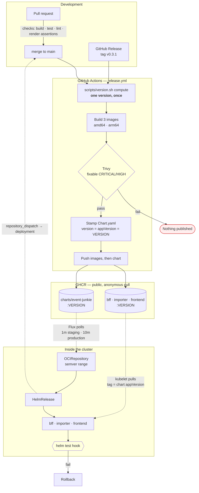

# Releasing and deploying

How a commit becomes a running deployment. Two halves that meet at a registry and never talk to each other directly:
[`release.yml`](../../.github/workflows/release.yml) **builds and publishes**, and Flux **pulls and reconciles**. Nothing in CI can reach a cluster, by design —
[ADR-016](../adr/ADR-016_GITOPS_DELIVERY.md).

The version scheme itself is in [DEVELOPMENT.md §Versions](../DEVELOPMENT.md#versions-and-cutting-a-release). The platform reasoning is in
[PLATFORM_SETUP §3–4a](PLATFORM_SETUP.md#3-container-registry--ghcr-not-docker-hub).

## The short version

```sh
# Ship a change: merge to main. That is the whole of it.
#   release.yml builds and publishes a snapshot; Flux notices and reconciles within minutes.

flux --context event-junkie-staging get helmreleases -A          # did it land?
flux --context event-junkie-staging reconcile helmrelease event-junkie -n flux-system --with-source   # impatient
gh api repos/enorm-labs/event-junkie/deployments --jq '.[0] | {environment, ref, created_at}'         # what GitHub thinks

# Cut a release: publish a GitHub Release whose tag matches gradle.properties, v-prefixed.
```

**Nothing here deploys from CI, and nothing can.** A green Actions run means "the artifact was published", not "it is live" — those are minutes apart. §When a
deploy goes wrong is the page to read when they diverge.

## The whole path



**Every arrow crossing into the cluster is dashed, and they all start inside it.** That is the entire security argument: CI holds no cluster credential because
there is nothing for it to hold.

## What triggers what

| Trigger                                      | Version                                 | Published                                      | Reconciled onto |
| -------------------------------------------- | --------------------------------------- | ---------------------------------------------- | --------------- |
| push to `main`                               | `0.3.1-snapshot.<utc-timestamp>.g<sha>` | images + chart                                 | **staging**     |
| **publish a GitHub Release** tagged `v0.3.1` | `0.3.1`                                 | images + chart, **and** `latest` on the images | **production**  |
| PR touching `release.yml` or `version.sh`    | snapshot                                | **nothing** — dry run                          | —               |
| `workflow_dispatch`                          | as above                                | nothing, unless `publish` is ticked            | —               |

Publishing is decided by an **allowlist** (`push`, `release`, or a dispatch that asks), so a trigger added later cannot silently become a publishing one.

**Releases are cut through GitHub Releases, not by pushing a tag.** The workflow triggers on `release: published`, so a hand-pushed tag publishes nothing — which
keeps the Releases page the single record of what shipped.

## One version, four artifacts

`gradle.properties` is the source of truth. Everything derives from it via [`scripts/version.sh`](../../scripts/version.sh).

```
gradle.properties  0.3.1-SNAPSHOT
        │
        └── scripts/version.sh compute ──► 0.3.1-snapshot.20260814122042.gdf18a02
                     │
                     ├── docker build -t ghcr.io/…/bff:0.3.1-snapshot.20260814122042.gdf18a02
                     ├── docker build -t ghcr.io/…/importer:…
                     ├── docker build -t ghcr.io/…/frontend:…
                     └── Chart.yaml  version: … / appVersion: …
                                             │
                                             └── every image.tag falls back to .Chart.AppVersion
```

**That fallback is the mechanism, and it is one line from being defeated.** A published values file that pins `<component>.image.tag` opts that
component out silently, and so does a `HelmRelease`. The render still looks correct, with a plausible tag on every image, while one workload runs a version
nobody chose. The chart's `tests/invariants_test.yaml` fails the build on the values file. `scripts/cluster-assertions.sh` fails it on a `HelmRelease`.

## The two version policies

Each environment's `OCIRepository` decides what it follows. They are deliberately opposite, and the staging one fails **silently** if written wrong.

```yaml
# deploy/clusters/staging/oci-repository.yaml
ref:
  semver: ">=0.0.0-0"          # the -0 admits prereleases. Without it: no snapshot ever matches
```

```yaml
# deploy/clusters/production/oci-repository.yaml
ref:
  semver: ">=0.1.0"
  semverFilter: '^[0-9]+\.[0-9]+\.[0-9]+$'   # release tags only, stated positively
```

Observed on k3d rather than reasoned about:

```
semver: ">=0.0.0-0"  ->  resolved 0.1.1-snapshot.20260814122042.gdf18a02@sha256:0a9239c280ab…
semver: ">=0.0.0"    ->  no match found for semver: >=0.0.0
```

### The range only means "newest" if the versions order

Two independent things have to be true, and only the first is famous. The `-0` decides **which versions are candidates**. The version scheme decides **which
candidate wins**. A correct range ranking unordered versions resolves a chart at random, reports `Ready`, and logs nothing. That is the same silent shape as
the missing `-0`, and it cost three days ([#455](https://github.com/enorm-labs/event-junkie/issues/455)).

SemVer §11 says identifiers made only of digits compare **numerically**, and identifiers containing a letter compare **lexically in ASCII**. The old
`0.1.0-snapshot.g<sha>` therefore sorted by short sha, which is random. Staging ran whichever sha happened to sort highest, until a merge produced one
higher still. That is roughly a 1-in-16 chance per commit, and it could move backwards. The timestamp is digits-only and fixes it. The `g<sha>` stays as a tie-break and for
traceability.

The same rule is why the base version moved `0.1.0` → `0.1.1` without `0.1.0` ever being released. **Numeric identifiers rank below alphanumeric ones**, so
`0.1.0-snapshot.2026…` sorts _under_ all ten legacy `0.1.0-snapshot.g…` tags. Those are immutable published artifacts and were not deleted. The patch bump puts
every new snapshot above them on the `major.minor.patch` comparison, before any prerelease identifier is read.

[`scripts/version-test.sh`](../../scripts/version-test.sh) is the gate. It resolves fabricated version sets through Helm's own Masterminds solver, the library
Flux's source-controller embeds, and asserts the newest wins. Asserting the _format_ would not have caught this. The format was always valid.

## When a deploy goes wrong

Flux runs the chart's own `helm test` hook as part of reconciliation — the smoke test CI cannot run, because CI cannot reach the cluster. A failure triggers
remediation:

|                                 |                                                                                                                                                    |
| ------------------------------- | -------------------------------------------------------------------------------------------------------------------------------------------------- |
| Upgrade fails or the test fails | Retry up to `retries`, rolling back between attempts                                                                                               |
| Retries exhausted               | **Roll back** — `remediateLastFailure: true`, without which the broken release is simply left running                                              |
| First install fails             | Retried, and the last failure is **left in place** on purpose: there is no previous version to return to, and a failed install is worth looking at |

Rollback is also `git revert` on the manifests, and drift from a manual `kubectl edit` is reported on staging (`driftDetection: warn`) and corrected on
production (`enabled`).

## Cutting a release

```bash
# 1. main is at the version you intend to release
scripts/version.sh check

# 2. publish the release — this is what triggers the workflow
gh release create v0.3.1 --target main --generate-notes

# 3. afterwards, bump all four files to 0.3.2-SNAPSHOT / 0.3.2 in a PR
```

A release version is **never committed**: `release.yml` passes `-Pversion=` from the tag, so the tag and the artifacts cannot disagree. Tagging `v0.4.0` on a tree
that says `0.3.1-SNAPSHOT` fails before anything is built.

## Rehearsing the whole thing locally

```bash
scripts/k3d-rehearsal.sh flux-all   # the published chart, through Flux, on k3d
scripts/k3d-rehearsal.sh all        # the working tree's chart, with locally built images
```

The first answers _"does the delivery mechanism work?"_, the second _"does my change work?"_. They must not share a cluster. See
[the k3d rehearsal prompt](../../.github/prompts/k3d-rehearsal.prompt.md).

## Bringing up a new cluster

**Not here — [CLUSTER_BOOTSTRAP.md](CLUSTER_BOOTSTRAP.md).** That is a different lifecycle: it happens once per cluster, from a laptop, and then never again.
This document is about what happens on every commit afterwards.

The one property worth carrying across, because it constrains the chart rather than the runbook: **order is enforced, not assumed.** The chart renders a
`cert-manager.io/v1` ClusterIssuer, and the API server rejects unknown kinds — so without cert-manager the whole application release fails, workloads included.
`dependsOn` is what orders it. `scripts/cluster-assertions.sh` fails the build if a release that creates an issuer stops declaring one.

## What is not automated, and why

- **`flux bootstrap` runs once per cluster, from a laptop** — [CLUSTER_BOOTSTRAP.md](CLUSTER_BOOTSTRAP.md) §9. It commits Flux's manifests to this repository
  and creates a deploy key. It needs a GitHub PAT once, which CI never holds.
- **Two secrets are made by hand** — the database credentials, and on staging only the Hetzner DNS token. The chart never templates a password, and
  [#416](https://github.com/enorm-labs/event-junkie/issues/416) replaces both with SOPS.
- **Production is `suspend: true`** until [#424](https://github.com/enorm-labs/event-junkie/issues/424) provisions it, and its `database.host` is an
  unmistakable placeholder rather than a plausible address.
- **GHCR package visibility** is a click, once per package, and every package is private on first publish regardless of repository visibility.
