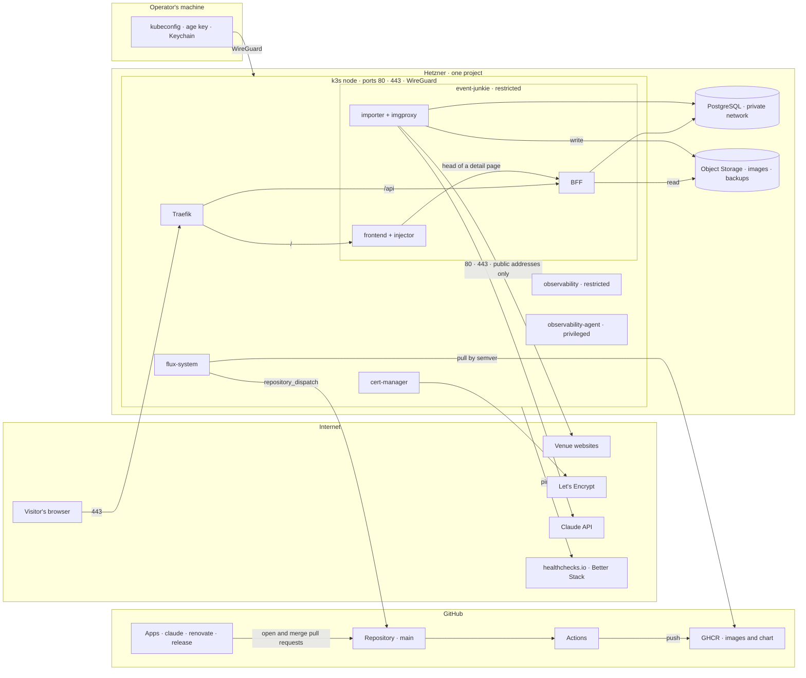

# Threat model

What an attacker can reach, what can go wrong at each boundary, and what stops it. The model follows the four questions of the
[OWASP Threat Modeling Cheat Sheet](https://cheatsheetseries.owasp.org/cheatsheets/Threat_Modeling_Cheat_Sheet.html) and uses STRIDE to name each threat.
Every _mitigated_ row names the file that does the work. A reader can check each row against the tree.

**Last reviewed: 2026-09-14.** §4 says when the model must be read again.

## The short version

- **One inbound path.** Ports 80 and 443 on one node, through Traefik, to two routes: `/` and `/api`. Everything else is unroutable by name
  ([ADR-023](../adr/ADR-023_OPERATOR_AUTHENTICATION.md)).
- **No login, no session, no user data.** The site reads public data. The importer writes it. Spring Security is not a dependency.
- **The strongest controls are network controls.** Default-deny NetworkPolicies, a firewall with two public ports, Pod Security `restricted`, and
  staging on the WireGuard tunnel only.
- **The strongest credential in the system is write access to `main`.** What lands there is what the cluster runs
  ([ADR-016](../adr/ADR-016_GITOPS_DELIVERY.md)). Three GitHub Apps can open a pull request there. A required check refuses the unlisted one (#1424).
- **No open threat is ranked in §3 today.** The last two — an unsigned chart on production (#1425) and a `privileged` namespace (#709) — are closed. The
  accepted rows there are the trade-offs still standing.

## 1 · What we are working on

### Trust zones

### Assets

| Asset                          | Why it matters                                                                                                                             | Where it is                                                    |
| ------------------------------ | ------------------------------------------------------------------------------------------------------------------------------------------ | -------------------------------------------------------------- |
| `main`                         | What lands there is what runs on the cluster, after `release.yml` and Flux                                                                 | GitHub, ruleset `main`                                         |
| The published chart and images | Flux pulls them by semver range, anonymously, and runs what it gets                                                                        | `ghcr.io/enorm-labs/`                                          |
| The database                   | Every event, venue and artist. A `--full` re-seed rebuilds it from the venues, [RESTORE_RUNBOOK.md](../ops/RESTORE_RUNBOOK.md) restores it | PostgreSQL on the private network, backups in Object Storage   |
| The nine cluster secrets       | Each has its own exposure cost, listed in [SECRETS.md](../ops/SECRETS.md)                                                                  | Per cluster. `events-db` in git under SOPS, the rest hand-made |
| The Hetzner token              | Read and write on every server, volume and firewall in the project                                                                         | Staging's `cert-manager` namespace, the operator's Keychain    |
| `github-dispatch`              | `contents: write` on this repository. The one secret that cannot be regenerated                                                            | `flux-system` on each cluster                                  |
| The domain and its certificate | `event-junkie.de`, HSTS pinned for a year                                                                                                  | Hetzner DNS, cert-manager                                      |
| Availability                   | One node and one Traefik pod. Two BFF and two frontend replicas on production. Better Stack notices in about six minutes                   | [ADR-021](../adr/ADR-021_PUBLIC_SITE_MONITORING.md)            |
| Visitor privacy                | No account, no cookie, no third-party script. The access log carries no client address and expires after 14 days                           | `RequestLoggingFilter.kt`, `openobserve.yaml`                  |

### Inbound entry points

| Entry                                                                | Who may reach it                                 | Where it is decided                                                                        |
| -------------------------------------------------------------------- | ------------------------------------------------ | ------------------------------------------------------------------------------------------ |
| 80 and 443 on the k3s node                                           | Everyone, production only                        | `infra/modules/environment/firewall.tf`, `public_web = false` on staging                   |
| WireGuard UDP                                                        | Everyone, but only listed peer keys              | `firewall.tf`, `wireguard.sh`                                                              |
| 22 and 6443                                                          | Nobody. `admin_cidrs = []` on both               | `firewall.tf`, both `terraform.tfvars`                                                     |
| `/` and `/api` through Traefik                                       | Everyone                                         | `deploy/charts/event-junkie/templates/ingress.yaml`, enforced by `tests/ingress_test.yaml` |
| `/api/admin/**`, `/actuator/**`, the importer, both management ports | Nobody from outside. `kubectl port-forward` only | Same Ingress. ADR-023 names this the control                                               |
| PostgreSQL 5432                                                      | The private subnet and the pod CIDR, with SCRAM  | `postgres.sh`, the `postgres` firewall has no inbound rule                                 |
| OpenObserve, signal-cli                                              | The tunnel                                       | No Ingress in `deploy/clusters/`                                                           |

### Outbound connections

Every namespace under the chart starts from default deny. Each arrow below is a named NetworkPolicy in `templates/networkpolicy.yaml`.

| From         | To                                          | Bound by                                                                                        |
| ------------ | ------------------------------------------- | ----------------------------------------------------------------------------------------------- |
| importer     | Any public address, TCP 80 and 443          | `allow-scraping`. Excepts the three RFC 1918 ranges and `169.254/16`. Pods have no IPv6 address |
| importer     | PostgreSQL                                  | `allow-database`, one address                                                                   |
| importer     | Object Storage, 443                         | `allow-scraping` covers it, since the bucket is a public address                                |
| BFF          | PostgreSQL, Object Storage on 443           | `allow-database` and `allow-object-storage`. The BFF never reaches a venue                      |
| frontend     | The BFF service port                        | `allow-frontend-to-bff`, for the injector sidecar                                               |
| cert-manager | Let's Encrypt, the Hetzner API on staging   | `cert-manager-netpol.yaml` per cluster                                                          |
| flux-system  | GHCR, `github.com`                          | Flux's own namespace, outside the chart                                                         |
| The node     | healthchecks.io, Object Storage for backups | `backups.sh`. Ping URLs live only on the node                                                   |

## 2 · What can go wrong

STRIDE letters: **S**poofing, **T**ampering, **R**epudiation, **I**nformation disclosure, **D**enial of service, **E**levation of privilege. Status
is one of three words. _Mitigated_ names the file or issue. _Accepted_ gives the reason. _Open_ names the issue that tracks it.

Likelihood and impact are each `low`, `medium` or `high`, judged for this system and not in general.

### B1 · Internet → Traefik

| Threat                                   | STRIDE | Likelihood | Impact | Status                                                                                                                  |
| ---------------------------------------- | ------ | ---------- | ------ | ----------------------------------------------------------------------------------------------------------------------- |
| A request flood exhausts the BFF pods    | D      | medium     | medium | Mitigated. `rate-limit-middleware.yaml`: 100 in flight, 50/s per source, burst 250. Real source addresses since #1013   |
| Plaintext first request, TLS stripped    | T, I   | low        | low    | Mitigated. HSTS for one year, `security-headers-middleware.yaml`. The redirect host is not pinned, on purpose           |
| A certificate expires unnoticed          | D      | low        | high   | Mitigated. cert-manager renews. `site-probe.yml` and Better Stack fail on an untrusted certificate                      |
| A port other than 80 and 443 answers     | E      | low        | high   | Mitigated. `firewall.tf`. Nothing tests it from outside. `dast.yml` talks to 443 only, so a port probe stays open       |
| The node's SSH accepts a password        | S      | low        | high   | Mitigated. `harden.sh`: `PasswordAuthentication no`, `PermitRootLogin no`, and port 22 is closed by the firewall        |
| Traefik or nginx carries a published CVE | E      | medium     | high   | Mitigated. Renovate and Dependabot propose, Trivy blocks a publish, `image-scan-scheduled.yml` rescans what is deployed |

### B2 · Traefik → frontend, Traefik → BFF

| Threat                                                         | STRIDE | Likelihood | Impact | Status                                                                                                                                  |
| -------------------------------------------------------------- | ------ | ---------- | ------ | --------------------------------------------------------------------------------------------------------------------------------------- |
| Scraped text carries a script and the page renders it          | T      | medium     | medium | Mitigated. Vue escapes by default and the tree has no `v-html`. The injector escapes every value. CSP allows one script hash (#854)     |
| A venue title with `$'` or `` $` `` corrupts the injected head | T, D   | low        | low    | Mitigated. `rewrite.ts` replaces through a function, so `$` patterns are inserted as they are (#1426). `rewrite.spec.ts` asserts it     |
| An expensive query holds a connection                          | D      | medium     | medium | Mitigated. Page size ≤ 100 (`application.yaml`), calendar range ≤ `MAX_CALENDAR_DAYS` (`EventService.kt`), unknown parameters are a 400 |
| A 500 leaks a stack trace or a query                           | I      | low        | low    | Mitigated. `GlobalExceptionHandler.kt` answers with a `ProblemDetail`. #1421 tests the body                                             |
| Another site's script reads the API                            | I      | low        | low    | Accepted. The data is public. CORS allows `GET` for the listed origins only (`WebFluxConfiguration.kt`), and is not an access control   |
| A path under `/api/images` reaches an arbitrary object         | I      | low        | low    | Mitigated. `CachedImageController.kt` resolves the key from the database, never from the path                                           |
| The admin API or Actuator becomes routable                     | E      | low        | high   | Mitigated. `tests/ingress_test.yaml` fails the build. ADR-023 makes an admin surface without a middleware a breach of the decision      |
| A crawler or a scraper copies the whole dataset                | I      | high       | low    | Accepted. The data is public and aggregated from public pages. #268 records why the API cannot be made frontend-only                    |

### B3 · BFF and importer → PostgreSQL

| Threat                                   | STRIDE | Likelihood | Impact | Status                                                                                                                             |
| ---------------------------------------- | ------ | ---------- | ------ | ---------------------------------------------------------------------------------------------------------------------------------- |
| SQL injection through a query parameter  | T, I   | low        | high   | Mitigated. R2DBC binds every parameter. `EventSearchRepository.kt` whitelists sort columns. #1421's API scan fuzzes each parameter |
| The database answers on a public address | I, E   | low        | high   | Mitigated. `listen_addresses` is `localhost` and the private address. `pg_hba.conf` allows the subnet and the pod CIDR             |
| The `events` password leaks from git     | I      | low        | low    | Accepted. SOPS with age. SECRETS.md records that the password is useless without network access                                    |
| A backup is lost or restored wrong       | T, D   | low        | high   | Mitigated. wal-g to Object Storage, a quarterly restore drill (`restore-drill-reminder.yml`), [BACKUPS.md](../ops/BACKUPS.md)      |

### B4 · Importer → venue websites

The importer is the one workload that talks to the open internet. Everything it reads is attacker-controlled text.

| Threat                                                  | STRIDE | Likelihood | Impact | Status                                                                                                                                       |
| ------------------------------------------------------- | ------ | ---------- | ------ | -------------------------------------------------------------------------------------------------------------------------------------------- |
| A venue page points a fetch at a private address (SSRF) | I, E   | medium     | high   | Mitigated at the packet level. `allow-scraping` excepts the RFC 1918 ranges and `169.254/16`. A redirect or DNS rebinding hits the same rule |
| A fetch reaches the node's own public address           | E      | low        | low    | Accepted. Ports 80 and 443 there are the public site. Nothing else answers                                                                   |
| An oversized or hostile image exhausts the importer     | D      | medium     | low    | Mitigated. `ImageFetcher.kt` rejects by declared and actual size, sniffs the type, and reads the header before decoding                      |
| Bad data poisons the dataset                            | T      | medium     | low    | Accepted. A venue can publish anything about itself. `/plausibility-check` and `/data-quality-audit` read for it                             |
| Our scraping harms a venue                              | D      | low        | medium | Mitigated. `PerHostThrottlingFilter.kt`, `RobotsTxtFilter.kt`, one User-Agent ([ADR-007](../adr/ADR-007_WEB_SCRAPING_STRATEGY.md))           |

### B5 · Importer → Claude API

| Threat                                                 | STRIDE | Likelihood | Impact | Status                                                                                                                        |
| ------------------------------------------------------ | ------ | ---------- | ------ | ----------------------------------------------------------------------------------------------------------------------------- |
| Venue text instructs the translation model             | T      | medium     | low    | Accepted. The output is a translation stored as text and rendered escaped. The worst case is a wrong translation of one event |
| The key leaks and someone spends against the workspace | I      | low        | low    | Mitigated. Hand-made, never in git, a spend cap on the workspace. SECRETS.md § `event-junkie-translation`                     |

### B6 · GitHub Actions → GHCR → Flux → cluster

| Threat                                                | STRIDE | Likelihood | Impact | Status                                                                                                                                                          |
| ----------------------------------------------------- | ------ | ---------- | ------ | --------------------------------------------------------------------------------------------------------------------------------------------------------------- |
| A pull request from a fork runs with secrets          | E      | low        | high   | Mitigated. `pull_request` triggers, `persist-credentials: false`, zizmor in `validate-workflows.yml`. The two `pull_request_target` workflows check out nothing |
| A bot branch runs a hostile install script            | E      | low        | medium | Mitigated. `fix-notices-on-bot-prs.yml` mints the App token only at the push step, after `npm ci`                                                               |
| A dependency ships malware                            | T      | medium     | high   | Mitigated in part. Dependency review on each PR, Dependency-Check nightly, Trivy on each image. Nothing checks a package's provenance                           |
| A chart or image in GHCR is replaced and Flux runs it | T, E   | low        | high   | Mitigated. `release.yml` signs the chart and the images, keyless, on the digest; every cluster's `spec.verify` matches the workflow's identity (#1425)          |
| A tag on GHCR is repointed after the chart verified   | T, E   | low        | high   | Mitigated. The chart names each image `repo:tag@sha256:…`, stamped by `release.yml` from its own push; the node pulls the digest (#1473)                        |
| A chart fails verification and nobody hears of it     | R      | low        | medium | Mitigated. The `source-failure` Alert dispatches every OCIRepository error to `flux-source-failure.yml`, which goes red (#1454)                                 |
| A commit reaches `main` without a review              | T      | low        | high   | Mitigated. `merge-gate.yml`, a required check on `pull_request_target`, fails an unlisted App's pull request until a person approves its head (#1424)           |
| A tag or an action is unpinned                        | T      | low        | medium | Mitigated. Every action is pinned by SHA, every tool by version. zizmor and Dependabot keep it so                                                               |

### B7 · Operator → cluster

| Threat                                               | STRIDE | Likelihood | Impact | Status                                                                                                                      |
| ---------------------------------------------------- | ------ | ---------- | ------ | --------------------------------------------------------------------------------------------------------------------------- |
| A stolen laptop holds the kubeconfig and the age key | E      | low        | high   | Accepted. One operator, and the tunnel needs the WireGuard private key too. [SECRETS.md](../ops/SECRETS.md) covers rotation |
| The Kubernetes API answers on the internet           | E      | low        | high   | Mitigated. 6443 is closed. Break-glass opens it for `admin_cidrs` only, by a `tofu apply` the operator runs by hand         |
| An action on the cluster cannot be attributed        | R      | low        | low    | Accepted. One operator. Flux writes every reconcile to the GitHub Deployments tab (#565)                                    |

### B8 · Cluster → GitHub and alerting

| Threat                                                        | STRIDE | Likelihood | Impact | Status                                                                                                                                                                             |
| ------------------------------------------------------------- | ------ | ---------- | ------ | ---------------------------------------------------------------------------------------------------------------------------------------------------------------------------------- |
| A node compromise yields `github-dispatch`, `contents: write` | E      | low        | high   | Accepted. `repository_dispatch` needs that scope. The token is hand-made, per cluster, and the ruleset still requires a pull request                                               |
| A node compromise on staging yields the Hetzner token         | E      | low        | high   | Accepted. DNS-01 needs it and Hetzner tokens are project-wide. `infra/AGENTS.md` records the choice. Staging is tunnel-only                                                        |
| Alerting dies with the node it watches                        | D      | low        | medium | Mitigated. healthchecks.io and Better Stack run outside. Silence is the alarm ([HEALTHCHECKS.md](../ops/HEALTHCHECKS.md))                                                          |
| A ping URL leaks and silences an alarm                        | S      | low        | medium | Mitigated. Ping URLs live on the node only, never in git                                                                                                                           |
| An in-cluster rule fires and nobody is told                   | D      | medium     | medium | Accepted until #877. Every rule in `deploy/alerts/alerts.json` routes to `record-only`, a row in `alert_history`, not a person. The external layer above is what reaches one today |

### B9 · Agent workflows → repository

Five `agent-*.yml` workflows run Claude with a shell. The action replaces `GITHUB_TOKEN` in the process with the `claude` App's installation token.
That App holds `contents`, `pull_requests`, `workflows` and `actions` at `write`. `agent-owasp.yml` and `agent-plausibility.yml` carry a second
job, `notify`, with `issues: write` (#1499). The agent never runs in that job.

| Threat                                                                   | STRIDE | Likelihood | Impact | Status                                                                                                                                                                                                                      |
| ------------------------------------------------------------------------ | ------ | ---------- | ------ | --------------------------------------------------------------------------------------------------------------------------------------------------------------------------------------------------------------------------- |
| A venue page instructs the plausibility agent, which holds a write token | E      | medium     | medium | Mitigated. The token can push a branch and open a pull request. `Merge gate` fails it until the operator reads it and approves the head (#1424)                                                                             |
| The same token pushes onto a person's open branch with auto-merge armed  | T      | low        | high   | Accepted. A required check cannot see who pushed. The window is one armed pull request at a time, and the push shows in its commit list                                                                                     |
| An agent dismisses a security alert                                      | T      | low        | medium | Mitigated. `agent-security.yml` grants `security-events: read` and `--unattended` files nothing                                                                                                                             |
| An agent commits as `GITHUB_TOKEN` and no check runs                     | D      | low        | low    | Mitigated. No `github_token:` input, on purpose. `agent-security.yml` header                                                                                                                                                |
| The Claude OAuth token leaks from a run                                  | I      | low        | medium | Mitigated. A repository secret, masked in logs, revocable in one click                                                                                                                                                      |
| An agent's report reaches the tracker through a job with a write token   | T      | low        | low    | Mitigated. `issues: write` is on the `notify` job only; the agent's shell holds its own job's token. `report-to-issue` passes every input by `env` and reads the report from disk, so no report text becomes script (#1499) |

### B10 · Object Storage and imgproxy → visitors

| Threat                                      | STRIDE | Likelihood | Impact | Status                                                                                                                             |
| ------------------------------------------- | ------ | ---------- | ------ | ---------------------------------------------------------------------------------------------------------------------------------- |
| imgproxy fetches an arbitrary URL           | I, E   | low        | medium | Mitigated. It binds to localhost in the importer pod, `IMGPROXY_ALLOWED_SOURCES` lists the origins, and every URL is signed        |
| The images key reaches the backups bucket   | T      | low        | high   | Accepted. Hetzner scopes a key to a bucket, not a verb. A bucket policy is a separate question, SECRETS.md § `event-junkie-images` |
| A hostile image reaches a visitor's browser | T      | low        | low    | Mitigated. Every derivative is re-encoded by imgproxy at import time ([ADR-020](../adr/ADR-020_IMAGE_PROCESSING.md))               |

### Cluster-wide

| Threat                                       | STRIDE | Likelihood | Impact | Status                                                                                                                   |
| -------------------------------------------- | ------ | ---------- | ------ | ------------------------------------------------------------------------------------------------------------------------ |
| A pod escapes to the node                    | E      | low        | high   | Mitigated. Pod Security `restricted` on `event-junkie`, `default` and `cert-manager`. Containers run as UID 10001 (#448) |
| A pod in `observability` escapes to the node | E      | low        | high   | Mitigated. `restricted` since #709; the collector agent that held it at `privileged` runs alone in `observability-agent` |
| The collector agent escapes to the node      | E      | low        | high   | Accepted. It reads every container log by mounting `/var/log`, so no level admits it. Alone in its namespace (#709)      |
| A leaked credential's liveness is unknown    | I      | low        | low    | Mitigated. `secret_scanning_validity_checks` is on (#1427), beside secret scanning and push protection                   |
| A debug pod has unrestricted egress          | E      | low        | medium | Mitigated. `default-deny` selects every pod in the namespace, not only the chart's                                       |

## 3 · What we do about it

### Open, ranked

None. The last entry, #709, closed when the collector agent moved out of `observability`. A new row in §2 whose status starts with _Open_ goes here.

### Accepted

Each of these is a choice. A reviewer who disagrees with one changes the row and files the issue.

- The API is public and readable by anyone, including scrapers. #268 records why it cannot be made frontend-only.
- The `events` password is in git under SOPS. Useless without network access.
- The Hetzner token lives in staging's `cert-manager`. DNS-01 needs it, and the token cannot be scoped narrower.
- `github-dispatch` holds `contents: write`. `repository_dispatch` needs that scope, and the ruleset still requires a pull request.
- The images key can write to every bucket the account holds. Hetzner scopes a key to a bucket, not a verb.
- Venue text can steer a translation. The result is text, rendered escaped.
- One operator, so repudiation is not a threat this system defends against.
- The collector agent runs `privileged`. Reading every container log means mounting the node, and Pod Security has no per-workload exemption. So it
  has a namespace to itself, and nothing else lives there (#709).
- An App with `contents: write` can push onto a person's open, auto-merge-armed branch. The check that gates merges cannot see who pushed, and
  the ruleset that could stop it broke auto-merge (#1424).

## 4 · Did we do a good enough job

### What tests this model

- **`dast.yml`** (#1421, #1423, #1461) sends hostile requests from outside. ZAP's active scans and Nuclei's exposure templates run nightly against
  the chart on k3d. The passive ZAP baseline and the same Nuclei pass, at a quarter of the rate, run weekly against production. It tests B1, B2, B3 and B10 against the running chart, and nothing else can.
- **`agent-owasp.yml`** (#1422) reads B4 to B9 each week, against the OWASP Top 10:2025 categories a scanner cannot observe, and leads with what moved.
- `tests/ingress_test.yaml`, `scripts/cluster-assertions.sh` and `validate-workflows.yml` fail a pull request that breaks a _mitigated_ row in B1, B2 or B6.

### When to read it again

Change this document in the same pull request as any of these:

- a new path on the Ingress, or a new Ingress
- a new secret, or a wider scope on an existing one
- a new `agent-*.yml`, a new job in one that holds a write scope, or a wider `--allowedTools`
- a new outbound connection from any pod
- a new namespace, or a Pod Security level below `restricted`
- a login, a session or a form that accepts input
- a new GitHub App installation, or a change to the `main` ruleset

Update the **Last reviewed** date after a full read of the model against the tree, not after a change to one row.

## Background and history

Filed from #1419 after #385 found every artefact scanned and the running site untested. The first version was written on 2026-09-14 against
`main` at `04b5ba57`.
